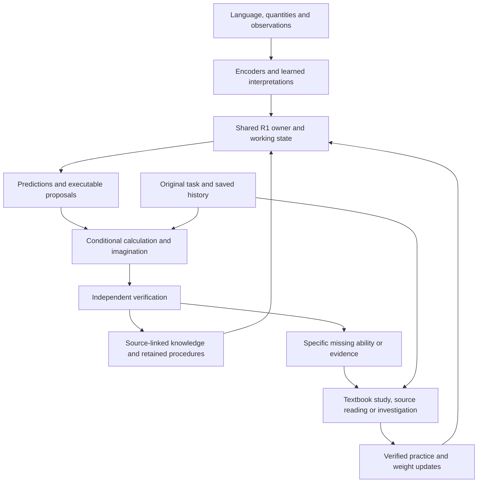

# SERA

**State-Space Engine for Reasoning and Adaptation**

Research by [Arnav123-s](https://github.com/Arnav123-s).

I am building one persistent learner that acquires executable knowledge, investigates missing information, imagines consequences and corrects its understanding with evidence. SERA brings learned language interfaces, recurrent memory, quantitative models, an executable skill library and independent verification into a continuing research system.

The central idea is to turn experience into something reusable: a learned interpretation, a compact mathematical operator, a model of a system, or a verified procedure. A task can remain open across sessions while the learner gathers the information and skills needed to return to it.

## Start here

| I want to… | Open |
|---|---|
| Run a task with the saved learner | **[Use SERA](docs/START_HERE.md)** |
| See current results and verification | **[Current status](docs/STATUS.md)** |
| Understand the implementation | **[Repository map](docs/REPOSITORY_MAP.md)** |
| Find a past experiment, checkpoint or failure | **[Research archive](docs/RESEARCH_ARCHIVE.md)** |
| Understand the intended architecture | [Architecture](research/architecture.md) · [Project direction](research/project-context.md) |
| Check teaching-data quality and provenance | [Data guide](docs/DATA.md) |

## What the saved learner can do

| Capability | Use it | Measured evidence |
|---|---|---|
| Acquire a physical model, refine its assumptions, imagine motion and compare controls | [Physical refinement](research-continuation/46_structural_refinement/README.md) | [36 worlds, 72 investigations and complete retained-owner replay](research-continuation/46_structural_refinement/report.md) |
| Ask what changes, distinguish competing explanations and retain compact response rules | [Counterfactual investigations](research-continuation/45_counterfactual_inquiry/README.md) | [Full prospective study and owner verification](research-continuation/45_counterfactual_inquiry/report.md) |
| Complete self-chosen questions with multiple proved answers and learn from verified progress | [Solution portfolios](research-continuation/44_solution_portfolios/README.md) | [217 routes, 58 newly executable questions and 27,263 correct reference answers](research-continuation/44_solution_portfolios/report.md) |
| Identify a gap in retained observations, construct competing explanations and calculate their missing-influence consequences | [Self-identified gaps](research-continuation/43_knowledge_gaps/README.md) | [12,288-program study, eight retained alternatives and independent measurements](research-continuation/43_knowledge_gaps/report.md) |
| Choose questions, propose equations, combine learned rules and retain independently checked discoveries | [Self-chosen discovery](research-continuation/42_composed_discovery/README.md) | [Examples, investigations, exact executions and observed-data checks](research-continuation/42_composed_discovery/report.md) |
| Continue practice across dictionary, conversation, grammar, philosophy, STEM prose, reading, four-language requests and mechanics | [Continuing learner](research-continuation/38_continuing_growth/README.md) | [Twelve-strand study, exact continuation and independent score replay](research-continuation/38_continuing_growth/report.md) |
| Identify a missing mathematical prerequisite, acquire it from retained constraints and return to internal discovery | [Autonomous acquisition and discovery](research-continuation/37_constraint_acquisition/README.md) | [Three acquired basis cases, eight further relationships and 256 checked routes](research-continuation/37_constraint_acquisition/report.md) |
| Construct and prove new connections from retained executable knowledge | [Internal discovery](research-continuation/35_operator_discovery/README.md) | [Five generated relationships and 256 independently checked alternative executions](research-continuation/35_operator_discovery/report.md) |
| Continue human-text and checked-method practice with rewards for verified learning progress | [Learning progress](research-continuation/34_learning_progress/README.md) | [Six curriculum strands, two successor transitions and independent replay](research-continuation/34_learning_progress/report.md) |
| Retain several verified ways to solve a task and learn which alternatives add coverage | [Verified method portfolios](research-continuation/33_capability_portfolio/README.md) | [512 fresh cases, reward comparisons and persistent qualification](research-continuation/33_capability_portfolio/report.md) |
| Learn which evidence improves a missing response, imagine motion and retain checked policy updates | [Verified completion and practice](research-continuation/32_verified_completion/README.md) | [768 fresh worlds, six controls and exact continuation](research-continuation/32_verified_completion/report.md) |
| Use a taught physical definition to calculate and compare conditional motion | [Grounded definition example](research-continuation/30_grounded_books/README.md) | [300 cases, 900 branches and retention audit](research-continuation/30_grounded_books/report.md) |
| Rank source sentences and investigate missing information on arXiv | [Source reading and research](docs/START_HERE.md#read-a-source-or-investigate-a-gap) | [Human-text study and audit](research-continuation/29_human_reading/report.md) |
| Learn a body's motion from observations; refine and forecast | [Motion learning](research-continuation/28_concept_refinement/README.md) | [C01/C02 results](research-continuation/28_concept_refinement/report.md) |
| Learn verified operators and calculate polynomial motion | [Mathematical study](research-continuation/27_self_study/README.md) | [Acquisition and correction](research-continuation/27_self_study/report.md) |
| Interpret English, Spanish, French and German requests | [Language interfaces](docs/START_HERE.md#interpret-a-request) | [Language and retention](research-continuation/27_self_study/report.md) |
| Label English requests and extract entities into a file | [Request annotation](research-continuation/26_stream_curriculum/README.md) | [Held-out evaluation](research-continuation/26_stream_curriculum/report.md) |
| Resume conditional investigations and acquire observations | [Investigation](research-continuation/25_constraint_inquiry/README.md) | [Owner and evidence audit](research-continuation/25_constraint_inquiry/architecture-audit.md) |

The linked reports give the teaching conditions, evaluation cases, comparison methods and complete measurements for each capability.

## How SERA is engineered

### One continuing parameter owner

The computational center is **R1**, a recurrent state-space learner implemented in PyTorch. Language, typed quantities, sequences and world observations enter through appropriate encoders. They connect to an owned memory and fusion computation, with output heads for their tasks. The continuing implementation extends this same object with reading weights, mathematical operators and empirical models.

This ownership is enforced in code: the task interface, learning session, solver and typed view refer to the same registered parameter object. Checkpoints record the configuration and tensor identities. A parameter update is followed by rebinding and checking retained knowledge against the updated owner.

The current integration is in [`experiments/`](docs/REPOSITORY_MAP.md); its reusable core is in [`src/sera/`](src/sera/). The [research archive](docs/RESEARCH_ARCHIVE.md) traces the successive implementations and their results.

### Learning through self-chosen investigations

The physical-model extension retains a prediction task while SERA chooses distinguishing observations, fits competing descriptions and checks them on separate evidence. Useful direction-dependent force coefficients become executable weights on the same owner. A versioned view supports what-if prediction, fixed-mechanism trajectories, finite control planning and evidence-ranked explanation. The final study preserved all 855 earlier tensor records and 217 solution routes. [Physical-model engineering and measured results](research-continuation/46_structural_refinement/report.md).

The counterfactual continuation follows a question beyond its first answer. It varies retained quantities, imagines several explicit mechanisms, selects observations that separate their consequences, and investigates another variable when competing explanations give the same initial answer. Contradictory evidence can trigger a broader mechanism basis and a return to the original question. Checked normalized response rules become compact executable weights on the continuing owner. Conventional names and explanatory feedback follow committed conjectures and independent verification. [Engineering, use and results](research-continuation/45_counterfactual_inquiry/README.md).

The preserved solution portfolio searches alternative expressions from its own retained executions, proves conditional identities, returns applicable routes to the original task and updates procedure-value weights from verified progress. A full cycle covered 358 saved questions, made 58 more questions executable, and retained 217 checked routes. Reward recognizes 54 new input-and-guard combinations after accounting for existing procedures and redundant requirements. Proofs, denominator guards, failed searches and corrected credit remain attached to the continuing learner. [Run a solution or start an investigation](research-continuation/44_solution_portfolios/README.md).

The retained empirical investigation lets SERA inspect its own evidence for incomplete coverage. It selected an unexplained part of an existing measured trajectory, constructed alternative conditional programs from its learned integration basis and checked their predictions against reserved observations. Eight qualified explanations remain on the same owner. Their differences can drive a proposed next observation, and each program can calculate the additional acceleration needed relative to its older explanation. [Use the investigation and inspect its findings](research-continuation/43_knowledge_gaps/README.md).

The discovery continuation starts with three elementary process examples: check a proposed pattern, seek a genuinely different route when two expressions are equivalent, and revise a claim after a counterexample. Its learned investigation weights select questions about missing quantities or text associations. Candidate programs fit the retained operator's executions or compose previously learned rules, then commit their predictions before independent assessment.

Checked discoveries become coefficient weights on the same R1 owner, accompanied by assumptions, dependencies and executable routes. Reward measures additional useful coverage, with aliases and already available calculations receiving no fresh discovery credit. The current portfolio preserves 149 records and can return multiple applicable routes for a supplied task. A generated acceleration relation also passed a separately attributed laboratory-data check. [How to use these capabilities and inspect their evidence](research-continuation/42_composed_discovery/README.md).

### Working memory and learned weights

R1 keeps **working state** for an unfolding episode and **weights** that persist across episodes. The associative memory learns keys, queries, values and write gates. A write corrects what memory currently predicts at a key; a query reads the resulting association. The fusion layer combines the current input with recalled information before a task head makes its prediction.

This supports several useful time scales:

| State | What changes it | What it provides |
|---|---|---|
| Recurrent working memory | Admitted events in an episode | Context and history for the current computation |
| Learned parameters | Verified teaching and controlled training | Reusable mappings, coefficients and predictions |
| Retained knowledge and programs | Checked acquisition and revision | Source identities, assumptions, dependencies and executable procedures |
| Task history | Investigation, attempts and corrections | Continuity when a task resumes |

The repository also contains complex rotor, density-factor and quantum-instrument research. These implement explicit propagation, conditioning and measurement operations. Their conventional controls, numerical costs and experimental decisions are indexed alongside them.

### Language becomes an actionable situation

The language stack includes request intent and entity prediction, interfaces trained on English, Spanish, French and German, sentence selection for source reading, and learned bindings between physical definitions and quantity roles.

For a taught physical meaning, SERA retains the original term, definition, source identity and learned association. A numerical task adds quantities, units and explicit physical premises. These establish the situation that its quantitative operator can execute. For example, a force task supplies net force, mass, elapsed time and initial conditions; its interpretation leads into the continuing mathematical learner.

The [human-text curriculum](research-continuation/29_human_reading/report.md) and [book curriculum](research-continuation/30_grounded_books/report.md) preserve the progression through lexical resources, questions and passages, human conversation, grammar, philosophy, calculus and physics. Teaching sources and transformed training records retain separate identities.

### Compact executable mathematics

The StudyR1 extension learns numerical operators over rational polynomial representations. Its acquired integration and summation maps live in the owner's parameter tensors. A proposed result is checked using an independent mathematical identity before being returned as verified algebra.

These operators compose. Given an acceleration polynomial, the motion route integrates to velocity, applies the initial velocity, integrates to position and applies the initial position. It then evaluates the resulting functions at the requested time. The result includes the functions and verification records, making the computation inspectable and reusable.

The internal-discovery extension uses the retained integral to generate and execute candidate compositions with time-weighting. It fits possible relationships, checks them with exact rational algebra, and stores accepted coefficients as executable parameters on the same owner. In the first completed cycle it constructed one connection and four composed extensions, then used them for 256 checked alternative calculations. New independent coverage earns credit; aliases share the existing credit. [Discoveries, assumptions and comparisons](research-continuation/35_operator_discovery/report.md).

The subsequent autonomous cycle inventories retained operators, identifies an unconnected prerequisite, generates investigations and saves the resulting gaps. Its acquisition controller constructs corrections from known mathematical constraints, updates the actual operator and returns to the original investigation. This connected summation, integration and time-weighting through eight further checked relationships. Candidate generation, exact verification and final evaluation have separate records; source feedback, teaching conditions and every reward remain inspectable. [Complete acquisition loop](research-continuation/37_constraint_acquisition/report.md).

SERA also learns empirical motion models from observed histories. The refinement interface preserves observations, fits the admitted model, checks identifiability and forecasts from retained history. Source assumptions, measured observations and calculated consequences remain individually inspectable.

### Imagination, investigation and learning

An imagined branch uses a copy of the relevant state and explicit premises. The grounded interface compares consequences such as reversing a force or doubling a mass. Each branch carries its inputs and algebra checks, while the observation history continues to represent what was actually received.

The verified-completion interface adds a **learned investigator** on the same owner. For a missing acceleration response, it retains joint mechanism weights and uncertainty, samples consistent possible mechanisms, and executes their consequences through the existing integral operator. The investigator learns to choose an informative observation or STOP. It commits its choice and predictions before a separate check calculates the reward. Useful choices strengthen its selection procedure; policy state and evidence receipts persist for the next task.

In the frozen conditional-practice study, teaching reduced matched prediction error by **80.4% from the initial policy** and **74.0% from random choice**. The full comparison also keeps an analytic recommendation option. [Run the loop and inspect the evidence](research-continuation/32_verified_completion/README.md).

When a task identifies missing knowledge, its original question and current attempts are saved. The source interface can search arXiv, pin paper identities, read available material and rank supporting passages. Verified teaching can then change retained parameters, after which the task is attempted again. The [self-study interface](research-continuation/27_self_study/README.md) implements diagnosis, source acquisition, practice, checking, updating and return to the original task.

### Reusable knowledge, correction and persistence

The verified-portfolio extension adds a learned method scorer to this same owner. A quest retains its original goal, alternative prerequisites, checked methods and unfinished work. Reward measures additional verified coverage and distinct valid methods. A reserved exploration attempt examines another candidate. Method identity includes executable content and assumptions, so different names for one procedure share credit while different valid approaches remain available.

An independent assessor qualifies the complete portfolio for a declared scope and owner. Qualification is renewed after learning changes the weights. In the current mechanics study, reward for new coverage taught both seeds to select all four supplied valid routes; each answered **512/512 fresh requests correctly**. Time integration, impulse and work–energy also reach the same worked answer through distinct checked routes. [Run these examples](research-continuation/33_capability_portfolio/README.md).

The executable library records a procedure's domain, assumptions, dependencies and verification history. Applicability checks determine when a stored procedure can run. Updates retain the earlier version and their evidence, so results can be inspected and replayed.

Session storage uses append-only revisions, checksums and a current-revision pointer. Training checkpoints include the state needed for exact continuation. Research releases preserve source hashes, protocols, selected and rejected candidates, resource costs and independent replay results. These mechanisms let the learner continue from an earlier session with its acquired state and unfinished work intact.

### What the engineering supplies and what SERA learns

The learning-progress extension trains a procedure scorer on realized acquisition gains across human prose, source reading and checked mechanics. It rewards gains above the learner's retained best score and separately records maintenance. Old/new knowledge crossed with old/new learning policies tests whether the procedure helps the next acquisition task. The latest saved owner retains the selected weight updates and its freshly qualified four-route portfolio. [Implementation, all controls and results](research-continuation/34_learning_progress/report.md).

I supply the encoders, representation contracts, learning algorithms, unit rules, independent checkers and experiment protocols. SERA acquires the trained request and reading mappings, quantity associations, numerical operator coefficients, empirical parameters, evidence-selection weights and admitted procedures through their recorded teaching or acquisition processes. The reports identify the origin of each component and measure the resulting behavior.

## A concrete task

Give the grounded interface the taught force definition and these premises: a constant net force of **6 N**, mass **3 kg**, motion in one dimension, initial rest and an elapsed time of **2 s**. The saved learner calculates **4 m** of displacement and **4 m/s** of velocity. It also compares an opposite-force branch and a doubled-mass branch, with independent rational checks for all three.

The [runnable request and instructions](research-continuation/30_grounded_books/README.md) include the exact input, source attribution, assumptions and saved output. This is the working pattern for the STEM curriculum: connect a taught meaning to quantities, execute a learned relationship, verify the result and retain what makes the relationship reusable.

## Current release

The [status page](docs/STATUS.md) identifies the current owner, its measured results and the exact verification run. The latest integrated interface is `scripts/sera_current.py`; each earlier interface and checkpoint remains available through the [research archive](docs/RESEARCH_ARCHIVE.md). A fresh checkout restores the full predecessor chain with `python scripts/restore_current.py`, which checks each archive and preserves divergent local files.

The current physical successor completed 72 investigations across 36 paired simulated worlds. It retained the simpler model for all twelve radial worlds, qualified the richer model for all twelve directional worlds and kept all twelve omitted-mechanism worlds open. Its 33-task example batch combines the physical model, counterfactual questions and earlier practical interfaces. The [preceding counterfactual study](research-continuation/45_counterfactual_inquiry/report.md) completed 228 investigations, including 1,227 correct final checked predictions and 360 fresh-background transfer checks.

The development direction is progressively deeper STEM capability through human-authored lessons, useful quantitative tasks, verified acquisition and cumulative retention. Each completed curriculum adds its executable interface and measured results to the archive.

## Development and preservation

Use Python **3.12.14**, CPU PyTorch **2.10.0**, NumPy **2.5.3** and SciPy **1.18.1** for the qualified persistence environment. [Setup and verification](docs/REPOSITORY_MAP.md#setup-and-verification) includes clean-checkout fixture restoration.

All prior research remains in place with an [indexed archive](docs/RESEARCH_ARCHIVE.md). Ignored `runs/` contains live local revisions. Sealed reports and checkpoints retain their original identities. The resource ledger governs local numerical work; printed balances are historical snapshots.

I have not assigned an open-source license to this research release. Original datasets and references retain their own licenses and attribution. See [data sources](docs/DATA.md) and [original references](research/references.md).
