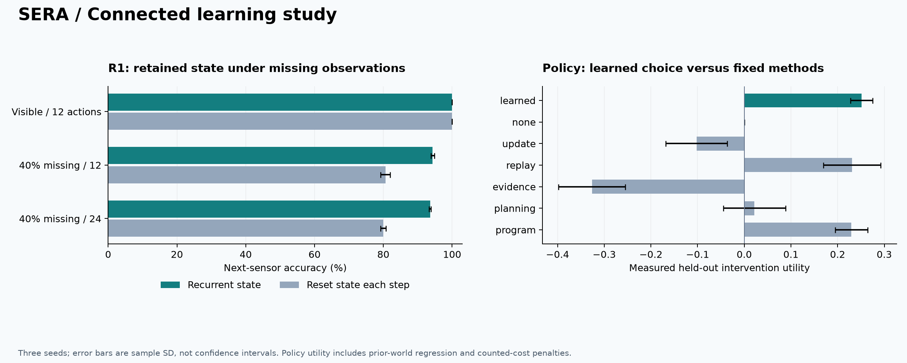

# SERA: connected learning study

I trained three independent SERA solvers from scratch, connected their R1/R2 learning paths, and measured both successful and rejected improvements. This report describes version 0.2; the first release's experiments remain historical evidence. The supplied physics documents informed the architecture. The learning evidence comes from generated symbolic tasks, not factual question-answer training on those documents.

## Findings

After compact R1 training, next-sensor accuracy with 40% missing readings was 94.35 ± 0.48%. Resetting the same model's memory at every step reduced it to 80.60 ± 1.40%. This ablation measures dependence on retained state; it is not a comparison with a separately trained memoryless model.

The learned improvement policy achieved utility 0.2513 ± 0.0240 on the withheld reset family. The strongest fixed-method mean was replay, at 0.2306 ± 0.0614. Its mean exceeded every tested fixed method, but twelve finite test episodes and three seeds do not establish a general policy advantage.

Across 6 later policy-selected proposals, 2 were promoted and 4 rejected. Ordinary reload reproduced the accepted behavior, and all three parent-rollback checks passed.

## What I taught it

| Component | Available information and target | Budget per seed |
|---|---|---|
| Symbolic foundation | Explicit task instruction and 20-feature symbolic events; marked retrieval, latest binding, ordered actions and majority labels | 500 AdamW updates × 64 = 32,000 example draws; length 12; validation-selected weights |
| R1 world learner | Visible/missing colors, previous action, actual reward, goal and public world identity; next visible color and actual reward targets | 512 × 8 = 4,096 collected transitions; 900 updates × 32 trajectories = 230,400 transition draws |
| Ordered-control skill | Active reset/execution queries to the supplied deterministic world | Bounded transition induction and independent verification at lengths 12, 24 and 96 |
| Earliest-binding skill | 128 support labels distinguish four supplied sequence rules; 256 independent verification examples | Select and verify a rule from the finite candidate set; no neural weight update |
| Improvement policy | Observed diagnostics and measured counterfactual utilities for six supplied methods | 8 training + 4 validation episodes; 500 fitting steps; final 4 reset-family episodes after freezing |
| Planned-feedback update | Actual consequences of executing the current R1 planner in a new permutation world | 32 × 8 practice transitions; 120 replay updates; fresh old/new-world admission |
| Autonomous generations | New-world support, saved policy and incumbent solver | Two generations; 32 support trajectories each; 16 updates when selected; fresh retention/admission |
| Independent R2 study | 256 × 8 masked trajectories and eight independently verified start/goal demonstrations | 200 instrument updates; 51,200 likelihood transition draws plus 1,600 verified-program credit draws |

These are deliberately small symbolic tasks. A visible color identifies a state within its world; the public world identifier, action alphabet, goals, finite grammar and task router are supplied. Internal simulator state and transition tables do not enter neural training. Missing sensor labels remain absent from admitted experience; evaluation truth is kept separately. Program discovery receives stronger reset/execution feedback than passive neural sequence supervision.

## R1 prediction and actual control

Each condition contains 256 independent trajectories per seed. Values below are mean ± sample SD across seeds. Training uses length 8 with 30% missing readings; tests use the declared longer lengths. NLL is in nats; reward MSE compares predicted probabilities to actual binary rewards.

| Evaluation condition | Accuracy | NLL | Reward MSE |
|---|---:|---:|---:|
| visible | 100.00 ± 0.00% | 0.0032 ± 0.0004 | 0.0012 ± 0.0008 |
| visible_reset_memory | 100.00 ± 0.00% | 0.0032 ± 0.0004 | 0.0012 ± 0.0008 |
| partial | 94.35 ± 0.48% | 0.2433 ± 0.0372 | 0.0233 ± 0.0037 |
| partial_reset_memory | 80.60 ± 1.40% | 0.6658 ± 0.0653 | 0.0628 ± 0.0046 |
| long | 93.59 ± 0.27% | 0.2684 ± 0.0090 | 0.0241 ± 0.0024 |
| long_reset_memory | 80.00 ± 0.79% | 0.7112 ± 0.0674 | 0.0657 ± 0.0044 |

| Executed control | Success across 12 start/goal pairs per seed |
|---|---:|
| reactive | 100.00 ± 0.00% |
| planned | 100.00 ± 0.00% |
| partial_planned | 100.00 ± 0.00% |

The base rotation worlds permit every nontrivial goal in one action. These control results exercise the connected path but cannot demonstrate a multi-step planning advantage. The new permutation/reset worlds below test adaptation under different dynamics. Partial-planned control masks later readings, so one-action success also limits how much that condition tests memory. Longer masked prediction is the stronger memory test here.

## Symbolic behavior after all generations

Ordinary solver inference uses accepted skills automatically. The final fresh pool has 512 examples per task per seed at length 12.

| Task | Final accuracy | Mechanism |
|---|---:|---|
| marked_retrieval | 99.93 ± 0.11% | Trained neural model |
| latest_binding | 89.19 ± 14.32% | Trained neural model |
| ordered_control | 100.00 ± 0.00% | Verified executable skill |
| majority | 85.61 ± 3.03% | Trained neural model |
| earliest_binding | 100.00 ± 0.00% | Verified executable skill |
| Equal-task macro | 94.95 ± 2.75% | Combined solver |

Perfect finite-task scores do not show that the neural network learned the corresponding procedure: the two acquired skills execute supplied program representations, with explicit applicability routing. The world learner uses separate parameters, so its updates do not directly change the symbolic neural model.

## Learned improvement policy

The study measured 276 actual method outcomes across 48 episodes. The final 12 test episodes use a reset family absent from policy development. Development and validation include repeated known worlds with separately sampled support/diagnostics; I count episodes, not independent world families. Policy weights were frozen before final outcomes were generated.

Utility = target-world score gain − 2 × worst prior-world score loss − 0.002 × log(1 + charged operations). A world score equally weights prediction accuracy and executed goal success. Fixed program search falls back to no change when reset access is unavailable. This utility is a declared experimental objective, not accuracy or a FLOP-normalized rate.

| Selection policy | Held-out utility |
|---|---:|
| Learned selector | 0.2513 ± 0.0240 |
| Always none | 0.0000 ± 0.0000 |
| Always update | -0.1022 ± 0.0659 |
| Always replay | 0.2306 ± 0.0614 |
| Always evidence | -0.3263 ± 0.0717 |
| Always planning | 0.0218 ± 0.0665 |
| Always program | 0.2296 ± 0.0345 |

Mean regret to the post-hoc best available method: 0.0680 ± 0.0374. Post-hoc best is an analysis upper bound, not a deployable policy. Selected methods: {'program': 8, 'planning': 2, 'replay': 2}.

| Test episode | Learned choice | Post-hoc best | Actual utility | Regret |
|---|---|---|---:|---:|
| meta-test/0/0 | program | replay | 0.3956 | 0.1524 |
| meta-test/0/1 | planning | replay | 0.1874 | 0.0911 |
| meta-test/0/2 | program | program | 0.1378 | 0.0000 |
| meta-test/0/3 | replay | program | 0.2284 | 0.0657 |
| meta-test/1/0 | program | program | 0.3409 | 0.0000 |
| meta-test/1/1 | replay | replay | 0.0994 | 0.0000 |
| meta-test/1/2 | program | replay | 0.3643 | 0.1075 |
| meta-test/1/3 | program | program | 0.1456 | 0.0000 |
| meta-test/2/0 | program | program | 0.4425 | 0.0000 |
| meta-test/2/1 | planning | replay | 0.0386 | 0.3993 |
| meta-test/2/2 | program | program | 0.3175 | 0.0000 |
| meta-test/2/3 | program | program | 0.3175 | 0.0000 |

This trains a selector over fixed learning procedures. It does not discover optimizers or invent learning algorithms. The model remains fixed during the subsequent generations; their outcomes do not establish a recursively improving improver. The complete meta-development cost must also be paid before deployment.

## Every persistent proposal

Each candidate is frozen before drawing fresh paired admission samples. Gain is the equal-task/world score difference; the lower bound is the declared one-sided bound. Max loss is the largest positive empirical regression across evaluated tasks/worlds, including the proposed target. Both symbolic gates include five tasks; later gates include all worlds known at that point.

| Seed / round | Method | Version / parent | Mean gain (pp) | Lower bound (pp) | Max loss (pp) | Decision |
|---|---|---|---:|---:|---:|---|
| 0 / 0 | verified_program | v1 / v0 | 12.15 | 9.46 | 0.00 | promoted |
| 0 / 1 | verified_program | v2 / v1 | 14.47 | 11.55 | 0.00 | promoted |
| 0 / 2 | planned-feedback-with-replay | v3 / v2 | 13.29 | 6.25 | 0.02 | promoted |
| 0 / 3 | program | v4 / v3 | 9.81 | 3.69 | 0.00 | promoted |
| 0 / 4 | program | v5 / v4 | 8.75 | 3.14 | 0.00 | promoted |
| 1 / 0 | verified_program | v1 / v0 | 13.10 | 10.41 | 0.00 | promoted |
| 1 / 1 | verified_program | v2 / v1 | 14.49 | 11.57 | 0.00 | promoted |
| 1 / 2 | planned-feedback-with-replay | v3 / v2 | 16.26 | 9.22 | 0.33 | promoted |
| 1 / 3 | planning | v4 / v3 | -1.53 | -7.66 | 4.59 | rejected: insufficient_independent_gain, retention_regression |
| 1 / 4 | replay | v5 / v3 | 7.33 | 1.72 | 14.02 | rejected: retention_regression |
| 2 / 0 | verified_program | v1 / v0 | 13.63 | 10.95 | 0.00 | promoted |
| 2 / 1 | verified_program | v2 / v1 | 13.82 | 10.89 | 0.00 | promoted |
| 2 / 2 | planned-feedback-with-replay | v3 / v2 | 20.84 | 13.80 | 0.05 | promoted |
| 2 / 3 | replay | v4 / v3 | 7.80 | 1.67 | 27.85 | rejected: retention_regression |
| 2 / 4 | replay | v5 / v3 | 15.10 | 9.48 | 2.98 | rejected: retention_regression |

Fresh promotion seeds and complete per-world/task scores appear in the JSON evidence. Empirical retention gates are not confidence bounds. Finite deterministic control outcomes are enumerated and independently sampled; this is not evidence of an unlimited distribution of goals. Rejected snapshots remain available, and no rejected candidate replaces current behavior.

The generational study replays the original 512-trajectory world buffer; later support is archived separately. This restricted coverage can leave the previously learned permutation world vulnerable to forgetting, and the gate checks it even though it is absent from replay. `scripts/prepare_solver.py` creates a separate copy for continued learning and merges actual initial/planned/generation support without changing weights or admitting meta/query/test data. Preparation is not another learning result.

| Seed | Current accepted version | Separate rollback | Total original study seconds |
|---|---|---|---:|
| 0 | v5 | v5 → v4: passed | 270.1 |
| 1 | v3 | v3 → v2: passed | 282.4 |
| 2 | v3 | v3 → v2: passed | 275.3 |

## R2 learned proposals under an equal execution-attempt budget

A separate permutation world supplies eight verified demonstrations per seed. Four other start/goal pairs per seed are withheld from those demonstrations. All methods have at most four candidate executions; a success also receives a separate verification execution. Transition likelihood training can see dynamics used by test programs. The holdout is goal composition within a trained world.

| Search method | Successful pairs / 12 | Seed success rate | Mean attempts per pair | Proposal-model transitions |
|---|---:|---:|---:|---:|
| fixed | 10 / 12 | 83.33 ± 28.87% | 2.25 | 0 |
| untrained_instrument | 8 / 12 | 66.67 ± 28.87% | 3.17 | 2,736 |
| learned_instrument | 12 / 12 | 100.00 ± 0.00% | 1.00 | 2,736 |

Largest trained channel/instrument completeness residual: 4.77e-07. Numerical validity is an implementation property, not proof of useful program learning. Execution-attempt equality does not mean equal action count, training compute or wall time; guided search pays for model proposals and training.

The interpreter implements action, sequence, bounded repeat and library call. These trials mainly learn action sequences; I have not established that acquired abstractions reduce future search cost. The full controlled instrument is a classical numerical model and provides no quantum-device speedup claim.

## Examples of behavior after reload

- Seed 0, reset-90000: start 0, goal 1; loaded skill executed actions [1], observed [0, 1], received rewards [1.0]; success=True.

These are actual executions reproduced from the accepted solver, not generated narrative examples. The verification artifact includes further traces and parameter counts.

## Costs, provenance and reproduction

The three original studies took 13.80 minutes in total on the shared CPU workstation. This includes development counterfactuals, final tests, failed/rejected candidates and rollback checks, but excludes earlier development probes and the additional reproduction audit (1.05 minutes). It is not an isolated throughput benchmark.

The independent artifact audit reproduced 15 paired admission decisions, checked 1,920 nonoverlapping meta-support identifiers and 48 unique meta-query datasets, reloaded all accepted component identities, re-executed saved goal skills and reproduced final symbolic scores. This audit reused recorded seeds to verify software; it is not a new generalization estimate.

[Operation counters](connected-operation-counts.json) aggregate nonoverlapping recorded phases. Categories include acquisition, observed sensors, optimizer work, replay, environment actions, program verification, model proposals/planning and paired evaluation. They are unlike units, not FLOPs. Meta-episode baseline-evaluation counters were not serialized, and individual phase timers are not complete; total study wall time includes those computations. I make no full-compute efficiency claim. Nested construction/charged-work snapshots are not counted twice.

Frozen implementation source SHA-256: `59c0835fba356932d945dc67c04b781aa5549702ee40389b09b9e03c73016594`. Environment: Python 3.12.14, PyTorch 2.10.0+cpu, NumPy 2.5.3, CPU. Each run records its data/solver identities and promotion seeds.

The report builder reads [study records](connected-study-data.json), [all policy outcomes](connected-policy-episodes.json) and [reproduction checks](connected-verification.json). The [evidence manifest](connected-evidence-manifest.json) records their hashes. Raw local checkpoints, candidate snapshots, trajectories, paired-score arrays and journals are retained outside Git history. See the [reproduction guide](../research/reproducing-connected-study.md) for exact commands.

## What remains unproven

The full 256-wide reference preset and its 35,840-byte core are implemented and tested, but this study trains a compact delta R1. Sensor colors, world identity, action vocabulary, goals, program grammar, task routing and intervention procedures are supplied. There is no learned perception/language stack, broad program-structure transfer, R3–R8 implementation, open-ended optimizer invention, independent evaluator process isolation, quantum advantage or demonstrated recursive research acceleration. These remain separate acceptance criteria in the [roadmap](../research/roadmap.md).

I preserve the [development failures](../research/development-log.md), [original architecture audit](architecture-alignment-audit.md), [resolution](architecture-audit-resolution.md) and [implementation checklist](../research/implementation-checklist.md). Passing engineering checks does not turn a negative learning comparison into a capability claim.
