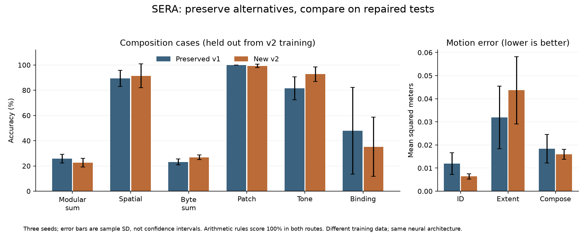

# SERA 0.4: preserved variants and corrected evaluation

I preserved the promising alternative directions and completed the first repair from the source-packet audit: semantic evaluation partitions and separate retention checks. The new results support keeping several variants. They do not establish that the newest model is the best overall learner.

The [variant registry](../research/variants.md) names 22 architectures, components and inference routes without creating duplicate experiments. The [data](evaluation-v2-data.json) and [independent verification](evaluation-v2-verification.json) retain numerical details. Old results remain under their original source identities.

Current executable source: `ad86ff13b9c0f15a67661dee2a9807d9cadda43f3696f1078f525d5aa5cbbe1b`. Frozen 0.3 source: `0d28049174092ae48ff91af9ff37c2478eedf51c159c41e3ccdcec6f39ce72bd`. Values below are means ± sample standard deviations across three seeds unless a count is shown. SD describes variation across these seeds; it is not a confidence interval.



## What remains worth keeping

| Preserved variant | Measured result | Interpretation |
|---|---|---|
| Sequence hybrid | 82.21 ± 1.00% ID; 77.16 ± 1.91% long | Useful early alternative; 11,208 parameters versus delta's 3,225. Different task suite from world/typed studies. |
| Sequence delta | 78.11 ± 2.61% ID; 72.95 ± 5.57% long | Smaller baseline for the same early sequence comparison. |
| Delta World | 86.81 ± 1.25% long masked prediction | Falls to 78.61% with memory reset. Identifying sensors and deterministic worlds constrain the claim. |
| HMM-22 | 100% repeated-pattern prediction | Strongest conventional control on the bounded aliased-event test; keep it for future belief/planning work. |
| Complex instrument | 88.17 ± 1.29% on the same repeated-pattern test | A valid controlled-instrument result, with HMM providing a stronger control. |
| Program reuse | 22/22 with either learned guide and library; 21/22 without library | Finite whole transformations under a token budget. Macro expansions can execute more primitive actions. |
| Full reference state | 38.67 ± 3.04% rank-4/all-routing prediction | Keep the architecture and negative result. Its training budget differs from Delta World. |
| Intervention selector | No sustained advantage over the best fixed procedure | Preserved policies and measured intervention episodes; improvement quality remains open. |

These are separate benchmarks and mechanisms, not one aggregate score. The original full results remain in the [0.3 study](stage-three-study.md) and the earlier [research report](first-study.md).

## Repaired teaching and test protocol

The v1 generator remains available for exact historical reproduction. `typed-semantic-v2` gives development and test cases semantic identities that ignore provenance, split names, decimal whitespace, equivalent units and masked payload. Identity uses the input alone, so contradictory labels cannot evade an overlap check. Finite cases are sampled without replacement; requesting more than the available domain fails instead of silently repeating cases.

Each new model receives 192 support and 48 validation examples for each of seven tasks, then 1,400 updates of 64 examples. Five learned adapters feed the same 26,219-parameter typed architecture. Checkpoint selection uses validation only. Each test partition has 128 cases per task. The 4,368 semantic cases within each seed are distinct across all five partitions, and none overlaps that frozen model's old support/validation cases. Training, validation and ID-test bucket ownership is independent of random seed.

| Task | Development / ID | Extent test | Withheld composition |
|---|---|---|---|
| modular_sum | non-palindrome, 3-5 operands | non-palindrome, 8-10 operands | palindrome, 5 or 7 operands |
| spatial_relation | matching m/m or cm/cm units | matching units, larger coordinates | mixed m/cm or cm/m units |
| byte_sum | 0-31 operands, 12 residue-pair classes | 32-63 operands, same 12 classes | 0-31 operands, four withheld residue-pair classes |
| patch_quadrant | solid bright quadrant | solid quadrant, more noise | diagonal bright pair inside quadrant |
| tone | one sinusoid | one sinusoid, lower amplitude | dominant sinusoid plus weaker second tone |
| motion | positions at times 0,1,2 | positions at times 0,2,4 | positions at times 0,1,3 |
| binding | six writes, final query key appears once | twelve writes, query key appears once | six writes, query key overwritten at least once |

Motion predicts one time unit after the final observed timestamp. Composition tests retain the task's supplied rule while withholding an input pattern or combination. They do not demonstrate unseen rule invention, language understanding or general multimodal reasoning. ID, extent and held-out labels refer to the **v2 development distribution**. Frozen v1 already saw some composition templates, including mixed units and overwritten bindings, in its old training; its concrete teaching cases are excluded here. Its results measure retained capability on unseen cases, not unseen-template acquisition. The models receive identical tests but have different training distributions and initializations; changes are not attributable to architecture.

## Typed performance on identical new tests

### V2 ID cases

| Task | Preserved v1 neural % | New v2 neural % | Support-majority baseline % |
|---|---|---|---|
| modular_sum | 27.34 ± 6.10 | 25.78 ± 4.75 | 23.96 ± 7.83 |
| spatial_relation | 92.45 ± 5.20 | 98.18 ± 0.90 | 25.78 ± 4.88 |
| byte_sum | 28.12 ± 2.07 | 25.52 ± 3.16 | 22.92 ± 1.97 |
| patch_quadrant | 100.00 ± 0.00 | 100.00 ± 0.00 | 27.08 ± 2.39 |
| tone | 98.44 ± 1.56 | 99.22 ± 0.78 | 23.18 ± 1.97 |
| binding | 40.89 ± 29.75 | 36.72 ± 15.68 | 29.69 ± 1.56 |

### V2 extent cases

| Task | Preserved v1 neural % | New v2 neural % | Support-majority baseline % |
|---|---|---|---|
| modular_sum | 24.48 ± 2.39 | 28.91 ± 3.41 | 28.91 ± 2.82 |
| spatial_relation | 48.18 ± 9.45 | 50.52 ± 7.05 | 20.57 ± 3.69 |
| byte_sum | 24.74 ± 6.51 | 26.56 ± 4.35 | 27.86 ± 2.96 |
| patch_quadrant | 100.00 ± 0.00 | 100.00 ± 0.00 | 25.78 ± 6.39 |
| tone | 95.31 ± 2.34 | 96.61 ± 2.74 | 22.40 ± 2.96 |
| binding | 39.32 ± 22.59 | 39.32 ± 7.59 | 28.91 ± 3.41 |

### V2-held-out compositions

| Task | Preserved v1 neural % | New v2 neural % | Support-majority baseline % |
|---|---|---|---|
| modular_sum | 25.78 ± 3.41 | 22.66 ± 3.41 | 23.70 ± 2.96 |
| spatial_relation | 89.32 ± 6.36 | 91.41 ± 9.47 | 25.00 ± 5.12 |
| byte_sum | 23.18 ± 2.26 | 26.82 ± 1.80 | 24.74 ± 1.19 |
| patch_quadrant | 100.00 ± 0.00 | 99.22 ± 1.35 | 23.18 ± 0.90 |
| tone | 81.51 ± 9.02 | 92.71 ± 5.86 | 20.83 ± 1.97 |
| binding | 47.92 ± 34.32 | 35.16 ± 23.48 | 23.70 ± 5.76 |

The two selected arithmetic procedures score **100%** for modular sum and byte sum in every new partition, for both v1 and v2. The supplied 21-candidate grammar and decimal parser account for this capability. The neural-only arithmetic results remain close to chance.

| Motion split | Preserved v1 MSE (m²) | New v2 MSE (m²) | Last-position baseline MSE (m²) |
|---|---|---|---|
| test-id | 0.0119 ± 0.0047 | 0.0064 ± 0.0011 | 0.0139 ± 0.0003 |
| test-extent | 0.0319 ± 0.0136 | 0.0437 ± 0.0146 | 0.0131 ± 0.0003 |
| test-composition | 0.0184 ± 0.0062 | 0.0160 ± 0.0022 | 0.0135 ± 0.0003 |

The new cohort improves mean tone composition accuracy from **81.51% to 92.71%**, but binding falls from **47.92% to 35.16%** and extent motion error increases. Patch accuracy remains high. The seed variation is substantial for binding and spatial transfer. I retain both cohorts and have not promoted the v2 typed model into the current solver. Weak binding and neural arithmetic remain explicit research failures; I did not tune repeatedly against these test results.

## Separate capability retention

The gain objective still gives equal weight to world prediction and control. Admission now checks each world's prediction accuracy and control success separately, plus five legacy outputs and seven typed tasks across three partitions when the typed component is installed. An omitted capability or mismatched paired dataset fails closed. Correlated retention checks do not increase the sample count in the gain bound.

The cap is 0.02 absolute score loss per capability. It is empirical, not a confidence guarantee. Motion uses exp(-MSE), so its cap is not a fixed bound in squared meters. Probability calibration, improver quality and every internal component's behavior are not independently gated here. The gain bound retains its fresh conditional sampling assumptions.

The synthetic audit counterexample now fails: prediction 0.90 → 0.60 and control 0.40 → 0.90 produce a higher composite score, but the prediction regression blocks admission. This is a constructed contract test, not an observed released promotion.

I reexecuted all **15** saved proposals under the old world objective and reproduced every old decision. Retrospective v2 reassessment leaves **3 passing and 12 rejected**, including additional evaluation operations in the cost check. The saved historical decisions and pointers were not changed. These reused historical proposals are not fresh admissions or additional independent trials.

| Seed / round | Original | V2 | Gain / lower bound (pp) | Largest capability loss (pp) | Failed critical checks |
|---|---|---|---|---|---|
| 0 / 0 | promoted | pass | 14.55 / 8.55 | 0.00 | None |
| 0 / 1 | promoted | pass | 8.50 / 3.15 | 0.00 | None |
| 0 / 2 | rejected | reject | 2.14 / -2.84 | 0.00 | None |
| 0 / 3 | rejected | reject | -1.21 / -6.52 | 9.18 | world/permutation-310000/prediction, world/reset-610002/control |
| 0 / 4 | rejected | reject | -0.54 / -6.15 | 23.05 | world/permutation-310000/prediction, world/reset-610002/control |
| 1 / 0 | rejected | reject | 2.66 / -3.34 | 0.00 | None |
| 1 / 1 | rejected | reject | 5.49 / 0.14 | 0.00 | None |
| 1 / 2 | rejected | reject | -6.61 / -11.59 | 53.57 | world/permutation-310001/control, world/permutation-310001/prediction, world/permutation-610100/control, world/permutation-610100/prediction, world/permutation-610101/control |
| 1 / 3 | rejected | reject | -0.13 / -5.44 | 8.59 | world/permutation-310001/prediction, world/permutation-610100/prediction, world/reset-610102/control |
| 1 / 4 | rejected | reject | 7.28 / 1.66 | 29.33 | world/permutation-310001/control, world/permutation-310001/prediction |
| 2 / 0 | promoted | pass | 19.26 / 13.26 | 1.29 | None |
| 2 / 1 | rejected | reject | 14.76 / 9.42 | 6.32 | world/permutation-610200/prediction |
| 2 / 2 | rejected | reject | 12.45 / 7.47 | 31.05 | world/permutation-310002/prediction, world/permutation-610200/prediction, world/permutation-610201/control |
| 2 / 3 | rejected | reject | -2.85 / -8.15 | 16.89 | world/permutation-310002/prediction, world/permutation-610201/control, world/reset-610202/control |
| 2 / 4 | rejected | reject | 13.92 / 8.31 | 24.02 | world/permutation-310002/prediction, world/permutation-610200/prediction, world/permutation-610201/control |

The three retained promotions lose at most **1.29 percentage points** on any measured capability, below the two-point cap. Negative values in the table indicate improvement, not a loss.

I also forked the existing continuation workspace once, preserving its full ledger and version history, and ran ordinary `sera learn` on world `permutation-880003`. This fresh attempt selected `program`, was **rejected** at cumulative round **6**, and evaluated **38** separate capabilities. The current continuation is `runs/sera-0.4-current`; `runs/sera-0.3-current` remains byte-identical. The standalone v2 typed model was not installed in that continuation.

## Verification, preservation and cost

Independent verification checked **31 artifact hashes**, regenerated all **15 semantic partitions**, reloaded and rescored **36 variant/partition combinations** (252 task scores), and found **zero score difference**. It independently checked all 15 decision calculations and reexecuted a complete paired capability decision for each seed. The new regression tests and existing suite pass: **59 tests**.

The preservation baseline covers **2,031 pre-existing files**: **2,020 unchanged**, and **11 revised tracked files** with their exact original bytes recoverable at `9072d3a0cfae8ffbfefdadbd1f6cad41e85c56a7`. Missing files: **0**. Unpreserved changes: **0**. Existing snapshots, unsuccessful experiments, wheels and source documents remain in place. New results use new output paths.

The three-seed study consumed **262.73 seconds wall time**, **262.14 CPU seconds**, **302.93 MiB peak process RSS**, and **6,526,388 heterogeneous counted operations**. Each model trained for the same 1,400 updates. The CPU ran one Torch thread. Phase costs and operation categories are in the data file; counts are not FLOPs. Two separate four-step plumbing checks cost 2.5 and 2.3 seconds; verification and development are outside the timed study. The live attempt took 24.78 seconds including process startup. No cloud compute was used.

## Checklist and source-packet alignment

- [x] Preserve old source, models, results, failed trials and continuation history.
- [x] Name useful variants and record exact checkpoint/evidence identities.
- [x] Add semantic overlap checks and explicit withheld composition patterns.
- [x] Keep historical v1 evaluation available under its original source identity.
- [x] Separate world prediction/control retention and cover installed legacy/typed outputs.
- [x] Train three new typed models, compare against frozen models on identical cases, and retain negative findings.
- [x] Reexecute historical proposals, audit the new evidence and exercise ordinary continuation.
- [ ] Connect typed acquisition and replay to the same persistent world learner, with a separate-component control.
- [ ] Demonstrate sequential improver benefit against fixed anchors, cumulative frontier and a full-budget baseline.
- [ ] Gate calibration/improver quality and establish compatible model growth or cross-world abstraction.

The original handbook's Recipe 2 (editable source lines 941–947) asks for task mixtures and held-out generators/compositions; Recipe 3 (951–957) asks for transfer, old-task retention, calibration and cost. The new protocol addresses the bounded composition and retention gaps from D03/D04. It does not close the shared-learner gap (D01), frozen-improver gap (D02), or broader lifecycle/growth contracts. The handbook's ranked hypotheses still favor a narrow R1 plus selected R2 path (1256–1272). Keeping HMM, hybrid and reference variants as controls is consistent with testing that path rather than erasing alternatives.

The next task is a minimal shared binding-acquisition stream: failure, admitted corrective evidence, retained update, fresh transfer and replay in the same persistent learner. Binding's weak and variable scores make it an explicit acceptance target. The separately trained typed component remains the control.

## Reproduce

```text
python scripts/evaluate_variants.py --study runs/stage-three-complete --output runs/my-evaluation-v2
python scripts/audit_evaluation_v2.py --study runs/my-evaluation-v2 --output runs/my-evaluation-v2-audit.json
python -m pytest
python scripts/verify_release.py
```

The comparison requires the preserved 0.3 checkpoint cohort. The registry identifies local artifacts; it does not claim that ignored checkpoints are included in a fresh Git checkout. Historical source verification reads the pinned Git commit, so fetch full history if using a shallow checkout.
