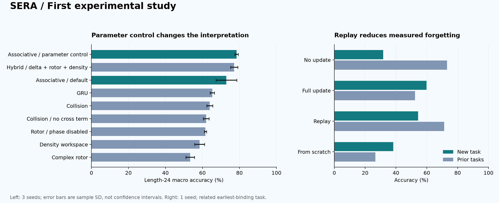

# SERA: first experimental study

In this first SERA study, I measure both useful improvements and negative results. I initialize every model from scratch and use no reference-package checkpoints or pretrained models.

## Findings

I find that the larger hybrid improves over the small default delta learner, but a classical delta learner with almost exactly the same parameter count matches its in-distribution score and has a slightly higher mean at doubled sequence length. I do **not** infer a quantum-inspired advantage from this study. I keep the smaller associative model as the default and retain the hybrid as an experimental option.

In a separate integrated run, I test program acquisition after a neural failure. Fresh macro accuracy rises from 66.21% to 81.69%, a gain of 15.48 percentage points. I measure no accuracy loss on the other three tasks. The candidate is promoted under the declared rule.



## Neural comparison

Each condition uses seeds 0, 1, 2; 500 AdamW steps; batch size 64; training length 12; 512 test examples per task and length. Validation selects checkpoints; final tests do not. Four task means receive equal weight. Values are mean ± sample standard deviation across seeds.

| Core | Parameters | Core state bytes | ID accuracy | Length-24 accuracy |
|---|---:|---:|---:|---:|
| Associative / parameter control | 11,216 | 1,152 | 82.00 ± 0.97% | 78.45 ± 0.93% |
| Hybrid / delta + rotor + density | 11,208 | 896 | 82.21 ± 1.00% | 77.16 ± 1.91% |
| Associative / default | 3,225 | 512 | 78.11 ± 2.61% | 72.95 ± 5.57% |
| GRU | 7,204 | 128 | 68.78 ± 1.77% | 65.32 ± 1.18% |
| Collision | 8,293 | 384 | 69.08 ± 2.27% | 63.93 ± 1.63% |
| Collision / no cross term | 8,293 | 384 | 69.94 ± 2.65% | 62.03 ± 1.57% |
| Rotor / phase disabled | 7,269 | 256 | 67.11 ± 0.89% | 61.62 ± 0.59% |
| Density workspace | 2,450 | 128 | 68.67 ± 1.16% | 58.46 ± 2.64% |
| Complex rotor | 7,269 | 256 | 67.92 ± 1.19% | 53.37 ± 2.33% |

The parameter control has 11,216 parameters versus the hybrid's 11,208 (0.071% difference). Its width/head/dimension setting was chosen by parameter count without its task scores. This is not a fully tuned architecture tournament or a FLOP-matched experiment. Core-state bytes exclude parameters, optimizer states, activations, gradients, encoders, planning branches and archives. Wall times were measured on a shared local machine and are not isolated speed rankings.

The complex rotor did worse than its no-phase control on longer sequences. The collision cross term had mixed effects: lower ID mean but slightly higher length-24 mean than its no-cross counterpart. Three seeds do not establish a stable universal ranking or a statistically confirmed phase benefit.

## Failure-to-skill intervention

The diagnostic policy identified poor ordered-control performance, then queried a deterministic resettable simulator. Discovery used 33 oracle calls and 80 executed actions, including repeated queries. The program passed 256 fresh sequences at each of lengths 12, 24 and 96. The promotion evaluation then used 4,096 new paired examples across four task strata at length 24.

The one-sided gain lower bound was 11.23 percentage points at this round's error allocation, exceeding the declared 1-point margin. Per-task retention gates passed. A content-addressed skill, candidate version, paired score arrays and the journal are stored locally; the parent version remains available for rollback.

This is an intervention with richer information: discovery receives observable state IDs and resettable action queries, whereas the neural learners receive supervised sequence labels. The diagnostic policy, task router, interpreter and induction procedure are supplied algorithms. The result demonstrates a functioning bounded integration, not a learned general improver, same-feedback neural superiority, or unrestricted program synthesis.

The acquisition gate charges oracle calls plus executed oracle actions. Training time and end-to-end time are recorded separately. This cost proxy is not full system compute. The retention gates are empirical; only the stated gain bound has the specified conditional statistical interpretation.

## Adapting while retaining skills

One seed; 128 distinct earliest-binding support examples; 64 updates where applicable; 256 query examples per task. Replay uses 32 novel and 32 previous-task examples per batch; full update and scratch use 64 novel examples. Query and support RNG namespaces are disjoint.

| Condition | New task | Prior task macro | Novel draws |
|---|---:|---:|---:|
| no_update | 31.64% | 73.14% | 0 |
| full_update | 59.77% | 52.34% | 4,096 |
| replay | 54.30% | 71.29% | 2,048 |
| scratch | 38.28% | 26.66% | 4,096 |

Full-model adaptation improves the new task but causes substantial forgetting. Replay preserves much more prior performance, with lower new-task exposure. These adaptations are diagnostic experiments; they are not automatically promoted. An average retention score does not establish that every individual task passes a retention gate.

## World prediction and planning

The learned action-conditioned model classified all 16 finite state/action transitions correctly and succeeded on 12/12 nontrivial start/goal pairs when its plans were executed in the environment. The oracle-model planner also succeeded on 12/12 pairs. The single random-policy control succeeded on 9/12 with an eight-action limit.

All transitions can be observed during training. This is an action-conditioned finite control check with observable states, not evidence of unseen-world generalization, perception, partial observability or Dreamer-scale learning.

## Learned event instruments

Six trials use three seeds each for real and complex Kraus parametrizations. Training is 300 steps on a four-symbol cycle. The first symbol is excluded from conditional NLL because its random initial phase is unobservable. Real and complex variants differ in effective real parameter count (64 versus 128), so their difference is not a matched-capacity comparison.

| Representation | Seed | Initial NLL | Length-24 NLL | Generated consistency | Completeness residual |
|---|---:|---:|---:|---:|---:|
| Real | 0 | 1.7749 | 0.35612 | 80.95% | 2.38e-07 |
| Real | 1 | 1.3765 | 0.02599 | 96.83% | 2.98e-07 |
| Real | 2 | 1.4815 | 0.28094 | 71.43% | 2.38e-07 |
| Complex | 0 | 1.6237 | 0.01027 | 98.41% | 4.81e-07 |
| Complex | 1 | 1.4958 | 0.15037 | 79.37% | 1.19e-07 |
| Complex | 2 | 1.4945 | 0.00244 | 100.00% | 3.58e-07 |

Both parametrizations support learning, conditioning and generation, with visible optimization variability. An exact classical cycle/bigram rule has zero conditional NLL; this experiment does not show superiority to that rule. A separate development run duplicated complex seed 0 and is excluded from this table.

## Verification and reproducibility

The initial suite has 26 passing tests covering independent matrix references, derivatives, probability/trace invariants, streaming/batch equivalence, session ownership, deterministic optimizer resume, active program learning in new finite environments, instruction/query bounds, invalid score rejection, fresh-suite reuse rejection, journal integrity, actual promotion and rollback. CI is configured for Windows and Linux; only local Windows execution was verified before publication.

Run these commands in the repository's Python environment:

```text
python -m sera benchmark --output runs/baseline-v1 --kinds delta gru rotor real hybrid collision collision_no_cross density --seeds 0 1 2 --steps 500 --samples 512
python scripts/matched_control.py
python -m sera run --output runs/integrated-v1 --steps 500 --samples 1024
python scripts/instrument_suite.py
python scripts/build_report.py
```

The comparative runs cover 27 fresh neural training runs; the integrated run adds one neural training run, a world-model run and three adaptation/scratch update conditions. Instrument tables report six trials. Fresh promotion seeds are sampled after freezing the candidate and logged afterward; a rerun is expected to differ slightly in its fresh promotion score. Neural data and initialization are deterministic within the recorded CPU environment; cross-version bitwise identity is not promised.

Raw local run directories are ignored by Git. Selected JSON evidence is copied beside this report. `evidence_manifest.json` records hashes for those copies. Original source materials are recorded in `research/source_manifest.json`; they were not rerun. All numerical findings above are computed by this report builder from the new run artifacts.

I completed the initial experiments before finalizing the SERA name. I preserved their original source hashes and immutable dataset RNG namespace. The import and branding rename does not change the learning equations or generated data. `rename-validation.json` records checkpoint re-evaluation under the SERA package. Historical checkpoints remain usable for evaluation; the strict training-resume check requires the original source revision, so new training uses a fresh run directory.

## Next decision

I will keep the small associative learner as the economical default. Before selecting the hybrid, I will run component-removal and compute controls on withheld generators. My next capability target is a learned diagnostic/applicability policy, followed by removal of supplied observable state IDs. I define the acceptance criteria in my research roadmap.
