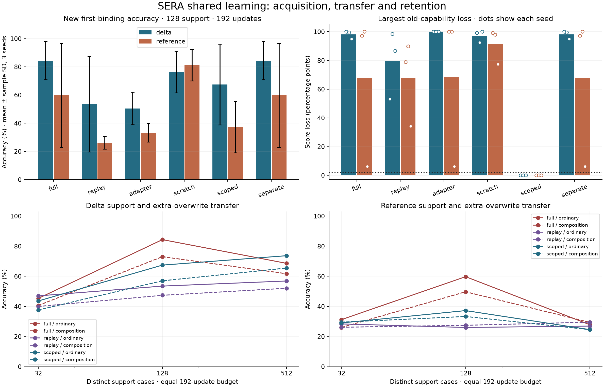

# SERA 0.5 shared-learner study

I built and trained one R1 parameter owner for world prediction, typed tasks and sequence inference. I compared the associative core with the handbook-sized reference, repaired numerical failures and destructive adaptation, and tested a persistent corrective update. The original experiments, failures and alternative models remain preserved.

The [source audit](shared-source-audit.md) maps the implementation to the packet. The [protocol and amendment](../research/shared-learner-protocol.md) distinguish the first frozen attempt from the repaired follow-up. [Machine-readable evidence](shared-learner-data.json) includes per-seed scores, validation curves, costs, checkpoint identities and preservation records.

## What I taught

Each core received 1,600 joint updates at batch size 32: 12,800 world-trajectory draws, 12,800 sequence draws and 25,600 typed-example draws. The fixed stream order was world, sequence, typed, typed. World supervision used visible sensor/action/reward data; hidden simulator states were reserved for scoring. Typed support contained 192 examples for each of seven tasks plus 512 explicitly instructed latest-binding examples. Sequence training covered marked retrieval, latest binding, ordered control and majority counting. Motion targets used meters. Arithmetic procedures were selected separately from a supplied 21-candidate grammar.

The new rule requested the first value assigned to an entity, despite later different assignments. Instructions explicitly distinguished first from latest. Every query-key overwrite changed the first/latest answer. The six-write training family was tested on six writes, twelve writes, and eight writes with an extra query-key overwrite. No query labels updated weights or chose checkpoints.

## Pretraining performance

| Shared core | Parameters | Core bytes | World prediction | Finite goal success | Legacy four-task mean |
|---|---:|---:|---:|---:|---:|
| delta | 1,003,808 | 32,768 | 90.29 ± 0.47 | 97.22 ± 4.81 | 79.65 ± 1.37 |
| reference | 1,253,606 | 35,840 | 92.44 ± 1.42 | 97.22 ± 4.81 | 80.14 ± 2.74 |

Values are percentages, mean ± sample standard deviation across three seeds. World prediction uses masked 12-step episodes in the trained world; goal success covers the twelve finite unequal start/goal pairs. It is not general-world planning accuracy.

| Typed task, neural route | Delta ID | Reference ID | Delta composition | Reference composition |
|---|---:|---:|---:|---:|
| modular_sum | 26.30 ± 3.25 | 26.56 ± 4.75 | 25.52 ± 2.96 | 24.22 ± 4.06 |
| spatial_relation | 95.57 ± 3.25 | 94.01 ± 8.35 | 83.07 ± 13.29 | 89.84 ± 6.94 |
| byte_sum | 23.96 ± 3.61 | 24.48 ± 4.51 | 23.44 ± 3.41 | 24.74 ± 1.19 |
| patch_quadrant | 100.00 ± 0.00 | 100.00 ± 0.00 | 100.00 ± 0.00 | 100.00 ± 0.00 |
| tone | 88.54 ± 2.39 | 97.66 ± 0.00 | 84.11 ± 1.19 | 89.58 ± 2.74 |
| motion | 95.87 ± 1.02 | 93.64 ± 0.85 | 96.28 ± 1.26 | 94.17 ± 0.33 |
| binding | 100.00 ± 0.00 | 76.04 ± 41.50 | 100.00 ± 0.00 | 74.48 ± 44.20 |

Motion uses `exp(-MSE)` rather than classification accuracy. Neural arithmetic and procedure-assisted arithmetic are separate measurements; detailed route scores are in the JSON evidence.

## Corrective learning and retention

All following controls use 192 updates, batch size 32 and identical support/validation pools within a seed. Replay uses 16 new and 16 retained examples per update; other trained controls use 32 new examples. No-update baselines use no correction. The scoped condition trains only low-rank weight residuals on the supplied first-binding input scope. The separate condition reuses full-update typed weights while preserving a second frozen owner for world/sequence outputs.

| Core | Method | Support | Ordinary | Long | Extra overwrite | Worst old loss | Retention passes |
|---|---|---:|---:|---:|---:|---:|---:|
| delta | no update | 0 | 0.00 ± 0.00 | 0.00 ± 0.00 | 0.00 ± 0.00 | 0.00 | 3/3 |
| reference | no update | 0 | 8.98 ± 15.56 | 6.77 ± 11.73 | 8.85 ± 15.34 | 0.00 | 3/3 |
| delta | full | 32 | 45.31 ± 12.11 | 43.36 ± 6.39 | 40.62 ± 6.78 | 85.03 ± 8.29 | 0/3 |
| delta | replay | 32 | 47.01 ± 13.73 | 40.10 ± 15.46 | 39.97 ± 8.69 | 56.12 ± 15.69 | 0/3 |
| delta | adapter | 32 | 43.75 ± 8.13 | 41.80 ± 9.24 | 36.07 ± 6.56 | 100.00 ± 0.00 | 0/3 |
| delta | scratch | 32 | 27.08 ± 1.37 | 25.13 ± 1.13 | 25.78 ± 3.20 | 86.72 ± 11.61 | 0/3 |
| delta | scoped | 32 | 43.62 ± 10.57 | 38.41 ± 15.23 | 37.63 ± 11.72 | 0.00 ± 0.00 | 3/3 |
| delta | separate | 32 | 45.31 ± 12.11 | 43.36 ± 6.39 | 40.62 ± 6.78 | 85.03 ± 8.29 | 0/3 |
| delta | full | 128 | 84.38 ± 13.54 | 74.35 ± 22.26 | 73.05 ± 6.91 | 98.18 ± 2.83 | 0/3 |
| delta | replay | 128 | 53.52 ± 33.91 | 50.39 ± 29.77 | 47.40 ± 21.43 | 79.43 ± 23.52 | 0/3 |
| delta | adapter | 128 | 50.39 ± 11.50 | 46.61 ± 6.59 | 36.72 ± 5.91 | 100.00 ± 0.00 | 0/3 |
| delta | scratch | 128 | 76.30 ± 14.65 | 71.22 ± 12.79 | 61.07 ± 3.41 | 97.27 ± 4.08 | 0/3 |
| delta | scoped | 128 | 67.45 ± 28.64 | 60.16 ± 34.82 | 57.03 ± 20.59 | 0.00 ± 0.00 | 3/3 |
| delta | separate | 128 | 84.38 ± 13.54 | 74.35 ± 22.26 | 73.05 ± 6.91 | 98.18 ± 2.83 | 0/3 |
| delta | full | 512 | 68.62 ± 35.92 | 70.05 ± 35.82 | 61.72 ± 21.62 | 100.00 ± 0.00 | 0/3 |
| delta | replay | 512 | 56.90 ± 23.93 | 52.60 ± 25.10 | 52.08 ± 16.04 | 95.05 ± 2.51 | 0/3 |
| delta | adapter | 512 | 54.30 ± 12.68 | 49.48 ± 15.09 | 36.07 ± 2.98 | 100.00 ± 0.00 | 0/3 |
| delta | scratch | 512 | 56.38 ± 10.73 | 48.18 ± 11.22 | 53.78 ± 9.12 | 91.02 ± 3.73 | 0/3 |
| delta | scoped | 512 | 73.70 ± 42.88 | 67.19 ± 39.80 | 65.49 ± 33.25 | 0.00 ± 0.00 | 3/3 |
| delta | separate | 512 | 68.62 ± 35.92 | 70.05 ± 35.82 | 61.72 ± 21.62 | 100.00 ± 0.00 | 0/3 |
| reference | full | 32 | 31.25 ± 8.01 | 29.04 ± 3.03 | 26.04 ± 8.01 | 62.37 ± 49.88 | 0/3 |
| reference | replay | 32 | 28.39 ± 5.67 | 26.82 ± 2.15 | 26.17 ± 3.10 | 58.85 ± 44.64 | 0/3 |
| reference | adapter | 32 | 34.24 ± 10.26 | 29.56 ± 1.37 | 28.78 ± 10.76 | 68.49 ± 54.58 | 0/3 |
| reference | scratch | 32 | 26.95 ± 0.39 | 26.82 ± 4.85 | 26.56 ± 2.38 | 78.52 ± 1.17 | 0/3 |
| reference | scoped | 32 | 29.04 ± 8.57 | 31.12 ± 1.97 | 29.56 ± 10.45 | 0.00 ± 0.00 | 3/3 |
| reference | separate | 32 | 31.25 ± 8.01 | 29.04 ± 3.03 | 26.04 ± 8.01 | 62.37 ± 49.88 | 0/3 |
| reference | full | 128 | 59.77 ± 36.87 | 55.47 ± 37.22 | 49.74 ± 24.04 | 67.84 ± 53.35 | 0/3 |
| reference | replay | 128 | 26.04 ± 4.49 | 24.48 ± 4.53 | 27.47 ± 0.81 | 67.65 ± 29.48 | 0/3 |
| reference | adapter | 128 | 33.20 ± 6.68 | 34.24 ± 9.68 | 33.59 ± 6.06 | 68.75 ± 54.13 | 0/3 |
| reference | scratch | 128 | 81.12 ± 11.11 | 77.08 ± 14.43 | 66.93 ± 6.61 | 91.54 ± 12.31 | 0/3 |
| reference | scoped | 128 | 37.24 ± 18.16 | 32.29 ± 13.99 | 33.33 ± 17.67 | 0.00 ± 0.00 | 3/3 |
| reference | separate | 128 | 59.77 ± 36.87 | 55.47 ± 37.22 | 49.74 ± 24.04 | 67.84 ± 53.35 | 0/3 |
| reference | full | 512 | 27.86 ± 4.73 | 25.91 ± 5.02 | 29.43 ± 2.60 | 61.72 ± 49.10 | 0/3 |
| reference | replay | 512 | 26.95 ± 3.20 | 24.61 ± 2.82 | 29.56 ± 2.83 | 67.39 ± 29.13 | 0/3 |
| reference | adapter | 512 | 33.07 ± 9.23 | 34.51 ± 6.25 | 30.60 ± 12.96 | 68.49 ± 54.58 | 0/3 |
| reference | scratch | 512 | 70.83 ± 25.29 | 68.36 ± 24.42 | 59.38 ± 17.40 | 87.50 ± 8.93 | 0/3 |
| reference | scoped | 512 | 24.61 ± 2.17 | 24.74 ± 3.03 | 24.61 ± 7.13 | 0.00 ± 0.00 | 3/3 |
| reference | separate | 512 | 27.86 ± 4.73 | 25.91 ± 5.02 | 29.43 ± 2.60 | 61.72 ± 49.10 | 0/3 |

Worst old loss is the largest loss among 34 individually scored capabilities in each seed, then averaged across seeds. The empirical limit is 2 percentage points. These fixed-suite comparisons are descriptive and do not promote models. Scoped retention outside its applicability domain follows from unchanged computation; its novel-task success must still be learned and evaluated. Three seeds provide limited uncertainty estimates. Equal update/example budgets do not imply equal FLOPs, parameters or CPU time. Replay uses a fixed schedule and novel-only checkpoint criterion; tuning retention-aware selection or loss weights remains untested.

| Core | Base/full/replay/scratch parameters | Global adapter total | Scoped total | Separate-model total |
|---|---:|---:|---:|---:|
| delta | 1,003,808 | 1,007,904 (+4,096) | 1,070,354 (+66,546) | 2,007,616 |
| reference | 1,253,606 | 1,257,702 (+4,096) | 1,367,792 (+114,186) | 2,507,212 |

Adapter ranks and affected weights differ: the global adapter has rank 8 at fusion, while scoped residuals have rank at most 16 across eligible core projections. The separate control retains two complete owners; a pruned expert was not tested. These are implemented-control costs, not capacity-matched architecture claims.

## Persistent solver result

The preselected seed-0 delta solver trained a fresh bounded R2 instrument and finite intervention selector, then attempted 1,024 scoped corrective updates using 128 support cases. Its fresh admission result was **promoted**. The cumulative round was 0; current version is `v1`. This longer update is separate from the 192-update table. The binding correction uses an explicitly selected scoped method; the learned controller covers world interventions.

| Fresh first-binding test | Before | After | After NLL | After Brier |
|---|---:|---:|---:|---:|
| ordinary | 0.00% | 100.00% | 0.0158 | 0.0035 |
| long | 0.00% | 91.02% | 0.2835 | 0.1404 |
| composition | 0.00% | 70.61% | 1.1259 | 0.4954 |

The mean paired gain was 87.21 points and its conservative lower bound was 82.31 points across 3,072 independent objective examples. The largest retained-capability loss was 0.0000 points. Latest-binding Brier quality and accuracy were checked separately. Parents, rejected candidates, original evidence and cumulative decisions remain available.

The controller was freshly fitted to eight measured training episodes and three validation episodes, then checked on four reset-family episodes. Its mean test utility was 0.2374; fixed replay scored 0.2599. Utility includes new-world improvement, old-world loss and the declared operation-cost penalty; it is not accuracy. The learned selector did not beat fixed replay here. It remains a selector trained against a fixed initial solver; this is not evidence of sustained sequential meta-improvement.

## Costs and failures

| Invocation group | Summed process CPU seconds | Summed invocation wall seconds | Maximum process peak MiB |
|---|---:|---:|---:|
| Initial attempt: three completed delta, three failed reference | 1492.23 | 1496.93 | 396.21 |
| Repaired six-trial comparison | 5787.64 | 5806.04 | 416.80 |
| R2/controller assembly and ordinary correction | 325.81 | 327.33 | 375.52 |

Seeds ran concurrently with one CPU thread per process. Summed invocation wall times are not elapsed calendar time, and peak RSS is a process high-water mark. Nested correction costs are already included in assembly. Phase counts, validation and evaluation work remain in raw records; heterogeneous operation sums are not FLOPs. Independent verification is separate from these training/assembly totals. Initial failed assembly, the first delta replay audits and some scoped development pilots lack measured elapsed/CPU costs; implementation labor, energy and external costs are also unmeasured. These omissions prevent a claim of complete research cost or research acceleration.

The first reference runs stopped on non-finite gradients. The repaired reference uses a documented frozen-projector gradient approximation and clamped mixture gates. Initial full/replay delta updates exposed destructive retention; the scoped method addresses the observed failure with a supplied applicability boundary. Program acquisition also exposed overdepth candidate wrapping, now rejected before execution. Every earlier result and failure remains labeled; repeated delta seeds are not counted as additional independent evidence.

## Verification and remaining research

All 114 saved inference conditions were reconstructed and replayed; 108 fixed-suite decisions were recalculated. The audit checks exact score vectors, neural/calibration reports, semantic partition separation, checkpoint hashes and shared ownership. The separate live verification repeats promotion scoring and checks restored ordinary inference. Preservation accounts for 2,130 original files, with no missing or unpreserved changes.

All 71 local tests passed. The installable 0.5.0 wheel was built in a fresh directory and installed into an isolated target. Its source hash matches the training code, and it restores the shared R1/R2 solver with the same parameter owner. The original archive and handbook hashes were checked again against the supplied files.

The shared R1 defect is repaired in the new variants. Broad learned representations, calibrated stochastic planning, general program abstraction, compatible model growth, external evaluator isolation and coupled learner/improver improvement remain open. The [source audit](shared-source-audit.md) states these limits explicitly. Earlier HMM, hybrid, compact-world and typed models remain useful research records; their task protocols differ and should not be pooled into a single model ranking.
