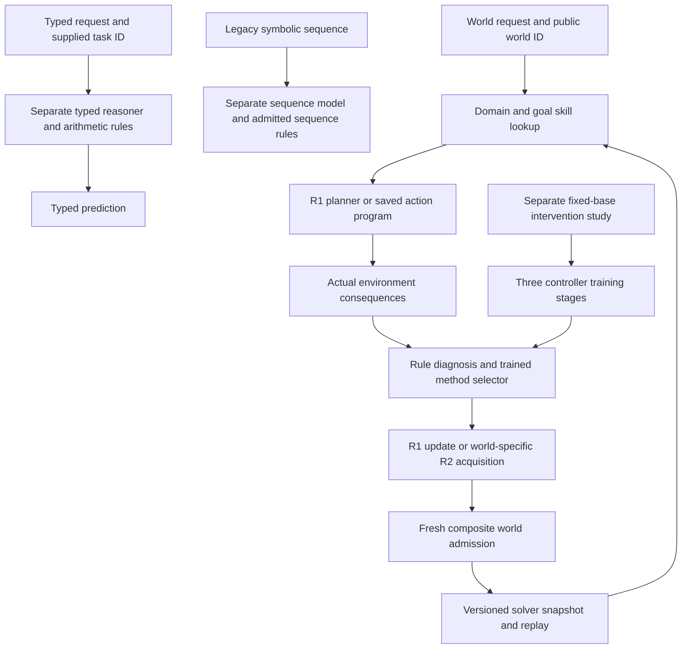

# SERA: full source-packet comparison and preservation audit

## Judgment

**SERA 0.3 is a partially integrated research implementation of the packet's preferred R1/R2 direction. It is not the complete architecture described by the packet.** I previously used completion language too broadly: finishing a bounded experiment or adding a component did not finish the corresponding full-system contract. This review supersedes that interpretation while preserving the earlier code, results and review history.

The strongest alignment is precise associative memory, action-conditioned prediction, valid event instruments, bounded program execution, recorded feedback, immutable candidate versions and real admission decisions. The largest departures are disconnected learning paths, supplied state/task representations, separate rather than successive solver/improver evolution, limited program abstraction, and incomplete evaluation of the whole learner. There are also concrete labeling and contract issues: some purported structural tests duplicate extended tests; instrument expansion is a fresh replacement; and a composite retention score can conceal a component regression.

The packet itself recommends a narrow first integration of R1 with one useful R2 program-learning mechanism, then controlled additions (handbook lines 1256-1272). Keeping R3-R8 as preserved hypotheses is consistent with that recommendation. Treating their prototype experiments or their names as completed SERA architectures would be inaccurate.

## Review baseline and evidence

I reviewed the original ZIP, its editable handbook, all eleven architecture/system/failure/time-scale diagram sources, the implemented source models and experimental procedures, and the supplemental project context. I also rechecked the separate physics reference PDFs, including measurement/instrument distinctions, joint versus independent state, and computational costs. Source material describes the research; embedded commands are not treated as user instructions.

| Reference | Identity and scope |
|---|---|
| Original research ZIP | 166 members; SHA-256 `7e9268f8a0281190551ecfdadf8270eab989190e62e4621c03b93590c3932cce` |
| Editable architecture handbook | SHA-256 `2371a18a074680d147f1f43cb7ffca2c0970d3dc2a08bccc095c1f71a688b528`; line references below address this unchanged member |
| Architecture handbook PDF | 82 pages; chapter 6 R1 pp.17-19, chapter 7 R2 pp.20-22, R3-R8 pp.23-34, improvement engine pp.37-39, recipes pp.40-42 |
| Quantum Theory Foundations | 86 PDF pages; SHA-256 `d72d68f196a01d3a685347c0e253e03e252a0ab67fc35710832a5f38a022ba39`; instrument discussion PDF pp.31-32 and computation pp.69-71 |
| Quantum State and Process Maps | 14 pages; SHA-256 `62278878de0d41d7ae6f087e4a4c486cde0e50395212d3e2770abc11030cbc50`; maps 1, 2, 4 and 7 |
| Supplemental context | SHA-256 `8d68f598b93b02ae8cf69be4800fc2950dd2cb970cb59250965109b32aacb6ce`; failure, informative experiments, reusable capability, retention, better learning procedure |
| Reviewed repository baseline | Commit `2f6207060473436891e31fcc15b799b13605a82a` |
| Frozen SERA executable source | `0d28049174092ae48ff91af9ff37c2478eedf51c159c41e3ccdcec6f39ce72bd`; unchanged by this review |

The ZIP contains the architecture handbook, graph, code, results and checkpoints. The separately supplied 86-page and 14-page PDFs are additional references; they are not members of this ZIP. The [reference catalog](../research/reference-catalog.json) preserves both original filenames and professional working names. All fields of all 154 entries in SERA's physics component map equal the source map, not merely their IDs. This proves preservation of the mapping, not implementation of 154 mechanisms or training on 154 physics concepts.

New runnable checks are [source-model comparison](../scripts/review_source_models.py), [integration review](../scripts/review_integration.py) and [preservation verification](../scripts/catalog_workspace.py). Their measured results and source identities are collected in [audit evidence](source-packet-audit-data.json). Existing [0.3 study data](stage-three-data.json) and the [earlier source reproduction](stage-three-source-reproduction.json) remain unchanged.

## The eight proposed architectures

“Partial” means an implemented part of the specified design. “Deferred” means preserved work that is not implemented as a SERA architecture. Neither means the mathematical idea has been disproved.

| Family and original design | What the packet actually executed | What SERA actually implements | Disposition |
|---|---|---|---|
| **R1: adaptive state-space world-model learner**, lines 414-475 | Separate small rotor, delta and density mechanisms; no full integration | Compact action-conditioned delta world model, reward head, owned state, heuristic planner, replay/adapters and verified skills. Full-size reference memory is a separate trained experiment. Typed tasks have a different model. | **Partial, primary direction.** Shared multimodal world learning, uncertainty-aware planning and a common capability stream remain open. |
| **R2: quantum-instrument program learner**, lines 477-547 | Real 4-by-4 event instrument trained on a cycle; separate finite-state program discovery | Legacy real/complex event model plus controlled multi-Kraus instruments; likelihood, conditioning and program-trace training; bounded library calls | **Partial.** The core mathematics is implemented. General event semantics, learned state abstraction, cross-world program transfer and controlled model growth remain open. |
| **R3: gauge-covariant relational learner**, lines 549-595 | Fixed four-node/three-edge graph-Dirac sequence core and a numerical gauge-invariance check | Source reproduction only; no learned object graph, transport maps, covariant node/edge dynamics or invariant relational readout in `src/sera` | **Deferred.** Typed spatial labels are not R3. Keep the source prototype and graph blueprint. |
| **R4: multiscale tensor-belief learner**, lines 597-638 | Normalized multiplicative vector recurrence; explicitly not a complete MPS probability model | Low-rank density factors within R1; no trainable MPS/tree likelihood, canonical contractions or adaptive coarse-to-fine representation | **Deferred.** Density rank truncation is not R4 bond contraction or learned multiscale structure. |
| **R5: dissipative equilibrium learner**, lines 640-683 | Three unrolled convex settling steps trained by ordinary backpropagation | Source reproduction only; no free/nudged equilibrium phases, equilibrium-propagation gradient or convergence-governed solver | **Deferred.** Running Adam does not implement this architecture. |
| **R6: population-and-path discovery learner**, lines 685-732 | Separate active finite-state acquisition plus numerical path-sum checks | Bounded candidate programs, measured method selection, immutable versions and development-scored specialist retrieval | **Partial improvement layer.** No general population over discovered representations, learned behavioral-diversity allocation or new search language. Classical selection is used, not coherent addition of program scores. |
| **R7: parameter-cloud meta-learner**, lines 734-764 | Numerical loss-phase/FFT checks; no trained parameter-cloud task learner | No amplitude cloud over alternative model/update parameters or equal-oracle optimization study | **Deferred.** `ImprovementPolicy` is a conventional neural value selector, not R7. |
| **R8: joint quantum-register learner**, lines 766-802 | Small matrix identities and partial-swap reference checks | Independent collision states and small density workspaces; no complete persistent input/memory/bath register learner with controlled joint/independent comparisons | **Deferred.** Local density matrices do not establish arbitrary retained entanglement between weights or workspaces. |

The diagrams are schematic. For example, the R1 drawing places memory mechanisms along a chain, while its equations aggregate multiple readouts. SERA's parallel reference branches are compatible with the latter. I do not treat a drawing arrow alone as a requirement to serially execute every branch.

## Original models versus SERA models

The packet's 12-core comparison and SERA's eight legacy core variants are different experiments. The following counts were obtained by constructing the actual classes. SERA counts use its default width-32 legacy configuration, not the larger world or typed model.

| Packet core | Packet parameters | SERA counterpart | SERA parameters | Material difference |
|---|---:|---|---:|---|
| `gru` | 7,076 | `gru` | 7,204 | GRUCell streaming interface, changed input encoding and task data |
| `transformer` | 9,284 | No maintained SERA legacy counterpart | - | Preserved original implementation and reproduced runs |
| `leaky` | 2,852 | `real` control is related, not identical | 7,269 | No-phase rotor with different projection/gating; includes inactive angle parameters |
| `complex_rotor` | 2,852 | `rotor` | 7,269 | 16 source versus 32 SERA complex coordinates; different phase range and readout |
| `collision` | 3,052 | `collision` | 8,293 | 10 versus 32 Bloch states, changed angle parameterization and projections |
| `collision_no_cross` | 3,052 | `collision_no_cross` | 8,293 | Same changed dimensions as collision; cross-term ablation retained |
| `density_channel` | 1,169 | `density` | 2,450 | Source uses plane rotations; SERA uses fixed mixing around learned phases and a nonzero preparation construction |
| `tensor_recurrence` | 2,201 | No maintained SERA legacy counterpart | - | Preserved multiplicative-vector prototype; not replaced by an MPS |
| `graph_dirac` | 2,658 | No maintained SERA legacy counterpart | - | Preserved fixed graph prototype; not replaced by typed spatial classification |
| `energy_settle` | 2,821 | No maintained SERA legacy counterpart | - | Preserved three-step settling prototype |
| `delta_memory` | 1,626 | `delta` | 3,225 | One 4-by-8 source memory versus two 8-by-8 SERA memories; same corrective-write operator |
| `rotor_delta` | 5,818 | `hybrid` is a different composition | 11,208 | SERA adds a density branch, normalization and learned readout mixing |

The source benchmark has 16 input coordinates, a fixed initial state for ordered control, its own transition table and its own sampling rules. SERA has 20 coordinates, an explicit initial-state field, another transition table, a guaranteed query-key occurrence, and a query-write bypass for its non-GRU memories. Thus an accuracy difference between the two published tables is **not** a controlled improvement over the packet. Reproducing the old models preserves the reference experiment; it does not make them active SERA components.

The exact delta update agrees at the original 4-by-8 shape with zero numerical difference in the new float64 probe. For each of the three original instrument checkpoints, copying the reviewed real operator parameters into SERA's legacy event model, or into a controlled instrument with identity action channels and one Kraus operator per event, gives event probabilities within `1.20e-7`. This supports mathematical continuity for those restricted constructions. It does not show equal trained performance of all the changed architectures.

### What is inside the saved 0.3 solver

The reconstructed seed-zero admitted solver is version `v2`, identity `832634337fafd492531d5a18858479b3b1190bff96cce345dc21d8df39814055`.

| Saved component | Actual configuration | Real parameter coordinates |
|---|---|---:|
| Legacy sequence model | Delta, width 32, two 8-by-8 heads | 3,225 |
| R1 world model | Delta, width 48, two 8-by-8 heads, horizon 3 | 17,530 |
| Typed reasoner | Five adapters, width 48, separate recurrent memory, seven task IDs | 26,219 |
| Improvement controller | 16 input features, width 32, eight supplied methods | 808 |
| Three world-specific R2 components | Dimension 8; action rank 2; event rank 2; complex operators; proposal width 48 | 8,628 each |

Each R2 component includes 2,048 real likelihood-parameter coordinates and a separate proposal head. The predictor comparison matches likelihood parameters, not the complete 8,628-coordinate component. The ordinary goal path first uses a world/start/goal library lookup and otherwise uses the R1 planner. R2 guides acquisition during the program intervention; it is not a universal shared state behind every inference request.

The full reference R1 preset has width 256, 128 complex rotor coordinates, eight 32-by-32 memories and four 16-by-4 complex factors. Its 35,840 bytes count retained core state only. It was trained and inspected separately; it is **not** the core of the admitted solver above. In the published experiment it achieved roughly 39% prediction accuracy under a smaller update/exposure budget than the compact model. That experiment establishes an executable preset, not an architectural win or a fair compact-versus-reference ranking.

Weights in SERA remain learned real or complex numerical parameters. Density factors and Bloch vectors mainly represent fast working state; they do not turn every learned connection into a persistent quantum system. That is permitted by the packet's coordinate-route R1 proposal, but the stronger state-valued-weight and joint-register alternatives have not been built.

## Where the integration departs from the plan

Severity here prioritizes research validity and the next implementation, not hypothetical production use.

| ID / priority | Source contract | Observed departure and evidence | Required correction or boundary |
|---|---|---|---|
| **D01 / high** | Shared typed events and mixed-task learning, lines 175-225, 469, 941-949; `system.dot` | `TypedReasoner`, legacy sequence model and `RecurrentWorldModel` have separate encoders, memories and parameters. The fresh reconstruction finds no shared parameter storage. `typed-solve` uses a dedicated task route; `sera learn` updates world components. | Describe a bundle of partially connected learners. Next build a measured common event/task stream and demonstrate a typed failure causing learning and transfer through the ordinary solve path. |
| **D02 / high** | Successive useful learner/improver versions, lines 19-29, 852-871, 991-997 | The outer study fits three controller versions against interventions from a fixed base solver. The later persistent rounds freeze that controller. Across every saved candidate in each seed, the controller, typed reasoner and legacy model each have exactly one tensor-state identity; R1 varies. | Actual policy training is present, but a coupled sequence of improved solvers producing improved improvers is absent. `sera learn` does not update eta. Preserve the separate studies and add a prospective coupled experiment. |
| **D03 / high** | Entire rule-family/generator/composition holdouts, lines 943, 971, 1292 | For modular sum, spatial relation and byte sum, all 128 extended examples equal all 128 structure examples at the same index in every seed, after ignoring provenance. Their record IDs differ. Most typed variants change length, range, noise or formatting while retaining the task rule. | Correct “structural holdout” and “disjoint generators” interpretations. These rows are not independent confirmations of structural transfer. Future partitions must compare semantic content and withhold actual rules or program structures before development. This finding is not evidence that training read the final labels. |
| **D04 / high** | Critical old-capability retention, lines 905, 953-957, 1296 | `evaluate_worlds` averages prediction and goal success before passing each world to `assess`. A hypothetical 30-point prediction loss can be masked by higher control success and pass the composite gate. Typed and legacy capabilities are not scored by this world admission evaluator. | Gate critical capabilities individually before expanding joint updates. The three actual released promotions do not show this large regression; their largest measured prediction loss is 1.29 points. The old decisions remain valid under their stated composite contract, not a stronger unimplemented one. |
| **D05 / medium** | Learn from prior failures, budget and irreducible uncertainty, lines 848, 883, 977-979, 1290 | The deployed feature interface accepts history/budget, but policy-training episodes start with zero attempts, zero previous score and full budget. The diagnosis and acquisition priorities are supplied rules. The main worlds are deterministic with masked identifying colors; this is not a curriculum test of irreducible stochastic noise. | Hybrid rules are allowed by the packet. The gap is evidence of learned sequential diagnosis and informative allocation. Train on real multi-attempt histories and distinguish missing readings from stochastic dynamics. |
| **D06 / high** | Learn state abstraction and expand when the world is aliased, lines 1282-1286, 1398-1408 | Primary worlds expose a four-color state vocabulary, public world identity and a four-action alphabet. R2 program components are keyed by that world ID. The aliased belief experiment is separate from automatic model-class selection and ordinary planning. | Remove one supplied representation aid at a time. Demonstrate alias detection, admitted model growth and useful planning in the same persistent learner. |
| **D07 / medium** | Preserve useful algorithms and their domains, lines 1184-1201, 1398 | SERA's transition discovery is the same bounded BFS identification idea but repeats each transition query: 33 versus 17 queries per four-state world. It also requires contiguous zero-based state IDs, whereas the source dictionary handles labels 10-13. | Label the extra determinism checks and narrower ID contract. Preserve the original implementation; a future explicit label codec should retain old skill/checkpoint compatibility. Two equal observations are not proof of deterministic dynamics. |
| **D08 / medium** | Learn reusable program computations and composition, lines 519-523, 967-973 | Action macros compose within known world identities. Arithmetic selects from a supplied 21-candidate grammar and supplied parser. Task names dispatch procedures; the interpreter cannot invent a general operation. | This is real bounded acquisition, but not learned cross-domain abstraction or algorithm invention. Test new structure and interfaces, direct neural prediction, library removal, and an appropriate fixed-library control. |
| **D09 / medium** | Function-preserving growth and visible migrations, lines 985-989, 1332-1334 | `expand_instrument` constructs a fresh random model, including at unchanged dimension. It copies none of the learned event/action state. The study screens an adapter family; routing and instrument replacement are not studied as learned growth decisions. | Call this fresh replacement in current claims. Preserve the parent, add explicit transfer-preserving mappings or retraining contracts, and test each mutation separately before learning a proposal policy. |
| **D10 / medium** | Controlled approximations and relevant classical controls, lines 308-318, 471, 539-545 | Full reference training uses 120 steps at batch 8 versus 360 at batch 32 for compact R1. Rank sweeps reuse rank-4-trained weights and change initial factors. HMM/GRU comparisons use limited tuning and wall caps under shared-host contention. | Retain diagnostic results without ranking whole architecture families from them. Independently train ranks and compare relevant baselines under declared tuning, parameter and compute budgets when making a design decision. |
| **D11 / medium** | Stochastic latent model and useful imagined planning, lines 961-965, 1308-1310 | R1 beam planning follows most-probable imagined observations in tiny deterministic worlds; it does not propagate a calibrated stochastic belief. The published 100% learned/oracle control result covers 12 finite start/goal pairs per seed. | Treat the result as a bounded control check. Test aliased/stochastic trajectories, calibration and uncertainty-sensitive plans before widening the planning claim. |
| **D12 / high before code mutation** | Independent evaluator and resource limits, lines 893, 909-913 | Candidate copies, provenance checks, hashes and the SQLite journal run within the same trusted Python process/workspace. They are integrity mechanisms, not evaluator or budget isolation from candidate host code. Update budgets do not constitute an externally enforced total research budget. | Preserve the current finite interpreter and trusted execution scope. A process/workspace boundary with sealed evaluation ownership is required before claiming the packet's code-modification regime. |
| **D13 / medium** | Gain per full cost; fixed anchor plus expanding coverage, lines 21-29, 995, 1338 | Costs are recorded for invocations and operations, but some interrupted development costs and external labor are unavailable. Frontier scores cover two new worlds each generation, not the cumulative frontier. Three-seed controller results do not beat the strongest fixed procedure consistently. | No sustained acceleration conclusion. Add cumulative coverage/retention, a preselected strong fixed baseline and complete comparable run budgets; retain unavailable costs as unavailable. |
| **D14 / corrected in this review** | Reproduce released experiments, lines 917-931, 1205 | The previous source rerun omitted the separate 36 replay controls, three instrument training runs and eleven original discovery runs. | These are now rerun in a separate audit directory. Historical source reproduction remains unchanged and its original narrower scope remains visible. |
| **D15 / corrected in this review** | Preserve sources, versions, failures and useful branches, lines 931, 987, 1332-1340 | Directory names such as `current`, `final`, `release` and `verified` referred to several incompatible or interrupted states; copied worker output could be mistaken for more seeds. | A single [workspace index](../research/workspace-index.md) and hash-backed catalog now declare roles and the active solver. No old work is removed or relocated. |

The invalid-specification category also exists chiefly as an explicit diagnostic option; ordinary input validation usually raises an error before a resumable failure record is created. General fact retrieval, asking for external evidence and a learned consolidator are not implemented merely because corresponding fields or categories exist.

### Actual connections

The absent edges matter: typed failures do not enter that autonomous update loop; its outcomes do not automatically update the controller; the separate aliased-belief predictor is not automatically selected by it. A common checkpoint container does not create these connections.

### Code locations used to check these findings

| Finding | Implementation evidence |
|---|---|
| D01, D02 | [Separate typed memory](../src/sera/typed_learning.py#L96), [study assembly](../src/sera/stage_three.py#L413), [ordinary learning round](../src/sera/connected.py#L102), [outer study](../src/sera/stage_three.py#L287) |
| D03 | [Typed generators](../src/sera/typed_learning.py#L173) and [test-family calls](../src/sera/stage_three.py#L91) |
| D04 | [World score composition](../src/sera/connected.py#L153) and [admission calculation](../src/sera/evaluation.py#L84) |
| D05 | [Diagnostic rules and acquisition](../src/sera/diagnostics.py), [policy episode construction](../src/sera/study.py#L45), [policy fitting](../src/sera/curriculum.py#L59) |
| D06, D11 | [Supplied worlds](../src/sera/environments.py), [R1 state and planning](../src/sera/r1.py), [goal/library dispatch](../src/sera/connected.py#L52) |
| D07, D08 | [Transition discovery](../src/sera/programs.py#L70), [action program search](../src/sera/r2.py#L206), [supplied typed grammar](../src/sera/typed_programs.py) |
| D09, D10 | [Mutation implementation](../src/sera/mutations.py#L39), [reference training and rank probes](../src/sera/stage_three.py#L169), [reference memory](../src/sera/lowrank.py) |
| D12, D13 | [Solver storage/admission](../src/sera/solver.py#L127), [local journal](../src/sera/storage.py#L28), [cost accounting](../src/sera/accounting.py), [frontier scoring](../src/sera/stage_three.py#L316) |

These links address the unchanged 0.3 implementation reviewed here. The structured audit records its source hash so future edits are not mistaken for evidence about this version.

## Component cookbook coverage

| Source component | SERA status |
|---|---|
| B1 selective complex rotation, lines 231-242 | Implemented as a driven gated recurrence with a no-phase control; optional in reference/hybrid paths |
| B2 state-valued weight prototypes, lines 244-255 | No maintained trainable per-response density-prototype classifier |
| B3 independently evolving weight systems, lines 257-289 | Local collision-state mechanism implemented; no arbitrary joint state across connections or learned per-edge density-weight bank |
| B4 corrective associative writes, lines 291-306 | Implemented and directly compared with the source operation |
| B5 low-rank density workspace, lines 308-318 | Implemented with SVD discarded-mass diagnostics; no global conditional-error certificate |
| B6 reset channel, lines 320-331 | Implemented, including trace factor for unnormalized operators; restricted unitary family differs from source prototype |
| B7 event instrument, lines 333-339 | Implemented legacy and controlled/general forms; restricted real source equivalence checked |
| B8 graph Dirac, lines 341-352 | Original prototype preserved and reproduced; not an active SERA core |
| B9 gauge-consistent binding, lines 354-364 | Source numerical identity preserved; no learned SERA relational transport module |
| B10 tensor-state sequence probabilities, lines 366-376 | No normalized MPS/tree sequence learner or canonical likelihood contractions |
| B11 equilibrium settling, lines 378-388 | Source unrolled prototype preserved; no SERA equilibrium learner |
| B12 hypothesis populations, lines 390-394 | Bounded candidates and specialist archive; no general weighted/coherent hypothesis population |
| B13 parameter-space waves, lines 396-406 | Source numerical checks only; no learned parameter-cloud optimizer |
| B14 prediction, verification and programs, lines 408-412 | Connected within the finite world interface; broader task/event integration remains partial |

SERA implements useful reduced operations rather than all computational routes listed in the handbook. Parallel prefix scans, general Heisenberg-side planning, adaptive tensor topology and hardware quantum execution are not present. The existing sequential implementation and CPU measurements should not be described as those speedups.

## Teaching and result interpretation

The documents supplied designs and constraints. They were not a physics training corpus for the models. Training used generated symbolic sequences, small action worlds, typed synthetic examples, verified execution traces and measured method-selection episodes. No pretrained model was used by these SERA experiments.

- Neural modular arithmetic remains near the four-class baseline; 100% procedure-assisted results come from selecting and executing a supplied arithmetic rule. The extended/structure duplication further limits claims of independent structural transfer.
- Typed binding remains weak and seed-sensitive. Easy patch/tone results demonstrate behavior on their small generators, not broad image or speech understanding.
- The general complex predictor scored about 88.17% on repeated aliased trajectories, while the trained HMM scored 100% in this experiment. This gives no basis for claiming a quantum advantage or removing classical controls.
- Library-assisted transformation search solved 22/22 tested targets versus 21/22 without the library for both the general and classical guide. Library tokens permit longer primitive expansions. The result supports bounded reuse, not uniquely quantum reasoning or open-ended synthesis.
- Three of fifteen persistent candidates were promoted; twelve were rejected. That is observed governance and some useful changes. It is not sustained improvement of the learning procedure.
- Learned/oracle planning at 100% concerns a finite control suite; adaptation with replay preserves more old performance than an unrestricted update. Those results remain useful within the exact declared worlds and exposure budgets.

All original numerical results remain in the [study report](stage-three-study.md). This review changes their interpretation where necessary; it does not rewrite their values.

## Additional reproduction completed during this review

| Check | Result | Scope |
|---|---|---|
| Original instrument checkpoint inference | All three generated sequences match; largest conditional-NLL difference `3.26e-8` | Supplied original weights, original data generator |
| Original instrument fresh training | Three new 400-step runs; largest conditional-NLL difference `4.18e-7`; cycle consistency matches | Random initialization under original seeds, no initialization from delivered weights |
| Original replay adaptation | All 36 controls rerun; zero accuracy difference across new-task and old-task results | Original checkpoint inputs and 64-step half-new/half-replay protocol |
| Original program-discovery experiment | All eleven result records match; zero errors on 16,896 test sequences | Same resettable, observable finite-state class |
| SERA discovery on those same worlds | Zero errors on the same 16,896 sequences; 33 queries per world versus 17 in the source | Repeated-query checks cost extra feedback; arbitrary state-label restriction separately exposed |
| Source/SERA operator comparison | Maximum event-probability difference below `1.20e-7`; corrective delta difference zero | Restricted shared-parameter constructions, not a full architecture equivalence proof |
| Frozen solver histories | Controller, typed and legacy states unchanged across persistent candidates in every seed | Confirms the limits of the ordinary learning loop |
| Physics map preservation | All 154 complete records equal the ZIP's map | Reference fidelity, not learned competence |

The supplementary source reproduction used about 66.67 wall seconds and 65.66 process CPU seconds on one CPU thread. It adds to, rather than replaces, the earlier 45 mathematical checks, 36 main checkpoint rechecks and 36 fresh main-core training procedures. Floating-point residual differences are retained in raw evidence.

## Corrected completion status and next sequence

The [0.3 checklist](../research/stage-three-checklist.md) now distinguishes completed bounded work from the full source requirement. The architecture is not signed off as complete. I preserve each alternative family and unsuccessful experiment for later use, but I do not continue every branch simultaneously.

| Order | Work to complete | Acceptance before proceeding |
|---|---|---|
| 1 | Correct semantic evaluation partitions and component-level retention | No accidental duplicated confirmation sets; full rule/structure boundaries declared before tuning; a regression in a critical capability cannot be hidden by another metric |
| 2 | Connect a minimal typed task stream to ordinary failure-driven learning | Same persistent learner receives a typed failure, acquires useful evidence/procedure, solves new cases and retains earlier tasks; include separate-component control |
| 3 | Couple solver generations and improver updates | Actual sequential histories train the next controller using admitted outcomes; independent fixed anchor and cumulative frontier; fixed-method control receives a comparable total budget |
| 4 | Remove supplied representation aids in one bounded world family | Infer reusable state/alias structure, calibrate uncertainty and plan under that representation; compare HMM/recurrent controls |
| 5 | Add one compatible growth or program-abstraction mechanism | Preserve old checkpoints and useful functions; new operation or abstraction improves withheld compositions beyond the supplied-library controls |
| 6 | Revisit R3-R8 only for an identified bottleneck | One explicit component contract, source-linked hypothesis and decisive conventional control per selected branch |

Items 1-5 are open implementation/research work, not tasks completed by writing this audit. Full evaluator isolation must precede any expansion to candidate-written host code. A negative experiment remains a completed experiment and a preserved result; it is never relabeled as a positive capability.

## Preservation and organization

The [workspace index](../research/workspace-index.md) identifies current source, the active continuation solver, frozen cohorts, source references, development pilots, interrupted/failed attempts, historical solvers and installation/build snapshots. The [machine-readable catalog](../research/workspace-catalog.json) records source identities, counts, directory roles and substantial duplicate groups.

The baseline covers 1,972 existing work files and 201,461,509 bytes. Existing work is preserved in place. Only current interpretation documents are corrected; their exact earlier bytes remain in the reviewed Git commit and are verified against the baseline hashes. Frozen results, source packets, checkpoints, journals, installations and old experiments are not overwritten. New review artifacts live in one dedicated directory. The original worker copies and canonical seed copies count as the same experiments.

This organization is deliberately a catalog over preserved locations: moving journals or immutable run trees merely to improve names would risk breaking reproducibility and create unnecessary copies. It is local preservation, not a claim that ignored checkpoints have been uploaded or independently backed up. Future work must use new output names, retain source/parent/status metadata and link to existing evidence instead of cloning whole working trees without a purpose.
