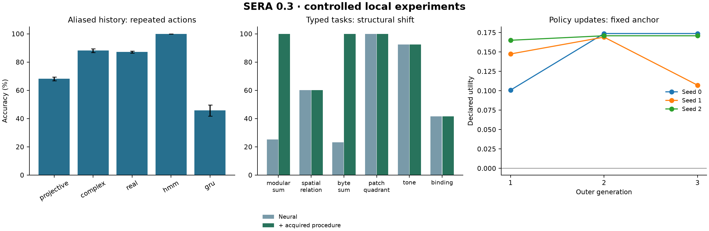

# SERA 0.3 teaching and performance study

I completed the next R1/R2 implementation stage and tested its behavior against the original architecture references. This report separates working software, measured learning and remaining research claims. Values below are means ± sample standard deviations across three independent seeds unless a count is shown. All final measurements use the source and configuration in the manifest.

Executable source SHA-256: `0d28049174092ae48ff91af9ff37c2478eedf51c159c41e3ccdcec6f39ce72bd`. Original archive SHA-256: `7e9268f8a0281190551ecfdadf8270eab989190e62e4621c03b93590c3932cce`.

The [protocol](../research/stage-three-protocol.md) records data exposure, supplied representations, controls and cost boundaries. The [architecture audit](stage-three-architecture-audit.md) maps each earlier finding to implementation and evidence. [Raw study data](stage-three-data.json), [policy episodes](stage-three-policy-episodes.json), [independent verification](stage-three-verification.json) and [original benchmark reproduction](stage-three-source-reproduction.json) retain the details.

## Original material reproduced independently

I reproduced all 45 original numerical/gradient checks and rechecked 36 supplied checkpoints. The maximum checkpoint accuracy difference was 0.00000000. I also trained all 36 original model/seed combinations from scratch using their original 500-step protocol. These runs belong to the supplied mechanism benchmark; they are not additional SERA 0.3 seeds.

| Original core | Source ID accuracy % | Fresh ID accuracy % |
|---|---|---|
| collision | 67.06 ± 0.84 | 67.06 ± 0.84 |
| collision_no_cross | 65.48 ± 0.45 | 65.48 ± 0.45 |
| complex_rotor | 64.84 ± 1.61 | 64.84 ± 1.61 |
| delta_memory | 79.35 ± 1.38 | 79.35 ± 1.38 |
| density_channel | 64.62 ± 1.97 | 64.62 ± 1.97 |
| energy_settle | 50.62 ± 1.59 | 50.62 ± 1.59 |
| graph_dirac | 63.35 ± 2.00 | 63.35 ± 2.00 |
| gru | 67.45 ± 0.87 | 67.45 ± 0.87 |
| leaky | 62.89 ± 2.58 | 62.89 ± 2.58 |
| rotor_delta | 71.48 ± 7.76 | 71.47 ± 7.73 |
| tensor_recurrence | 61.87 ± 8.16 | 61.87 ± 8.16 |
| transformer | 67.29 ± 0.52 | 68.12 ± 0.51 |

## What I taught the solver

The saved solver includes a separately trained legacy sequence decoder, recurrent world model, general event instrument, typed observation learner, acquired procedures and learned improvement policy. The architecture documents determine the design; they are not a corpus of physics facts that this model has learned to recite. Training labels come from declared simulators and verified execution.

Each seed receives 192 examples in each of seven typed tasks, 48 validation examples per task and 1,400 joint updates. Five input adapters process symbolic events, numerical values, short byte strings, 4x4 image patches and 16-sample audio frames. Units, scale, position and availability masks are explicit. The arithmetic procedure is selected from 21 supplied candidates by support consistency and separate validation. I report its contribution with the neural weights frozen.

| Task | Ordinary neural accuracy % | Structural neural accuracy % | Structural with procedures % |
|---|---|---|---|
| modular_sum | 26.82 ± 3.16 | 25.26 ± 2.96 | 100.00 ± 0.00 |
| spatial_relation | 94.79 ± 3.16 | 60.16 ± 19.62 | 60.16 ± 19.62 |
| byte_sum | 25.00 ± 0.78 | 23.18 ± 1.80 | 100.00 ± 0.00 |
| patch_quadrant | 100.00 ± 0.00 | 100.00 ± 0.00 | 100.00 ± 0.00 |
| tone | 99.22 ± 0.78 | 92.45 ± 5.20 | 92.45 ± 5.20 |
| binding | 42.19 ± 37.96 | 41.67 ± 31.19 | 41.67 ± 31.19 |

Motion predicts two coordinates in meters. Ordinary MSE: 0.0122 ± 0.0049; structural MSE: 0.0530 ± 0.0166 square meters. This is a regression error, not classification accuracy.

Longer sums and binding histories, whitespace changes, spatial range shifts, patch occlusion, lower-amplitude tones and faster motion define the declared shifts. Full NLL/Brier scores and concrete input/expected/predicted records are in each seed's `typed` evidence. High patch/tone accuracy refers to these small generators. Arithmetic procedure success does not make the neural arithmetic result disappear.

## History-preserving event prediction

| Predictor | Likelihood real parameters | Repeated accuracy % | Repeated NLL | Length-40 accuracy % |
|---|---|---|---|---|
| projective | 544 | 68.22 ± 1.30 | 0.4378 ± 0.0116 | 75.60 ± 0.28 |
| complex | 2048 | 88.17 ± 1.29 | 0.3401 ± 0.0448 | 91.01 ± 0.45 |
| real | 2048 | 87.13 ± 0.62 | 0.4362 ± 0.0477 | 88.93 ± 2.98 |
| hmm | 2046 | 100.00 ± 0.00 | 0.0011 ± 0.0000 | 100.00 ± 0.00 |
| gru | 2120 | 45.74 ± 3.95 | 1.0380 ± 0.0436 | 51.28 ± 4.15 |

The general instruments retain distinguishable history after an event and pass independent likelihood/physical checks. The projective control loses that capacity. Classical HMM and GRU controls receive the same support and training-time cap; unused proposal parameters are excluded from the likelihood comparison and reported separately. I do not claim quantum advantage. Poor GRU performance is a result of this small architecture and protocol, not evidence against recurrent models in general.

## World learning, planning and adaptation

Long masked-world next-observation accuracy: 86.81 ± 1.25%; resetting the trained memory: 78.61 ± 1.43%.

| Planner | Success on 12 distinct start/goal pairs % |
|---|---|
| reactive | 88.89 ± 9.62 |
| learned | 100.00 ± 0.00 |
| oracle | 100.00 ± 0.00 |

| New trajectories | Update | New accuracy % | Old accuracy % | New Brier |
|---|---|---|---|---|
| 8 | none | 27.21 ± 8.54 | 88.19 ± 0.85 | 1.30 ± 0.15 |
| 8 | update | 59.05 ± 6.99 | 38.50 ± 5.91 | 0.64 ± 0.10 |
| 8 | adapter | 28.47 ± 8.22 | 86.05 ± 0.65 | 1.20 ± 0.14 |
| 8 | replay | 51.41 ± 8.32 | 85.94 ± 2.29 | 0.74 ± 0.10 |
| 8 | scratch | 42.38 ± 3.66 | 26.93 ± 2.57 | 0.84 ± 0.11 |
| 32 | none | 27.21 ± 8.54 | 88.19 ± 0.85 | 1.30 ± 0.15 |
| 32 | update | 81.86 ± 4.52 | 32.88 ± 8.80 | 0.27 ± 0.06 |
| 32 | adapter | 28.67 ± 8.82 | 83.90 ± 2.29 | 1.17 ± 0.14 |
| 32 | replay | 71.14 ± 6.79 | 85.26 ± 2.51 | 0.39 ± 0.08 |
| 32 | scratch | 62.20 ± 4.13 | 24.74 ± 1.24 | 0.51 ± 0.05 |
| 128 | none | 27.21 ± 8.54 | 88.19 ± 0.85 | 1.30 ± 0.15 |
| 128 | update | 89.47 ± 0.78 | 33.53 ± 10.52 | 0.19 ± 0.04 |
| 128 | adapter | 29.45 ± 8.24 | 84.53 ± 1.93 | 1.15 ± 0.12 |
| 128 | replay | 82.96 ± 1.43 | 86.83 ± 1.43 | 0.27 ± 0.04 |
| 128 | scratch | 72.59 ± 2.76 | 27.84 ± 4.01 | 0.41 ± 0.03 |

Each update condition has 32 optimizer steps; no update has none. These are sample-size curves at fixed update budget. The oracle alone can query exact world transitions. The learned planner uses most-probable imagined observations, so this comparison does not establish calibrated belief planning.

## Full reference memory and conditional work

| Routing | Density rank | Core bytes | Accuracy % | Evaluation seconds | Largest discarded mass |
|---|---|---|---|---|---|
| all | 2 | 34816 | 38.56 ± 2.99 | 0.33 ± 0.03 | 0.283544 |
| all | 4 | 35840 | 38.67 ± 3.04 | 0.37 ± 0.03 | 0.101139 |
| all | 8 | 37888 | 38.67 ± 3.10 | 0.51 ± 0.00 | 0.043665 |
| top1 | 2 | 34816 | 37.17 ± 1.50 | 0.16 ± 0.01 | 0.208155 |
| top1 | 4 | 35840 | 37.20 ± 1.51 | 0.17 ± 0.02 | 0.077684 |
| top1 | 8 | 37888 | 37.17 ± 1.50 | 0.20 ± 0.03 | 0.034731 |

Both routing modes train the full-size reference preset. The rank sweep reuses rank-four-trained weights; ranks also change the initial factors. Actual executed branch-row counts and diagnostics are preserved. Top-1 routing executes only selected branches and uses a declared surrogate gradient. The discarded mass is a single-truncation quantity and does not certify total trajectory error.

This training budget did not establish competitive prediction for the full preset. It does not justify replacing the compact core. The independent audit reconstructs each all-branch model from its original seed/support, matches its learning curve and evaluation, and saves an actual trained-session diagnostic trace.

## Acquired program composition

| Guide | Acquired library | Solved | Queries | Mean executed actions |
|---|---|---|---|---|
| fixed | False | 0 | 22 | 48.00 |
| fixed | True | 0 | 22 | 64.00 |
| general | False | 21 | 22 | 18.00 |
| general | True | 22 | 22 | 15.64 |
| classical | False | 21 | 22 | 15.82 |
| classical | True | 22 | 22 | 12.36 |

The requests specify whole four-input transformations absent from all one/two-action training programs. Earlier verified macros become callable units in later searches. Each condition has eight executions, a 128-action cap and a three-token interface; a macro can expand to several actions. This measures reuse under a token budget. Per-world guide training and library acquisition remain separate recorded costs. The automatic learning path also passes existing libraries into search, with domain and dependency-version checks.

## Improving the intervention policy

| Generation | Cumulative training episodes/seed | Anchor utility | New-frontier utility | Uniform anchor utility | Posthoc best fixed anchor |
|---|---|---|---|---|---|
| 1 | 4 | 0.14 ± 0.03 | 0.15 ± 0.08 | 0.02 ± 0.07 | 0.19 ± 0.04 |
| 2 | 8 | 0.17 ± 0.00 | 0.05 ± 0.16 | 0.02 ± 0.07 | 0.19 ± 0.04 |
| 3 | 12 | 0.15 ± 0.04 | 0.13 ± 0.07 | 0.02 ± 0.07 | 0.19 ± 0.04 |

The study measured 558 intervention outcomes across 75 episodes. All nine policy versions have actual parameter updates. A fixed four-world anchor is reused only for evaluation; the frontier adds two worlds per generation. Fixed, uniform, difficulty-based and explicit-diagnosis comparisons use the same recorded counterfactual outcomes. The best fixed method column is posthoc and is not a deployable oracle-free selection rule.

Utility is new-world gain minus twice the largest old-world regression and a declared logarithmic operation-cost penalty. Meta-training enumerates all available methods and is a real research cost. The inner solver is held fixed in this policy comparison. The separate saved-solver experiment below measures actual successive task updates. Improved policy weights alone do not prove sustained improvement of the learning procedure.

## Persistent behavior, retention and rejection

| Seed | Current | Retained trajectories | Promoted | Rejected | Worst attempted regression (points) | Useful archived versions |
|---|---|---|---|---|---|---|
| 0 | v2 | 479 | 2 | 3 | 10.25 | v0, v4 |
| 1 | v0 | 494 | 0 | 5 | 35.09 | v0, v3, v4 |
| 2 | v1 | 352 | 1 | 4 | 6.89 | v0, v1, v2, v3, v4 |

Learning support, active queries and program traces are retained across completed rounds, including rejected candidates. Budget and previous-attempt features come from persisted history. A finite typed adapter proposal passes validity and development screening before any fresh admission. Archive selection uses development data and retains immutable specialist versions; a retrieved specialist actually seeds a subsequent replay proposal. The current accepted version remains the rollback parent. All proposal decisions, rejection reasons, per-world retention and archive bytes are in the raw record.

## Cost and limits

The final study invocation took 12.58 minutes of wall time and 35.92 process CPU minutes. Process peak RSS was 342.7 MiB. The separate original reproduction took 8.22 wall minutes. Phase records include acquisition, training, validation, execution, evaluation, rejected proposals and archive work. Pilot and interrupted-run records are preserved in the development audit. RSS is a cumulative process high-water mark, and heterogeneous operation counts are not FLOPs. External assistance, human labor and energy are not assigned a fabricated numeric cost.

Three independent processes each use one Torch thread on the shared host. CPU time sums workers; reported peak RSS is the largest worker high-water mark rather than simultaneous aggregate memory. Hardware contention is included in observed wall timing.

Some externally interrupted development processes did not flush complete wall/CPU records. Those costs are explicitly unavailable, not zero, in the development audit. This further prevents a claim about improvement per complete research cost.

The engineering gaps have concrete implementations and tests. Positive learning claims remain limited by the observed outcomes: finite synthetic tasks, three seeds, fixed vocabularies, short programs, engineered arithmetic primitives and small policy episode sets. Broad perception/language, a learned optimizer, hostile-process evaluator isolation, R3–R8 integration, quantum advantage and sustained research acceleration remain unestablished. I keep these research limits explicit instead of converting completed experiments into unsupported capability claims.
