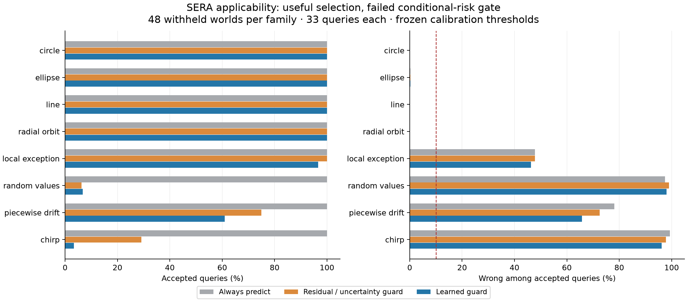
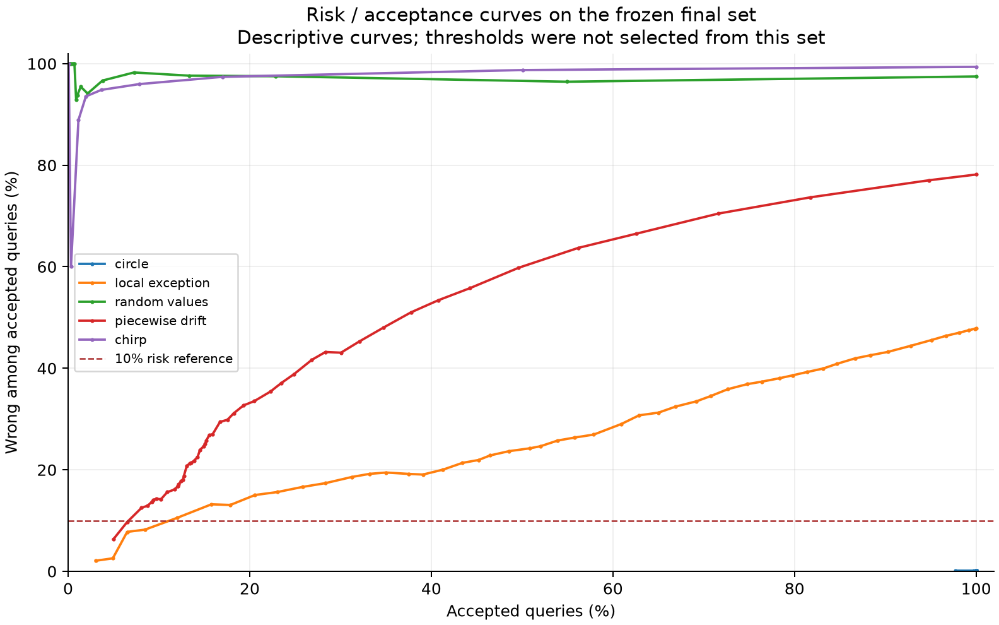

# GG-GUARD-001: learned applicability results

I trained and audited a learned validity guard on **1,344 distinct worlds**. It improved the declared selection score over the fixed controls and preserved all in-menu predictions, but **failed the preregistered conditional-risk gate**. I retain its model and complete evidence as an experimental candidate. It is not admitted into the operational shared learner.

## What I taught it

The prediction engine stayed the four-class supplied-phase Gaussian generator: circle, ellipse, line and growing orbit. A separate 16-input, 16-hidden-unit tanh network learned the probability that a proposed prediction would lie within Euclidean distance 0.2 of an independently observed noisy outcome. Observation noise was 0.05 standard deviation per coordinate. This label concerns a measured answer at a declared tolerance, not proof that the underlying mechanism is correct.

The guard received public query coordinates, distance to actual observations, predictive and coefficient uncertainty, class disagreement, and prequential residual summaries. It received no mechanism names, environment seeds, coefficients, clean targets or future answers as features. Clean mechanism values were used only for the secondary MSE measurement. I checked that changing hidden query answers could not change the guard's features.

There were **576 teaching worlds**, **192 probability-calibration worlds**, **192 threshold-selection worlds**, and **384 final worlds**. Every world contributed ten prefix observations and 33 separately observed query outcomes. All of a world's queries stayed in its partition. Teaching included four in-menu families, local exceptions and random-value negatives. Piecewise drift and chirp mechanisms were completely excluded from fitting and both calibration banks; final evaluation used 48 fresh worlds from each of eight families.

The model has **291 learned scalars**, including two probability-calibration parameters, plus 32 feature-normalization scalars. It used 500 full-batch Adam updates and 250 separate calibration updates. Training BCE decreased from **0.75165 to 0.11235**; this is training fit, not a generalization score. One optimizer seed was frozen independently of all environment seeds; robustness across optimizer initializations is untested.

## Final performance at the frozen operating point

Acceptance is the fraction of queries answered. Risk is the fraction of those answers that miss the observed-outcome tolerance. MSE is mean squared coordinate error against the hidden clean mechanism. Each table row contains 1,584 final queries clustered within 48 worlds.

| Family | Learned acceptance | Learned risk | Accepted clean MSE | Fixed residual acceptance | Fixed residual risk |
|---|---:|---:|---:|---:|---:|
| circle | 100.0% | 0.1% | 0.000480189 | 100.0% | 0.1% |
| ellipse | 100.0% | 0.3% | 0.000878713 | 100.0% | 0.3% |
| line | 100.0% | 0.1% | 0.000597928 | 100.0% | 0.1% |
| radial orbit | 100.0% | 0.1% | 0.000686618 | 100.0% | 0.1% |
| local exception | 96.6% | 46.3% | 0.0413746 | 100.0% | 47.9% |
| random values | 6.7% | 98.1% | 0.710624 | 6.2% | 99.0% |
| piecewise drift | 60.9% | 65.8% | 0.0640417 | 75.0% | 72.5% |
| chirp | 3.3% | 96.2% | 0.34722 | 29.2% | 97.8% |



The declared utility was `correct accepted - 4 × wrong accepted`, averaged per world. The learned guard improved it by **0.2108** over the residual/uncertainty guard; the paired, family-stratified world-bootstrap 95% interval was **[0.1341, 0.2893]**. This is uncertainty over instances in the eight specified families, not over all possible mechanisms.

The distance-only control found no nonempty acceptance set meeting its calibration risk target, so it rejected every final query. Its zero acceptance is explicitly reported; an improvement over it is weaker evidence than the comparison with the residual/uncertainty control. Always predict and always abstain are also retained in [all metrics](summary.json).

## Why the guard failed

Threshold selection met its pooled calibration target: **9.53%** observed risk at **83.00%** acceptance. But many safe in-menu predictions dominated that average. The selected minimum predicted-validity probability was only **0.084088**. It admitted too many poor predictions from minority mechanisms. A pooled error target did not establish a valid boundary for each mechanism.

All four in-menu families retained 100% acceptance with 0.06–0.25% risk. Local exceptions nevertheless had **46.3%** risk, and protected piecewise drift had **65.8%** risk. The learned guard rejected most random/chirp queries, but its few accepted answers there were overwhelmingly wrong. Positive utility relative to a weaker control does not make those answers supported knowledge.

The frozen descriptive curve at a 0.9 probability threshold gives 12.0% acceptance / 10.5% risk on local exceptions and 9.2% / 13.7% on piecewise drift, while rejecting all random/chirp queries. These are post-evaluation diagnostics of an already declared curve, not a newly validated operating policy. Even that stricter point does not establish the requested applicability guarantee.



The observational-alias diagnostic is more fundamental: two worlds share the exact ten observations, but a compact bump makes their unobserved answers differ by `(2, -2)`. The guard assigns both **98.48%** validity probability and accepts both. No method can identify the missing exception from that unchanged prefix alone. Further evidence or an explicit conditional answer is required; this is not a numerical defect to tune away.

## Audit, preservation and cost

- Exact replay checked **44,352 query feature/prediction rows**, all 1,344 posterior histories, final guard probabilities, calibration thresholds and final summaries. Refitting reproduced the entire model artifact exactly. A second replay from a fresh frozen-source workspace also passed.
- Independent observation-space Gaussian algebra checked **37,632 component posteriors**, including prequential prefixes. The largest feature/prediction difference was about **2.1e-10**, below the unchanged 2e-8 tolerance. NumPy evaluation of the learned network differed by at most **2.22e-16**. Labels, decision counts, partitions and fixed-control scores agree.
- I corrected two checker defects after retaining their failed attempts: the serialized evidence enum and ellipse/line coefficient ordering. Both checker versions and the original source are preserved. No learner, data, model, threshold, result or tolerance was changed. [Repair record](audit-repair.json).
- **174 tests pass**, including seven checker regressions. Ruff and both historical release verifiers pass. Existing shared-owner source files are byte-identical, and **16,556 predecessor files / 511,596,737 bytes** remain unchanged. The earlier 40-capability retention study remains its own historical result; this component made no new shared-owner update or transfer claim.
- The final job took **55.93 supervised seconds**, with **586,358,784 peak job committed bytes** (not RSS). Worker analysis/fitting/scoring took 50.50 seconds; guard fitting and probability calibration took 2.64 seconds. Process startup, final serialization and shutdown account for additional job time. Separate replay, repaired audits and their failed attempts are charged in [supervision records](supervision/).
- The cohort used **13,440 support observations**, **31,680 teaching/calibration outcomes**, and **12,672 final assessment outcomes**. Controls received identical prefix observations. Fixed controls shared threshold-selection exposure; the learned guard's extra teaching/probability-calibration exposure remains an additional cost.
- The complete raw cohort is **11,102,953 compressed bytes**. The model file is **71,957 bytes**, including provenance and witness identities. Most of that model file is audit metadata rather than weights. The decoder, full factual witnesses and frozen-source archive are additional storage; a parameter count alone is not the full memory cost.

Model SHA-256: `8e5f72ef11676b660848d4ff094a25736fdeb73213ba7f01bb758cb12ac8ab2a`. Protocol SHA-256: `cd8315d32e49bf068a2f348f1b9cd76a70dcf92cd78495abc416d5da74829245`. All raw observations, clean assessor values, exact features, per-world metrics and learner weights are published in this directory. Historical large cohorts remain locally indexed rather than duplicated.

## Architecture decision and next experiment

This completes a **component experiment for W08**, not W08 as a whole. The packet requires corrected applicability plus common-owner transfer and retention. The reliability gate failed, so I preserve the learned guard as an explicit experimental candidate and keep it out of supported-answer execution. See the [source-packet comparison](architecture-audit.md).

The next prospective study will test evidence-conditioned calibration with a minimum validity probability, then paid additional observations when existing evidence is insufficient. It must use new instances and newly protected mechanisms: the two families tested here are no longer unseen research material. It must keep each control's observation costs matched and cannot turn imagined answers into factual labels. M2 remains open; M3–M4 are not established.

## Reproduce

```powershell
.venv/Scripts/python.exe scripts/verify_applicability.py
.venv/Scripts/python.exe scripts/replay_guard_release.py --output runs/my-guard-replay
.venv/Scripts/python.exe -m experiments.generative_memory.applicability_audit --run research-continuation/15_applicability --output runs/my-independent-guard-audit.json
```

Use a fresh output path. Exact retraining is checked under the frozen Python 3.12.14 / Torch 2.10.0+cpu / NumPy 2.5.3 runtime. The replay helper verifies and extracts the original source; the current independent auditor is the documented corrected revision. Different runtimes are not silently accepted as byte-identical reproduction.
