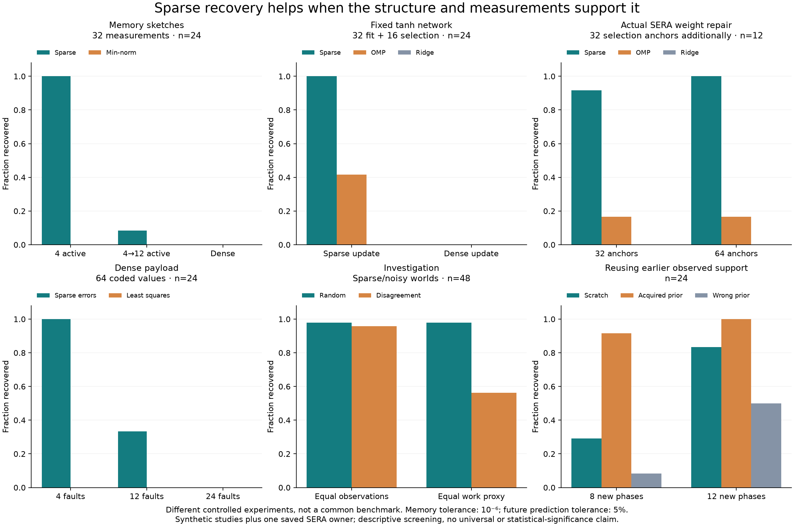
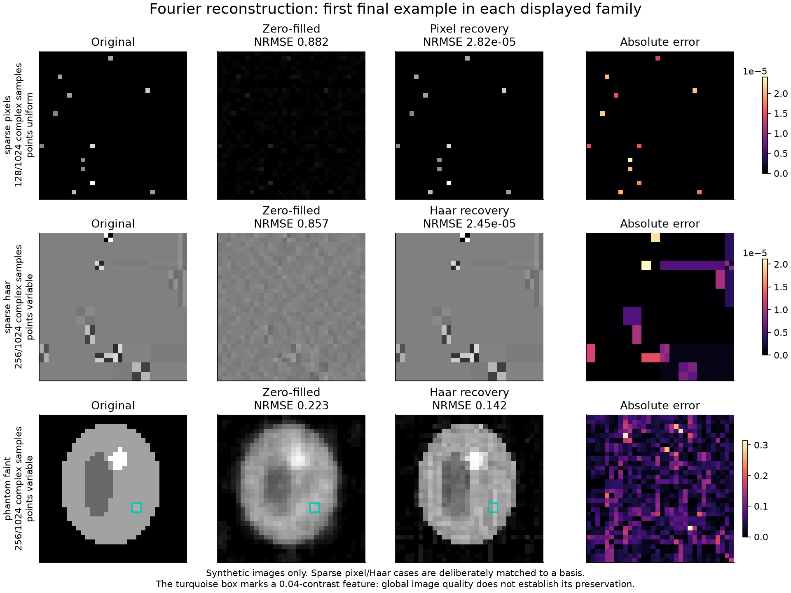

# Sparse mechanisms, memory and weight adaptation

I completed a multi-use study with **23,096 fresh final result records**, preserved development trials, and one replay of the source packet's 400 solutions. These records are many conditions over a smaller number of independent worlds, signals and faults; they are not 23,096 independent learners. I tested mechanism recovery, observation selection, prior reuse, memory sketches, corruption repair, neural readout adaptation and synthetic Fourier imaging. I then tested weight correction on a copy of the actual saved SERA owner and built an executable artifact-recovery utility.

The useful result is conditional: sparse structure can produce large gains when the representation and observations support it. It does not provide unlimited memory, general training acceleration or a replacement for checking whether the representation fits the task. Two proposed promotions failed their declared gates and remain experimental. The live owner, its learned lessons and its service are preserved.

Read the [primary literature notes](literature.md), [architecture comparison](architecture-audit.md), [completed checklist](PLAN.md), [failure and repair ledger](failures.md), [cost receipt](costs.json), [resumption instructions](resume.md), and [machine-readable outcome](results.json). Figures below use audited saved results; generating them does not train again.

## Mechanism recovery and informative investigation

I extended the supplied expression library to 7, 17 and 33 atoms. On the common small dictionary I retained SERA's existing posterior/subset procedure; the other controls are orthogonal matching pursuit and dense ridge/minimum-norm fitting. All methods receive the same support, selection and challenge observations. There are two observed scalar outputs per phase. Trials vary sparse/noisy/dense mechanisms, local exceptions, missing frequencies, chirps, corrupted observations, sample count, regular/random sampling and stored precision.

The 13,440-fit final contains 504 underlying worlds and 2,016 paired measurement settings. There were no failed solves. The independent audit checked 8,064 LP certificates, role separation, costs, recorded predictions and truth, with zero prediction/truth discrepancy at its precision.

For the declared 33-atom/random/float64 sparse and noisy strata, mean future relative error was **0.05924** for basis pursuit, **0.29547** for OMP and **0.71763** for ridge: a **79.95%** reduction against the strongest of those controls. At 20 fit phases, sparse recovery solved 24/24 noiseless and 24/24 noisy cases. At 12 phases, these fell to 20/24 and 15/24. Including eight selection and twelve calibration phases, the total access was 64 or 80 scalar values, not merely the fit phases.

The overall restricted success rate was 83/96, below the prespecified 90% gate. More seriously, **15 of 98 accepted answers were wrong** across all seven families in the target strata: **15.31% accepted error**, above the 5% gate. At 20 fit phases, eight local-exception answers were accepted and all eight were wrong. Low residual and apparently informative samples did not establish model adequacy. I rejected supported-answer integration. See the [complete recovery audit](CS-FINAL-001/independent-audit.json).

The next frozen study ran **864 paid-query lifetimes** across 24 instances of each of four families, three policies and three budget regimes. In sparse/noisy cases:

| Policy | Equal observations: solved / 48 | Mean error | Mean work proxy | Equal work cap: solved / 48 | Mean error |
|---|---:|---:|---:|---:|---:|
| Random queries | 47 | 0.02349 | 80.5 | 47 | 0.02349 |
| Space filling | 43 | 0.05059 | 80.5 | 43 | 0.05059 |
| Model disagreement | 46 | 0.01561 | 112.5 | 27 | 0.28463 |

The work proxy charges each acquired scalar as 1 and each linear solve as 0.25; it is not a FLOP count or equal wall time. At equal observations the disagreement policy improves mean error by 33.53% against random. With a work cap of 84, it can afford only three extra phase queries, while random can afford eight, and loses decisively. Its accepted-risk gate also fails under that work cap. I rejected investigator promotion. Actual elapsed time, movement and solve counts remain in every record.

Expanding challenge access from twelve random phases to 32 space-filling phases withdrew the two wrong local-exception answers accepted by the random-query arm. This changed both the count and design of challenges, and cost 120 instead of 80 total scalar values; it does not isolate which change helped or establish a distribution-free guarantee.

I separately learned support from 24 prior observed phases, changed one active component, and evaluated **144 reconstructions**:

| New fit phases | Scratch recovery | Acquired support | Wrong support |
|---|---:|---:|---:|
| 8 | 7/24 | 22/24 | 2/24 |
| 12 | 20/24 | 24/24 | 12/24 |

All these successes also met the stricter 1e-6 criterion. Every arm is charged the earlier 48 scalar values plus 16 or 24 new values. This supports reuse of acquired K in a supplied dictionary. The update rule itself remains engineered. See the [query and prior audit](CS-QUERY-FINAL-001/independent-audit.json).

## Memory sketches and corruption repair

The application final includes **2,160 memory reconstructions**, with eight recorded online additions per stored vector. A 32-value Gaussian sketch recovered four active entries among 128 coordinates in **24/24** noiseless trials; after erasing one quarter of its measurements, it recovered **22/24**. With support growing from four to twelve active coordinates it recovered only **2/24** exactly. Dense arbitrary vectors recovered in **0/24**.

The ordinary storage comparison is decisive: four known entries require **56 bytes** for index/value/count fields, versus **272 bytes** for the 32-value sketch plus its seed/dimensions. A dense 128-value float64 vector takes 1,024 numeric bytes. These are numeric representations, not complete Python/container sizes; regenerated operator memory and update/encoding work are recorded separately. The sketch is therefore not the best compression of a sparse vector whose contents are already known.

In **240 separate redundant-coding decodes**, I stored 32 dense values as 64 coded values and asked the decoder to locate unknown corruption. With four bad values, sparse-error decoding recovered **24/24** payloads; ordinary least squares recovered **0/24**, with mean relative error 0.67836. At twelve corruptions, exact sparse-error recovery fell to **8/24**. This is redundancy-assisted repair, not compression.

I turned that mechanism into a small-file utility and tested a **395-byte copy of SERA's actual retained numerical contexts**. The utility encodes 16-bit words, rounds recovered words and returns bytes only after per-block and separately retained whole-payload SHA-256 checks. It supports 1–8,192 bytes and never overwrites an output. Codewords expand payload storage approximately eightfold before padding and metadata. This overhead is deliberate and fully disclosed.

| Corrupted 64-bit cells per block | Sparse-error utility: exact restores / 16 | Eight byte copies: exact restores / 16 |
|---|---:|---:|
| 0 | 16 | 16 |
| 4 | 16 | 16 |
| 12 | 0 | 3 |
| 24 | 0 | 0 |

The utility produced no silently wrong output in these 128 tests. The public restore command also recovered the saved example exactly; a heavily corrupted example exited with rejection and created no output file. The repeated-copy baseline matched numeric storage, used the same replaced cells and bytes, and was competitive. I make no claim of superiority over standard error-correcting codes or backups. Metadata and the expected digest must remain intact. See [usage](README.md) and [actual-memory results](CS-REAL-MEMORY-001/result.json).

## Learning and repairing network weights

The synthetic application final contains **3,456 readout fits**. Each task has 64 output weights, with either a linear input map, a fixed tanh hidden network, or strongly correlated tanh features. Competing methods see identical teaching and development labels; evaluation inputs are inaccessible to fitting. I materialize the learned output weights and execute that network, rather than scoring only a coefficient vector.

With a sparse four-weight change in the tanh network, **32 teaching plus 16 development labels** gave **24/24** successful sparse fits, versus **10/24** for OMP. Mean future relative errors were approximately **7.2e-15** and **0.19496**. For dense changes, neither method met the 5% target: ridge's **0.25226** mean error was better than sparse recovery's **0.29539**. Fewer observations, missing nonlinear behavior, noise and near-duplicate features are separate preserved conditions. Updating the single head also changes its old behavior; this study does not establish multi-task retention. See the [application audit](CS-APPLICATION-FINAL-001/independent-audit.json).

I then restored the real saved SERA owner, verified that its views still share the same object, and conducted **360 further fits** on a copy. Its actual recurrent language path supplies the 256-dimensional readout features. A single existing output neuron receives either four unknown faults or dense corruption; repair methods receive damaged weights and retained pre-fault scalar responses. Those responses are model-generated maintenance evidence, not new factual teaching.

| Sparse faults in actual SERA | Sparse correction | OMP correction | Ridge correction |
|---|---:|---:|---:|
| 32 fit + 32 development anchors | 11/12 | 2/12 | 0/12 |
| 64 fit + 32 development anchors | 12/12 | 2/12 | 0/12 |

At 64 anchors, sparse correction's mean future correction error was **5.81e-8** and residual weight error **1.89e-7**. All tested held-out slot decisions matched the pristine model. Dense faults were not recovered: sparse correction error **0.24733**, ridge **0.20411**. The 12 trials are fault realizations on one trained owner, not twelve independent learners.

The language task's original 99.61% slot accuracy was mostly insensitive to these localized faults. Consequently, restoring the numerical response is a real maintenance result but **not evidence of a new language capability or a material task-accuracy improvement**. All other tensors remained exact, the modified row was restored after each trial, and the actual live owner remained unchanged. Full recurrent execution agrees with the cached-feature execution within the recorded tolerance. See the [actual-owner audit](CS-OWNER-FINAL-001/independent-audit.json) and [metric correction history](owner-development.md).

## Fourier imaging and the MRI connection

The final contains **2,304 synthetic reconstructions**: twelve image seeds per family, four families, two measurement counts, four sampling geometries, two noise levels and three methods. A 32×32 image is measured in Fourier space. Every method receives the same complex samples; each complex sample counts as two real scalar observations. Point sampling and complete Cartesian lines are reported separately.

| Condition | Sparse reconstruction mean NRMSE | Zero-filled mean NRMSE | Interpretation |
|---|---:|---:|---|
| 12 sparse pixels, 128 random complex samples, pixel basis, noiseless | 0.00003097 | 0.90160 | 12/12 recover within 5%; only 12.5% of Fourier coefficients acquired |
| Sparse Haar image, 256 variable-density samples, Haar basis, noiseless | 0.00002842 | See complete table | 12/12 recover within 5% under the matching basis |
| Sparse pixels, 128 regularly spaced Cartesian samples, pixel basis | 0.93373 | See complete table | Ambiguity remains even at a tiny optimization-stationarity residual |
| Piecewise phantom with faint feature, 256 variable-density samples, Haar basis | 0.19731 | 0.23348 | Better global error does not preserve every feature |
| Dense texture, same count and Haar method | 0.91497 | See complete table | Mismatched sparsity assumption |

For the faint-feature phantom, mean ROI absolute error was **0.05975**, greater than the true feature contrast **0.04**. Mean local-contrast error was **0.03495** under Haar recovery versus **0.02558** for zero filling. Global NRMSE improved while this local feature metric worsened. That is an important counterexample to interpreting a plausible reconstruction as reliable detailed knowledge.

The first imaging optimizer was inadequate; its saved development result had error 0.802 on a matched sparse case. I diagnosed slow progress under a tiny penalty, added regularization continuation with acceleration restarts, tested that change on fresh development cases, and then froze the final. No final image was used to tune the optimizer. The original pilot, both source versions and costs remain preserved.

This follows the Fourier acquisition and sparsity ideas in the [original Sparse MRI paper](https://people.eecs.berkeley.edu/~mlustig/CS/SparseMRI.pdf). My solver uses pixel or separable Haar penalties, not its combined wavelet/total-variation implementation. These are synthetic, real-valued, single-coil, idealized Fourier cases; no clinical performance is inferred.

## Verification, costs and disposition

Independent auditors recomputed saved predictions, known synthetic truth, evidence-role separation, matched observations, scalar costs, LP primal/dual conditions, array hashes, physical layer outputs and imaging objectives. Thirteen distinct targeted tests passed across fourteen executions; earlier unchanged regression evidence remains historical and is checked by hash. I did not rerun the complete earlier training or regression cohorts.

Review found and repaired an initial audit syntax draft, the first imaging optimizer, a secondary actual-owner score and a one-FFT counter omission. The last correction changes the operation count only; supervised wall time always included that FFT. OMP's synthetic weight solve-count field is an upper bound when early termination occurs. Exact historical records remain alongside explicit correction overlays.

All numerical jobs, including verification, development, report rendering and the intentional CLI rejection, use the shared one-thread/2 GiB committed-process-tree supervisor. [Costs](costs.json) include their complete charged wall time and peak committed memory. Documentation, file hashing, source inspection and web reading are outside that numerical-job allowance and are not claimed free total project labor.

The release keeps the failed supported-answer and disagreement-investigator candidates outside live execution. The file-repair utility is available explicitly for small artifacts; it does not silently rewrite an owner or checkpoint. Sparse support reuse and sparse readout adaptation are promising candidates for a future acquisition study, but representation learning, reliable adequacy under shift and independently improved eta remain open. The larger research learner has not been declared complete.
