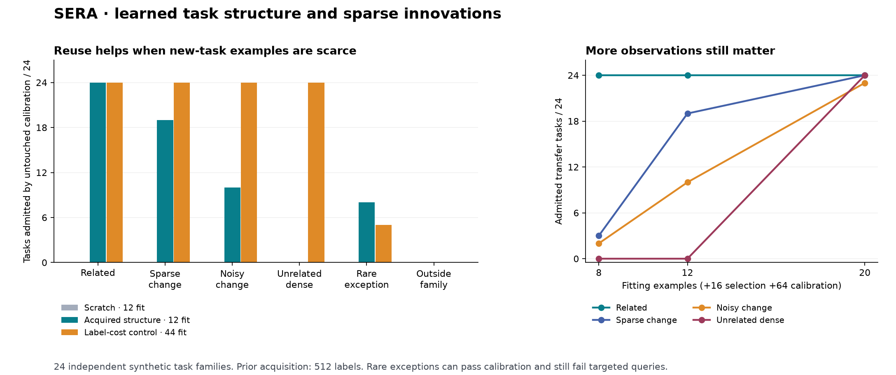

# Acquired task structure, sparse innovations and persistent execution

I completed a new task-acquisition cycle and connected a usable empirical numerical route to a preserved descendant of the existing SERA owner. It learns three-input scalar rules from examples, reuses acquired task structure, preserves previous versions, withdraws contradicted rules and accepts fresh corrections. The [task runner](README.md) is ready locally.

## What was learned

The supplied numerical vocabulary contains 20 orthonormal Legendre terms of total degree at most three on `[-1,1]^3`. Four earlier tasks are fitted from observed input/output pairs and independently calibrated. SVD of their admitted coefficients acquires up to three reusable task generators. A new task can combine those generators and learn a sparse coefficient correction. The source subspace is learned from observations; its true evaluator basis is never given to the learner.

This implements a restricted form of acquired knowledge K. The vocabulary, solver grid, rank limit, grouping and validation procedure are supplied. It does not train a new recurrent representation or independently improve the investigator eta. [Primary research notes](literature.md) distinguish the construction from Tao's discussion, Modified-CS and ELLA rather than claiming their guarantees apply automatically.

## Prospective comparison

After a four-family development cohort, I froze 24 new independent task-family seeds. Each produces six target conditions, three fitting budgets and nine policies: **3,888 final outcomes**. These are paired conditions from 24 independent families, not 3,888 independently trained SERA learners. Each target has 512 withheld random queries and sixteen separately labeled targeted exception probes. No final result was used to adjust the fitter or rerun that final cohort.

At twelve fitting examples, every policy also pays for sixteen selection and 64 untouched calibration examples: **92 new-task labels**, plus any prior acquisition. “Admitted” means the fixed selected model passes its distributional empirical gate.

| New task condition | Scratch: admitted / 24 | Acquired structure: admitted / 24 | Wrong acquired structure: admitted / 24 | Extra-label scratch: admitted / 24 |
|---|---:|---:|---:|---:|
| Related to earlier tasks | 0 | **24** | 0 | 24 |
| Three sparse coefficient changes | 0 | **19** | 0 | 24 |
| Sparse changes with bounded noise | 0 | **10** | 0 | 24 |
| Unrelated dense task | 0 | **0** | 0 | 24 |
| Rare local exception | 0 | **8** | 0 | 5 |
| Outside the polynomial family | 0 | **0** | 0 | 0 |

All 24 admitted related tasks and nineteen admitted sparse-change tasks meet the 0.05 absolute tolerance on all 512 withheld queries. Seven of the ten admitted noisy tasks do so; the remaining three have nonzero future violation rates below 5%. At twenty fitting examples, transfer admits all 24 related, sparse-change and dense tasks, and 23/24 noisy tasks. Dense recovery here comes from sufficient observations and the scratch fallback.

The prespecified paired mean reduction in future tolerance-violation rate on related plus sparse-change tasks at twelve fitting examples is **0.82735**. The approximate normal 95% lower limit is 0.74881. A supplementary audit also applies the original handbook's more conservative bounded-world expression at alpha 0.025: its lower limit is **0.27291**, still positive. The independent unit is the task-family seed. This establishes a conditional benefit in acquiring the tested numerical tasks; it does not establish general positive transfer through the shared recurrent core.



## Strong controls and failures

Prior acquisition costs **512 labels**: four tasks with 48 fitting, sixteen selection and 64 calibration cases each. For a declared sixteen-target amortization horizon, the extra-label scratch control receives 32 additional current-task fitting labels. It therefore uses 44 fitting plus eighty checking labels and recovers all related, changed and dense tasks. That sixteen-task horizon is a cost-control assumption, not an executed sixteen-task deployment lifetime. I do **not** claim a lifetime sample-cost advantage. The demonstrated benefit is adaptation with fewer new-task examples when relevant earlier knowledge is already available.

The wrong-prior arm also learns its basis from observed earlier tasks, but from an unrelated family. It produces no admitted tasks at twelve fitting examples. The source acquisition, wrong-source acquisition, rejected fits and control computation are all retained and charged. Equal observations alone do not mean equal computational work.

All eight admitted rare-exception cases fail targeted queries in their exception region. These exceptions occupy about 1% of the supplied input distribution, so a less-than-5% distributional risk target can still admit a model that is wrong there. None of the 61 admitted transfer cases at twelve fitting examples exceeds 5% violation on the 512-query iid evaluation, but that finite observation is not a simultaneous guarantee. This is why the runtime returns **EMPIRICAL_PREDICTION**, never a pointwise proof. Unseen shift and exceptional inputs remain limitations.

Sparse LP infeasibility on inconsistent/out-of-family data is recorded in candidate traces; successful fallback selection does not erase those failures. Static review also caught one unused import and one misplaced test fragment before execution. They produced no numerical result changes.

## Actual persistent owner

The [integration experiment](TT-OWNER-001/result.json) restores the actual language/control owner and registers learned numerical readouts on it. Each readout holds twenty float64 learned coefficients, or 160 tensor bytes. Six stored readouts add 960 tensor bytes; full memory also includes the inherited owner, examples, candidate traces, acquired bases, JSON metadata, immutable history, proof indices and runtime allocations. The 960-byte count is not the total system memory claim.

Four observed source calibrations teach combinations of these supplied evaluator functions:

```
g1(x) = 0.5 + 1.2*x1 - 0.4*x2*x3
g2(x) = x2^2 + 0.3*x1*x3
g3(x) = 0.6*x3 - 0.2*x1^3
```

The new task learns `0.7*g1 - 1.3*g2 + 0.4*g3` from twelve fitting, sixteen selection and 64 calibration examples. It restarts exactly and predicts four fresh query values with maximum numerical error 3.33e-16. A later observation reveals an added `0.6*x1^2` term; its error is 0.486, so the old rule is withdrawn and returns no predictions. Fresh twenty-example fitting plus sixteen selection and 64 calibration cases learns the changed task, with maximum error 1.11e-15 on those four query cases. These near-roundoff errors concern known synthetic calibration functions, not physical sensor accuracy.

| Same queries | Before observed change | After fresh correction |
|---|---:|---:|
| `(-0.5, 0.2, 0.8)` | 0.1912 | 0.3412 |
| `(0, 0, 0)` | 0.3500 | 0.3500 |
| `(0.8, -0.3, 0.1)` | 0.86524 | 1.24924 |
| `(-0.2, -0.4, -0.7)` | -0.32636 | -0.30236 |

The earlier four task predictions remain accurate to 8.88e-16; all inherited tensors and checked language logits remain bitwise unchanged. The finite arithmetic proof route still returns its checked solution. Shared owner aliases are checked, but the new numerical path evaluates supplied polynomial features directly—it does not prove transfer through learned recurrent features. The existing live application's owner and pointer remain unchanged.

## Audit repair and migration

Review found that the initial runtime blocked calibration reuse only under the same task name. I tightened this to the whole session, including previously observed inputs. A renamed task can no longer reclassify old examples as fresh calibration. The original source and nine original revisions remain preserved in `TT-OWNER-001`; the [migration audit](TT-MIGRATION-001/result.json) verifies their preservation, unchanged learned tensors, identical predictions and language logits, continued formal execution, explicit refusal to load mismatched source, and no state mutation after rejected reuse attempts.

The active descendant is revision ten, owner `a33ba52e98517abbf0573c27838abeeda93cb72dd14fda0a564bf11c16a5f119`. Its new identity records the changed execution/validity contract; the learned weights did not change during migration. This repair did not alter the final cohort, whose evidence was already disjoint. The command-line shortcut was exercised against the saved descendant.

## Verification, costs and scope

The independent audit recomputes predictions using a separate Legendre evaluator, scores, calibration limits through binomial-CDF inversion, evidence separation and acquired source subspaces. The supplementary mathematical audit verifies all 3,888 candidate selections and 7,247 primal/dual certificate appearances, including repeated use of the same fitted candidate across controls. Maximum prediction discrepancy is 5.68e-14; maximum LP primal violation is 6.39e-11. No final optimization was rerun for these audits.

**22 distinct targeted tests pass across 26 executions:** nine new contract tests and thirteen affected existing persistence, language and live-owner regressions. Integration and migration assertions are additional executed checks, not counted as extra unit tests. The figure was visually inspected. The release verifier checks frozen artifacts, sources and supervision receipts without training.

The final study obtains 43,584 physical research labels including both correct and wrong prior acquisition, plus 73,728 future evaluation values and 2,304 targeted evaluations. Development, runtime integration, migration, tests, rendering and actual command use have separate supervised receipts. [Exact costs](costs.json) reconcile those jobs against the existing cumulative allowance. Literature reading, implementation, static inspection and byte hashing consume additional elapsed work and are outside that numerical-worker allowance. No paid compute, remote push or autonomous background research job is implied.

The [architecture comparison](architecture-audit.md) preserves the original R1-first recommendation, separates K from eta and identifies the remaining gaps. This is a useful bounded numerical-learning component. General material retrieval/comprehension, learned representation migration, better investigation under full cost, and independently improved learning procedures remain open. All final outcomes and rejected alternatives are preserved; future experiments must use new evidence.
