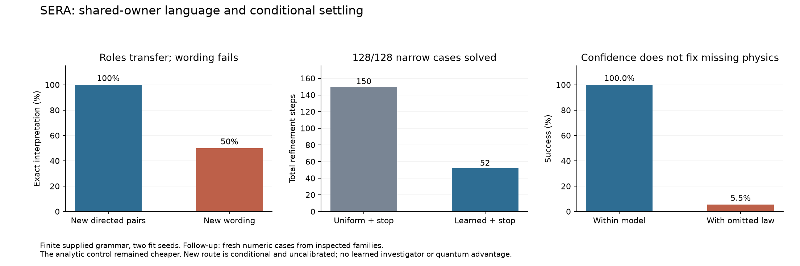

# SERA: learned roles connected to persistent conditional imagination

I completed the v10 handoff and two new research cycles on the actual continuing
SERA owner. The resulting local tool can interpret a taught request, discover a
missing landmark position, acquire it from simulated observations, imagine controls,
pause and restore its work, and revise the investigation after new motion evidence.
It preserves all earlier implementations, stores and results.

The useful gain is a working connection between learned language, acquired dynamics
and persistent investigation. The evidence does **not** establish general language,
new physical concepts, a learned investigator, beneficial shared-core adaptation or
quantum advantage. The original applicability gate remains intact.

## What was taught

The new role interface received 80 generated teaching sentences, four named
entities, four supplied meanings and active/passive productions. It learned actor,
target and modality through the existing recurrent owner. Entity occurrence masks
and semantic labels were supplied. I ran one pilot and six canonical parameterizations:
two seeds crossed with ordered input, order-erased input and twice the ordered
training exposure. The primary fit used 200 full-batch Adam updates; the extra
exposure control used 400. There are only two independent optimization seeds.

The proposal interface learned a two-control inverse mapping from 4,096 conditional
examples generated by the acquired parent motion model, with 400 updates and 51,200
example presentations. Its target generator used a supplied analytic inverse.
Those imagined teaching examples did not enter factual memory. The combined new
interfaces have **11,336 parameters**, or 45,344 bytes at float32 before optimizer,
predecessor weights, histories and metadata. All **130 predecessor tensors stayed
bitwise unchanged** in every fit.

The persistent demonstration then acquired three new simulator readings of a
beacon location and one new observed motion transition. It learned location
statistics and updated its existing motion statistics; it did not learn object
identity from images or retrieve a new physical law from text.

## Language results

| Condition | Withheld directed pairs | Withheld wording composition |
|---|---:|---:|
| Ordered, 200 updates | 32/32 across two seeds | 48/96 |
| Same architecture, order erased | 11/32 | 32/96 |
| Ordered, 400 updates | 32/32 | 48/96 |

Each seed sees the same 16 directed-pair and 48 wording tests. These counts are
crossed seed/sentence records, not independent language populations. In total,
384 final language records survive unchanged. The selected model was chosen by
teaching loss before the final outcomes; the extra-training arm did not replace it.

The wording failure is substantial. All teaching passive productions began with
“please”; merely adding that known word to an active production did not generalize
reliably. Extra training did not repair the failure. I restricted operational
admission to the supplied active/passive productions and preserve the entire new
wording family as unresolved. That post-evaluation restriction is engineering,
not a changed final score or a calibrated language-understanding guarantee.

An independently housed copy gave exactly the same logits. Sharing ownership
therefore demonstrates lifecycle integration, not positive transfer from sharing.
Derivative probes confirmed a nonzero path through the actual frozen R1 fusion;
only new interface parameters were optimized.

## Conditional numerical results

CI-001 evaluated 1,024 numeric cases from four families crossed with six methods:
6,144 records. Every method used the actual acquired circle geometry and motion
coefficients. These are conditional variations of one parent model, not 1,024 new
independently observed physical worlds. Seven parameter branches keep their
parameters fixed over both imagined transitions.

| Method | Ordinary successes /256 | Narrow successes /256 | Narrow measured time |
|---|---:|---:|---:|
| Eight uniform proposals | 213 | 39 | 0.116 s |
| Learned proposals | 256 | 130 | 0.152 s |
| Uniform + 12 refinement steps | 256 | 256 | 1.828 s |
| Learned + 12 refinement steps | 256 | 256 | 1.865 s |
| 33×33 control grid | 256 | 256 | 0.332 s |
| Supplied analytic inverse | 256 | 256 | 0.123 s |

Success means nominal endpoint distance at most 0.03 m under the installed model.
The grid was faster than unconditional refinement despite evaluating more candidate
points. The analytic baseline is stronger still in this supplied local family.
These single-pass timings are descriptive, not a replicated speed claim.

All methods stayed unresolved on the radially unreachable family; the runtime did
not turn finite search failure into an impossibility assertion. In the omitted-law
family, learned refinement produced 256/256 nominal witnesses but only **26/256**
met the assessment target after an unmodeled torque was included. The independent
assessor's law never entered the solver.

## Follow-up: stop when the declared residual target is met

I froze CI-002 after the first study and used 512 fresh numeric cases from the same
already inspected families. This is an exploratory follow-up, not independent
confirmation on new mechanism families. No weights or threshold were retuned.

| Adaptive initializer | Ordinary: successes; steps | Narrow: successes; steps | Narrow time |
|---|---|---|---:|
| Uniform | 128/128; 23 | 128/128; 150 | 0.209 s |
| Learned | 128/128; 0 | 128/128; 52 | 0.127 s |
| Analytic reference | 128/128; 0 | 128/128; 0 | 0.060 s |

The fixed residual gate avoids unnecessary refinement. The analytic reference
still wins on cost, and the policy itself was written rather than learned. Under
omitted torque the learned path had 128/128 nominal witnesses but only **7/128**
assessment successes. Early stopping does not resolve model inadequacy.

## Persistent integration and verification

The actual descendant store has **15 immutable revisions**. It requested a missing
position, received three qualified simulated readings, resumed four saved refinement
steps identically to uninterrupted execution, handled a tested passive wording,
rejected unqualified wording, admitted one new motion observation, invalidated the
old prediction and re-imagined from the updated situation. An unfinished task remains
saved after two steps. Reversed roles request missing dynamics; historical occurrence
requires event evidence. Imagining a completion does not assert that it occurred.

The final `reach` request has nominal distance **0.01591 m**, with a largest retained
parameter-branch distance **0.07537 m**. That discrepancy remains visible. It is a
conditional witness at the nominal parameters, not a robust guarantee. Continuous
controls interpolate an action-response model originally taught with discrete
controls; that extra assumption is explicitly recorded. No proposed continuous
action was physically executed.

All **302 local regression tests passed**, including 19 new cases. A separate scalar
implementation reproduced **7,680 numeric outcomes** across both cycles and their
witness/assessment decisions, with maximum absolute discrepancy **2.36e-16**.
The v10 packet's five-stage replay also passed at its original tolerances. The
earlier v5 release is checked separately; its source and evidence stay preserved.

The runtime's `conditional_transition_points` field counts gradient-transition
work only. Experiment records separately count endpoint/gate work; neither counter
is complete FLOPs. Supervisor wall charges include restoration, library reproof,
testing, reports and failed work. `costs.json` records all receipts, memory peaks,
remaining allowance and unmeasured categories. Code authoring, research and static
hash/archive work have uninstrumented engineering cost, not zero cost.

The extra-exposure controls repeated their first 200 updates in fresh fit directories;
their 200-step checkpoints are byte-identical to the primary checkpoints for each
seed. All duplicate-prefix computation is charged and retained. It contributes no
additional independent evidence; future extra-exposure controls should resume the
saved optimizer to avoid that unnecessary cost.

## Use, preservation and next work

Follow [the exact commands](README.md) to read `reach`, continue `unfinished`, or
request another named landmark task. The new CLI displays a concise result by
default; `--json` returns the full branch and provenance. The original workbench,
numerical-task and v5 inquiry stores remain at their previous pointers.

[The intake comparison](intake.md), [architecture audit](architecture-audit.md),
[primary research review](literature.md), [frozen first protocol](protocol.md),
[follow-up protocol](followup-protocol.md) and [checklist](checklist.md) record scope
and decisions. Source, supervision, raw-record and checkpoint archives preserve
exact bytes; the local-state manifest also identifies the original resumable files.

Next: repair language composition on genuinely protected productions, acquire
missing semantic/physical interfaces from grounded evidence, and qualify usefulness
under new mechanism families. EqProp learning, learned tensor/Born clouds, mixed
controllers, sustained plasticity and independently improved eta remain open.
No existing failed applicability result has been bypassed or declared solved.

At sealing, this cycle charged **494.979 seconds** across **16 supervised jobs**, with peak process-tree committed memory **1,240,494,080 bytes**. The existing allowance has **67.827 seconds** left. These are measured supervised costs, not total research effort or a new grant.
