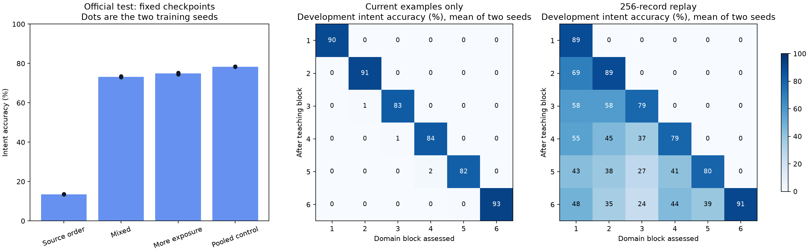

# SERA: real-request acquisition, successive learning and a usable annotation tool

I taught the continuing SERA owner's request interface from **11,514 real English requests**. The development-selected checkpoint scored **74.54% intent accuracy**, **50.20% entity-span F1**, and **41.14% exact intent-plus-entity frames** on **2,973 official held-out requests**. It now processes local text/JSONL files into labelled requests and entity spans. [Use the saved learner](README.md).

I also carried one learned interface and its optimizer through six successive domain groups. A 256-record replay reservoir improved final retention in both paired training seeds. These are measured acquisitions in the taught request domains. The complete records retain earlier fits, individual errors, repairs, source identities and full supervised costs.

## What SERA was taught

MASSIVE 1.1 supplied 11,514 training requests, 2,033 development requests and 2,974 official test requests. Training covers 18 domains, 60 supplied intents and 55 entity categories (111 BIO tags). Domains include alarms, audio, calendars, cooking, date/time, email, general interaction, home devices, lists, music, news, playback, question answering, recommendations, social interaction, takeaway food, transport and weather. Learning a question-answering request category is measured as intent classification, separately from answering its content.

The interface learns hashed-word embeddings, a projection into the existing recurrent owner, normalization and two output heads. It adds **450,219 trainable parameters** (1,800,876 float32 value bytes). The original 145 predecessor tensors are protected. The optimizer receives source intent and token-span labels; inference encodes request text alone. The schema, loss, curriculum and optimizer are supplied engineering. The acquired text-to-frame mapping is the learned capability.

Training uses an exact resumable 128-record shuffle buffer. A global mixed-order view is a seeded permutation of the same 11,514 rows, repeated across passes. The source has 5,302 distinct lowercased training words occupying 3,886 of 8,191 usable hash buckets; collision effects remain part of measured performance. All train/development annotations reconstructed exactly; final exclusions appear below.

## Completed research cycles

| Cycle | Executed teaching and decision |
|---|---|
| SC-001 | One 256-request pilot, 80 updates, 2,560 presentations. Teaching intent reached 246/256; the separate 128-row development probe reached 65/128. Exact optimizer/session continuation passed. |
| SC-002 | Two seeds × shared/pooled routes; all source training rows, 1,800 updates and 57,600 presentations per model. Source-order results are preserved. |
| SC-003 | Same examples, seeds, optimizer and updates with a full source permutation. This prospectively tested ordering interference and qualified a shared request-annotation checkpoint. |
| SC-004 | Two seeds × current-only/256-record replay, six successive domain groups, 300 updates per group, one persistent optimizer per lifetime. Each step uses 16 new-stream presentations plus 16 repeated/replayed presentations. |
| SC-005 | Resume each of the four mixed checkpoints from step 1,800 to 5,400. Exact Adam/RNG/cursor restore adds 115,200 presentations per continuation without rerunning its completed prefix. |

The primary fits total **36,080 optimizer updates and 1,154,560 presentations**, including the pilot; these repeated presentations are not additional unique examples. Audit/test updates are separate and remain charged in job receipts. Sixteen terminal checkpoints enter the fixed evaluation cohort; the four longer-exposure endpoints are continuations of existing learners. There are two seeds per comparison, not thousands of independent learners.

## Complete fixed-cohort results

All values below use the same official test partition. The checkpoint was chosen by development exact frames, then intent accuracy, then lexical path, before final access. Sequential models are supplementary and do not participate in selection. There was one final evaluation, with no subsequent tuning or reselection.

| Checkpoint | Intent accuracy | Span F1 | Exact frames |
|---|---:|---:|---:|
| SC-full-shared-2641 | 13.69% | 23.19% | 7.64% |
| SC-full-shared-2642 | 13.42% | 21.34% | 6.83% |
| SC-full-pooled-2641 | 37.10% | 28.98% | 15.98% |
| SC-full-pooled-2642 | 39.39% | 29.44% | 16.75% |
| SC-mixed-shared-2641 | 73.53% | 44.14% | 36.13% |
| SC-mixed-shared-2642 | 72.96% | 48.66% | 38.45% |
| SC-mixed-pooled-2641 | 78.91% | 42.15% | 37.50% |
| SC-mixed-pooled-2642 | 78.88% | 41.41% | 36.66% |
| SC-exposure-shared-2641 | 75.21% | 49.39% | 41.17% |
| SC-exposure-shared-2642 **selected** | 74.54% | 50.20% | 41.14% |
| SC-exposure-pooled-2641 | 78.24% | 41.70% | 36.83% |
| SC-exposure-pooled-2642 | 78.51% | 40.87% | 37.27% |
| SC-sequential-naive-2651 | 10.49% | 24.85% | 5.72% |
| SC-sequential-replay-2651 | 42.68% | 33.27% | 18.63% |
| SC-sequential-naive-2652 | 10.46% | 22.67% | 5.85% |
| SC-sequential-replay-2652 | 43.69% | 32.72% | 18.06% |

The selected checkpoint is `runs/SC-exposure-shared-2642/step-005400.pt`, SHA-256 `5ab3bf1e77b0710ea0d516e645ef22e14e3f31fc4f0c3df238dce2e0dc3f93c3`. Its development scores were 76.34% intent, 53.97% span F1 and 42.89% exact frames. It met the predeclared ≥70% intent and ≥50% span-F1 annotation gate.

Official source coverage: 2973/2974 rows, 1 exclusions. Among the 2952 test rows whose exact case-folded text does not occur in training, the selected model scored 74.39% intent, 50.01% span F1 and 40.89% exact frames. The full official score is kept alongside this declared novelty subset. Source IDs are disjoint across all three partitions.

Excluded source records: `[{"id": "11650", "reason": "Source length outside the declared 1..40 token scope"}]`. The 1–40-token admission rule was frozen before test access. Counting excluded requests as incorrect over all 2974 source rows gives 74.51% intent and 41.12% exact frames. Entity F1 uses the eligible rows.

The fixed most-frequent-training-intent control (`calendar_set`) scored 7.03% intent accuracy. Its all-outside entity output has zero span F1. The trained pooled route is the stronger architectural control. It shares the supplied interface size and update count but bypasses recurrence, so compute costs differ. Rankings of intent and joint frames can differ; the selection criterion was frozen in advance. No standard-LLM ranking is inferred from these internal comparisons.

## Successive acquisition and retained knowledge

Blocks are: (1) alarm/audio/calendar, (2) cooking/datetime/email, (3) general/iot/lists, (4) music/news/play, (5) qa/recommendation/social, (6) takeaway/transport/weather. Each lifetime visits every training ID. Current-stream exposure is 28,800 presentations and total training is 57,600 presentations in each arm. Both arms advance identical reservoir RNG/bookkeeping for audit; only the replay arm trains on memory samples.

| Seed / arm | Final development intent | Final equal-block accuracy | Mean forgetting, percentage points |
|---|---:|---:|---:|
| 2651 / naive | 12.84% | 15.50% | 85.58 |
| 2651 / replay | 45.30% | 46.56% | 46.50 |
| 2652 / naive | 12.94% | 15.62% | 85.71 |
| 2652 / replay | 45.99% | 47.01% | 44.09 |

Equal-block accuracy is the registered primary retention outcome. Forgetting is the best post-teaching accuracy before the final stage minus final accuracy, averaged over the first five blocks; a negative entry retains an observed later improvement. Full 6×6 matrices, immediate acquisition and already-taught curves are in `independent-audit.json`. Memory contains 256 records, plus a complete seen-ID set, insertion/sample RNGs, Adam state and source cursor. Serialized memory and bookkeeping sizes are recorded separately.

Replay is the implemented improvement for the measured sequential interference. Full mixing is the implemented improvement for stationary source-order exposure. Their uses differ: global mixing revisits the whole known corpus; the sequential learner uses a bounded reservoir of previously seen examples. Fixed replay is an engineered learning procedure; these trials measure the ability it enables rather than relabelling it as an independently learned investigator.

## What the saved learner actually did

The selected actual owner processed the same three illustrations fixed during the pilot, wrote their classifications and entity spans to `runs/SC-annotation-demo/annotations.jsonl`, restored its exact request session, and processed the older conditional motion request through its inherited shared owner. Every illustration is retained below.

| Input | Learned intent | Predicted entity values |
|---|---|---|
| set an alarm for nine am | alarm_set | time: nine am |
| what is the weather in london | weather_query | place_name: london |
| add milk to my shopping list | lists_createoradd | list_name: shopping |

These are displayed predictions, not a hand-labelled success count. The file-annotation task is performed; the record explicitly reports zero external actions. Softmax values are exposed as model scores without a calibration claim. Missing/invalid input has a retained error record.

## Diagnosis, repair and verification

I preserved the source-order fits and tested mixing with unchanged training information. I then tested bounded replay under matched exposure and extended the mixed fits by exact optimizer continuation. The final table includes all outcomes, including cases where more exposure or a particular route is less effective. These measurements guide the next intervention; they are not universal ability verdicts.

An 8-second preparation attempt timed out; its partial output remains. A retry correctly refused the occupied parent location. A lightweight preparation path completed in a new directory. The first persistence audit exposed stale guarded-fact binding after owner extension; capturing facts before attachment and rebinding after loading repaired the lifecycle. Its failed source/log are retained. Removing an unused import later used an explicit preserving store migration with unchanged owner and predictions. The initial download metadata incorrectly described partial archive retrieval; the original metadata and exact correction are preserved because the license at the end required reading the whole compressed archive.

The final suite contains **331 passing test cases**. The independent audit recounted **120,756 saved predictions**, checked all 16 cohort checkpoints and training-ID membership, and verified that final selection remained unchanged. Every completed fit retained 145 predecessor tensors and 96 earlier language outputs exactly. Interrupted/uninterrupted optimizer and replay fixtures agree. All original applicability and prior-store contracts remain separately preserved.

## Preservation and next use

`raw-records.zip` contains complete prediction records, summaries, freeze receipts and saved request revisions. The checkpoint archives contain every cohort endpoint and pilot/resume audit states. `local-state-manifest.json` indexes every retained intermediate; they remain in local `runs/` without multiplying large checkpoint copies in Git. `data.zip` contains original and prepared source bytes plus the original license. `sources.zip`, `supervision.zip` and the manifests bind code, costs and results. Prior release artifacts remain intact.

[Architecture comparison](architecture-audit.md), [source review](literature.md), [completed checklist](checklist.md), [exact next research action](next-cycle.md). The next integration connects learned request entities to a persistent local task, verified corrections and reacquisition on fresh frozen evidence. The present tool is immediately usable for request annotation through the commands in README.md.

Data attribution: FitzGerald et al., [MASSIVE](https://github.com/alexa/massive), CC BY 4.0; English source material from Bastianelli et al., [SLURP](https://aclanthology.org/2020.emnlp-main.588/). Replay mechanism reference: Chaudhry et al., [On Tiny Episodic Memories](https://arxiv.org/html/1902.10486v4).

At sealing, the cycle charged **2665.335 supervised seconds** across **38 jobs**, including failed attempts. Peak process-tree committed memory was **1,277,284,352 bytes**. The approved allowance retained **1002.491 seconds**. Source acquisition read **40,251,390 compressed bytes**. Research and static engineering costs are listed separately as unmeasured, not zero.
