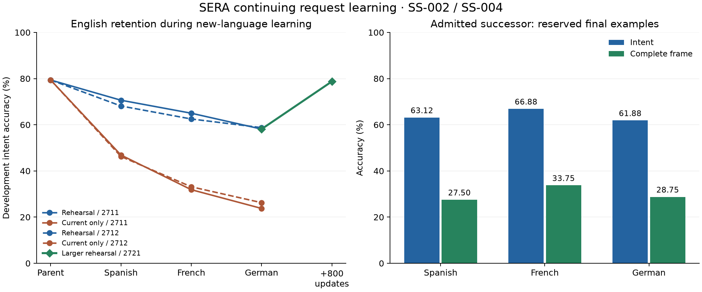

# SERA self-study, continuing language acquisition and verified source correction

I continued the actual SERA request owner, taught new language mappings, added
source-learned mathematical operators and integrated the admitted successor into
an append-only local store. The practical entry point is [README.md](README.md).
This report separates the original v11 replay, new learning experiments and
engineering verification. [Execution checklist](checklist.md).

## Reconciliation and preservation

The local repository was clean at `73dd66caecb7a0f3d3ab0bba21a725e2fc4d5678`.
The older remote `9104839400d5053152ca423be6da1efe355aa71a` was an ancestor.
I first published the complete intervening history and organized navigation at
`e05183b2773d863e0e3f7d4398d2d40e3434c5e0`, verifying both main and the research
branch. Kavi remained pinned at `50f743cc44794b67bc1d30b927e25991197edce2`.
The new work belongs to this continuation; earlier studies remain preserved.

The starting English checkpoint was
`runs/SC-exposure-shared-2642/step-005400.pt`, SHA-256
`5ab3bf1e77b0710ea0d516e645ef22e14e3f31fc4f0c3df238dce2e0dc3f93c3`.
The final multilingual checkpoint is
`runs/SS-rehearsal-2721/step-002000.pt`, SHA-256
`39631cd5fbce7693684ef02fe90f3e2ba9dc09b033cba1679c4ea286d3b6fa24`.
The corrected mathematical state is retained with its lesson history in
`runs/sera-study-live`. [Initial identities](reconciliation.json) and the final
preservation record make these claims inspectable.

I safely extracted the v11 ZIP into a fresh intake and read its prompt, status,
ledger, report, cookbook and RH plan. The supplied laboratory's one verification
pass covered560 episodes,5760 source reads,17920 final checks and5503 accepted
results. Its36 tests passed; independently replayed numerical weights differed
by at most1.85713×10⁻⁹. These are supplied-packet results, separately recorded in
[v11-verification](v11-verification), rather than newly trained SERA scores.

## What was taught

| Material | Teaching exposure and provenance | Retained change |
|---|---|---|
| English | Existing11514 annotated MASSIVE training requests; continued rehearsal uses this original training collection | Existing intent/entity interface retained and rehearsed |
| Spanish, French, German |1200 official training requests per language, supplied intent/entity labels | Learned continuing request-interface weights |
| Power sums | Six equations extracted from versioned Knuth arXiv HTML; five passed the initial independent screen | A learned13×13 numerical sum operator |
| Antiderivatives | Six basis lessons generated from a supplied OpenStax power-rule schema, degrees0..5 | A learned13×13 numerical integral operator |
| Polynomial motion | Composition of the retained integral operator with supplied acceleration and initial conditions | Checked velocity and position calculations |
| Source correction | One independently certified correction from a frozen96-candidate family | One additional learned sum-operator lesson for degree11 |

The operator receives a coefficient vector and learns a map to output
coefficients. It is registered on the continuing neural parameter owner. A
ridge update uses verified examples; rationalization proposes a candidate, and
an independent exact certificate controls acceptance. Source lessons are retained
for provenance and exact restoration. No external source fetch is needed to use
the learned operator after restoration.

I supplied the coefficient representation, table reader, exercise schema,
source-selection policy, optimizers, rehearsal schedule and certificate checkers.
SERA learned the numerical operators and the request mappings. Learning a useful
operator and engineering a useful learning procedure are reported separately.

## Mathematics and physical calculations: SS-001

The original task was to sum2k+3k³+k⁵ over k=0..n−1 for every natural n. Its
initial zero-weight proposal failed the exact certificate, triggering source
acquisition. After checked practice the original task was solved and remained
solved after integral learning. Development performance changed from0/64 to64/64.

The frozen final assessment used128 new sum combinations,128 new antiderivative
combinations and64 composed motion tasks. Coefficients were drawn from−7..7.
The sum family initially used odd degrees1,3,5,7,9. The integral family used
degrees0..5. No final record was used to select or tune a candidate.

| Mechanism | Polynomial certificates | Motion tasks | Interpretation |
|---|---:|---:|---|
| Verified source-to-weight learning |256/256|64/64|Admitted retained learner |
| Read-only acquisition |0/256|0/64|Same examples, no weight update |
| Unchecked source-learning control |256/256|64/64|Retained as a failed source-admission control |
| Installed symbolic reference |256/256|Separate direct-algebra reference|Privileged supplied solver, zero source reads |

The unchecked arm also passed this final task family because the rejected
eleventh-power column was outside it. I therefore do not infer an accuracy
advantage for verification from this comparison. Verification prevented a known
invalid lesson from entering the admitted state; SS-003 tested its correction on
a separate new family.

Before language teaching,154 predecessor tensors and32 fixed request-logit
outputs were bit-identical after mathematical acquisition. Every language run
then protected all non-request tensors, including the acquired operators.
The final integration independently solved the augmented least-squares problem;
its maximum weight differences were4.44×10⁻¹⁶ for sums and1.11×10⁻¹⁶ for integrals.

One executable example uses a(t)=2+3t+t², x(0)=5, v(0)=−1 and t=3. The
retained operator returned x=125/4 and v=55/2. The certificate establishes the
polynomial calculation under the recorded physical assumptions. The same actual
owner performs request interpretation and these calculations; positive transfer
between their weight regions is a separate experimental question.

## Continuing language acquisition and retention: SS-002 / SS-004

I streamed the publisher's MASSIVE archive discovered through Hugging Face.
Each language used1200 training rows,160 even-ID official-development rows for
development and160 odd-ID official-development rows for a newly reserved final
cohort. Official test rows were unused in this cycle. Parallel semantic IDs can
overlap with earlier English learning, so these scores measure new-language
mapping on existing request categories.

Two seeds compared matched update/presentation budgets. Each lifetime learned
Spanish, then French, then German for400 Adam updates each. Rehearsal used256
examples from English and each previously taught language. The current-only
control used repeated current-language examples in the corresponding half-batch.
All optimizer state, source cursors, random states and intermediate checkpoints
were retained.

Both initial rehearsal candidates learned the new languages but missed the
predeclared English retention gate. Before opening the final set I registered
SS-004:800 further updates from the first rehearsal candidate's exact optimizer
state, half English and half balanced new languages, learning rate0.0005.
English samples came from the full original training collection. This deliberately
uses a larger rehearsal resource and is not a storage-matched SS-002 comparison.

| Candidate | English development after all stages | Spanish final intent | French final intent | German final intent |
|---|---:|---:|---:|---:|
| Rehearsal, seed2711 |58.13%|61.25%|65.63%|67.50%|
| Current-only, seed2711 |23.75%|43.13%|65.00%|67.50%|
| Rehearsal, seed2712 |58.75%|60.00%|65.63%|65.00%|
| Current-only, seed2712 |26.25%|38.13%|65.00%|63.75%|
| Continued rehearsal, seed2721, admitted |78.75%|63.13%|66.88%|61.88%|

English development began at127/160=79.375%; the admitted continuation finished
at126/160=78.75%. Its Spanish/French/German development scores were61.875%,
66.875% and61.25%, satisfying the registered gate before final evaluation.
There were five models in one final cohort; the final scores did not select the
admitted checkpoint.

For the admitted model, complete intent-plus-entity frames were44/160 Spanish,
54/160 French and46/160 German. Entity-span F1 was30.95%,39.18% and33.61%.
These stricter measures are reported alongside intent accuracy to distinguish
recognizing the requested action from correctly filling every argument.
The earlier English final result remains at its original checkpoint and protocol;
the78.75% figure above is explicitly a development retention measure.

The four base lifetimes used4800 total new optimization updates; the continuation
added800. The100 updates before a checkpoint-path failure are included, not
repeated. The admitted lineage adds2000 request updates to the parent's5400.
There are3600 unique new-language teaching records shared across comparisons,
not a separate3600-record corpus for every arm. Detailed exposures, replay costs
and checkpoint scopes remain in the training receipts and archives. The800-step
rehearsal extension saw3485 new-language IDs and7793 English IDs,11278 distinct
IDs within that stage. The runtime reports this stage scope explicitly; its
earlier combined-counter label is preserved and corrected in the migration record.

## A rejected source claim corrected and learned: SS-003

The retrieved arXiv HTML table's eleventh-power row contained the numerator
32N⁶−64N⁵+68N⁴−40N³+5N² over6. Both independent checks rejected the imported
claim. I preserve the exact source bytes, equation identity and failed lesson.
This observation concerns the retrieved mathematical representation; I have not
attributed the discrepancy to a particular stage of the paper's publication.

The predefined search changed one Nʲ coefficient, j=1..6, by a nonzero integer
from−8..8. Exactly one of96 candidates passed: add5 to the N² numerator
coefficient, giving10N². This is labelled a derived correction with its own
certificate, rather than rewriting the source or assigning it new authority.

SERA learned the corrected lesson through the same acquisition interface and
returned to the eleventh-power goal. It then passed32 new development problems
and, after freezing,128/128 new final combinations through degree11. The
correction preserved158 other tensors, including the evaluated language weights
and the integral map. The original sum and integral proposals remained identical.
The bounded candidate generator and checkers were supplied; the successful
candidate's retained operator update was learned.

## Persistent goals, interruption and RH prerequisite

The admitted store preserves original task coefficients, source budget, ordered
lesson IDs, practice outcomes, retained weights and immutable parent research
contracts. Four initial append-only revisions record the migration, correction
and RH prerequisite; a fifth preserves the later metadata-only correction. A deliberate interruption after two committed lessons
exposed an ordering defect; the repaired scheduler reproduces the uninterrupted
events, goals, weights and owner exactly.

The pinned RH parent concerns nontrivial zeros of the meromorphically continued
zeta function and retains the official Clay definition source. Its executable
child used the retained operator to integrate1+x+x²+x³+x⁴+x⁵, producing
x+x²/2+x³/3+x⁴/4+x⁵/5+x⁶/6 with an exact derivative certificate and no new source
read. The parent remains open with explicit convergence, logarithm,
rearrangement and critical-strip obligations. This gives a concrete completed
prerequisite and an unchanged research target. [Goal record](rh-goal.json).

## Data audit and source access

I found substantial local collections under `D:/ai/projects/llm`, including
physics, science, general, multilingual and arXiv-named folders. The metadata
inventory is in [local-data-audit.json](local-data-audit.json). Folder names alone
do not establish language, subject, license or training eligibility. The other
project reserves Gutenberg as held-out material; those exclusions were preserved,
as was its quarantine collection.

The33 arXiv batch files totaled6727773 bytes and contained concatenated metadata
without reliable individual paper IDs. Hashing found66 additional byte-identical
copies across general/science folders. I count these as duplicate storage, not
independent knowledge. Rather than train on unverified provenance, this cycle
acquired exact primary-source URLs and the source-labelled MASSIVE records.
The local collections remain available for a later explicitly audited curriculum.

The public arXiv query found Knuth's versioned paper. The full HTML response
contained641 mathematical annotations; its484841 bytes have SHA-256
`15fcaa4a288ad0cfec64d7992308ed357a3f4744c3c8dda382ebcf103be6ad99`.
The paper reader and search receipts are preserved. Current searches can use
`--refresh`, while old bytes and costs remain in the content-addressed cache.

## Verification, failures and costs

The independent audit recounts2400 saved language predictions and1088 saved
polynomial/motion/correction outcomes. It uses a separate span reconstruction
and symbolic identity checks without new final-set model inference. The
integration audit checks owner identity, protected tensors, least-squares
agreement, source-free reuse, exact restoration and immutable parent statements.
The full regression receipt records357 passing repository tests. After the final metadata-only correction,28 targeted tests also passed.

Preserved defects include the Windows cache-lock cleanup issue, checkpoint path
serialization failure, interrupted lesson-order defect, rational-input bounds,
cache-path validation and training-lineage metadata corrections. Old code,
failed checkpoints, failing tests and repair identities remain under `failures/`
and `source-history/`. No failed numerical work is removed from the cost ledger.
Byte-fingerprinted completed experiment files have narrow Ruff style/import
exceptions documented in pyproject.toml; executable-error diagnostics remain on.

[costs.json](costs.json) includes every owned numerical job, including failures,
reservations, actual wall charges, peak process-tree committed memory and source
acquisition timing. It separately labels static engineering/inspection time as
unmetered rather than treating it as zero. Each numerical child uses one CPU
thread and a2GiB committed-memory cap. The explicitly approved60-minute
extensions are preserved in the ledger. No paid services were used.

The final decision is to admit the continued-rehearsal checkpoint and independently
corrected mathematical state. All comparison arms and earlier admitted stores
remain preserved. The [architecture audit](architecture-audit.md) maps this
specific progress to the original persistent-learner vision and v11 work packages;
[next-cycle.md](next-cycle.md) records exact continuation and the next justified
experiment without reopening the completed final evaluations.
