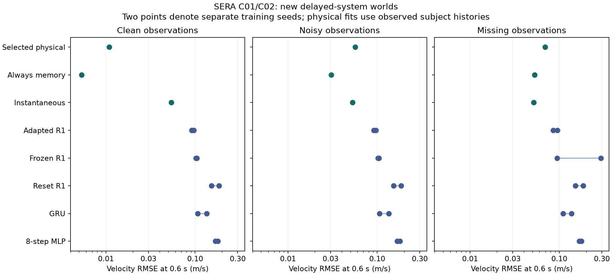

# SERA v13: learned empirical refinement through the continuing owner

I completed C01/C02 through the actual Stage 27 learner. The saved continuation acquires a motion model from observed history, retains learned coefficients on that owner, predicts conditional trajectories, invalidates stale state when a new observation arrives and preserves earlier model versions. Its learned polynomial operators and four-language request interface remain intact. [Use it](README.md); [audit the connection](architecture-audit.md).

The selected route passed the prospectively frozen gate on a new final cohort. For clean delayed systems, its 0.6-second position/velocity mean-squared error was **95.90% lower than instantaneous identification**. A descriptive bootstrap over the 12 independent parameter-world clusters gives 83.16–99.51% reduction. This is a finite, supplied synthetic physics curriculum with subject calibration observations; it is not a claim about all physical reasoning or an LLM comparison.

## What was taught and tested

I taught ten neural candidates—five mechanisms, two optimization seeds—from **256 trajectories across 64 parameter worlds**, with 80 transitions each. Every fit received 240 Adam updates, eight 40-step windows per update, with twelve warm-up steps. The five mechanisms were the actual R1 with frozen memory, the actual R1 with conditional learned rank-4 memory/fusion updates, the same R1 reset every step, a 32-state GRU and an eight-step MLP. The existing R1 has width256, eight heads and memory dimension32. No new recurrent component was added to the deployed empirical route.

The physical candidates learned bounded gain, force offset, drag and, where supported, relaxing-force coefficients from supplied observations. Candidate equations and a seven-value relaxation grid were engineered inputs. Fits used 48 observed transitions for calibration, the next16 for model selection, then refit on the full80 observed transitions. A fixed simplicity rule favored smaller models within the declared residual tolerance. This route performs online parameter learning; it does not claim to have independently discovered the variables, equations or selection rule.

Development used24 independent worlds and144 observation views. The **new final cohort used36 independent worlds,72 histories and216 observation views**: instantaneous, delayed and omitted-quadratic-drag mechanisms, each observed cleanly, with noise, and with noise plus10% missing readings. Every history pair ended at the same current position and velocity and received the same future commands. Models saw only position, velocity, commands, availability and the clock; hidden force, parameters, family labels and future outcomes stayed with the assessor. All14 prespecified arms were evaluated once on final data, producing36,288 predicted future steps.

## Held-out results

Velocity RMSE below is in metres/second at12 steps (0.6 seconds). Each neural row retains both separately trained seeds. Full position/velocity errors at1,4 and12 steps, individual history-pair outcomes, raw prediction hashes and timing are in [r2](r2/). Physical controls are calibrated per subject; neural controls are globally trained, so the table does not establish an equal-cost asymptotic algorithm ranking.

| Candidate | Delayed clean | Delayed noisy | Delayed missing | Simple clean | Omitted drag clean |
|---|---:|---:|---:|---:|---:|
| **Selected physical policy** | **0.01085** | 0.05658 | 0.06927 | 0.01752 | 0.03019 |
| Always relaxing memory | 0.00533 | 0.03052 | 0.05306 | 0.0000000052 | 0.02920 |
| Instantaneous identification | 0.05415 | 0.05267 | 0.05175 | 0.00000000011 | 0.06103 |
| Coarse gain and offset | 0.17380 | 0.17456 | 0.16908 | 0.03997 | 0.17332 |
| Adapted actual R1, seed2801 | 0.09150 | 0.09165 | 0.09538 | 0.05439 | 0.09255 |
| Adapted actual R1, seed2802 | 0.09660 | 0.09647 | 0.08516 | 0.06416 | 0.08403 |
| Frozen actual R1, seed2801 | 0.10229 | 0.10220 | 0.29253 | 0.09062 | 0.09506 |
| Frozen actual R1, seed2802 | 0.10473 | 0.10463 | 0.09472 | 0.06576 | 0.08061 |
| Reset actual R1, seed2801 | 0.18499 | 0.18499 | 0.18499 | 0.12258 | 0.16276 |
| Reset actual R1, seed2802 | 0.15202 | 0.15202 | 0.15202 | 0.14346 | 0.13160 |
| GRU, seed2801 | 0.10650 | 0.10643 | 0.11041 | 0.13665 | 0.13205 |
| GRU, seed2802 | 0.13469 | 0.13467 | 0.13662 | 0.11655 | 0.13852 |
| Eight-step MLP, seed2801 | 0.16802 | 0.16801 | 0.16734 | 0.11970 | 0.15989 |
| Eight-step MLP, seed2802 | 0.17954 | 0.17957 | 0.17732 | 0.11836 | 0.17145 |

The adapted R1 correctly predicted the direction of history-dependent velocity separation in **23/24 seed-by-world pairs**; resetting its memory produced identical pair predictions and0/24 correct directions. Its mean delayed-clean position/velocity MSE was69.69% lower than the reset control. This is direct evidence that its existing memory learned useful history-sensitive behavior in this curriculum. Every neural arm's development next-step error decreased during training; [analysis.json](analysis.json) retains before/after values and checkpoints.

The selected physical policy got10/12 delayed clean pair directions correct and chose a memory model in22/24 clean delayed histories. It chose no memory models for the24 clean simple histories. Its admitted simplicity tolerance traded some simple-system precision for smaller models: instantaneous identification was substantially more exact on those simple systems. The always-memory control also forecast delayed histories more accurately than the selected policy. Noisy/missing results show where the current selection and derivative-based estimation can improve. I kept the frozen choice and all these comparisons; they motivate a new, independently partitioned C03 study rather than retuning this final cohort.

The omitted-drag cohort is a model-adequacy challenge. Useful finite predictions do not turn a residual into calibrated uncertainty or identify an omitted mechanism. The runtime exposes residual and assumption obligations explicitly.

## Actual integration, correction and retention

The task loop began with MISSING_KNOWLEDGE, acquired81 synthetic observations, learned coefficients, independently checked the recurrence and returned EMPIRICAL_PREDICTION for the original task. A second subject learned a separate history without changing the first subject's prediction. One later observed transition invalidated the first model's cached state; refinement retained its predecessor and created a new learned version.

The saved example contains two subjects and three retained model versions—**15 registered coefficient scalars**, plus the existing owner, source records and observation archives. This count is not the full storage cost. The two append-only store revisions preserve the acquisition and subsequent correction at `runs/sera-refinement-live`.

The independent audit established:

- Exact shared object identity across the continuing learner and its task interfaces.
- **162 predecessor tensors byte-identical** after empirical learning and correction.
- Identical English, Spanish, French and German request logits on128 declared development probes.
- The retained polynomial-motion answer: position125/4, velocity55/2, with exact coefficient certificates.
- The original RH research goal retained unchanged.
- No weight/evidence changes from alternate imagined branches; separate subject support and explicit invalidation after new observations.
- Exact saved-session restoration and **10/10 optimizer/RNG resumptions**, replaying updates201–240 to byte-identical checkpoints.
- **216/216 independent final physical forecast replays**, with maximum scalar-versus-matrix difference8.88e-15.

The new route labels empirical prediction, conditional imagination and certified algebra separately. Source, model mechanism, coefficient, schema, subject, unit and clock checks reject invalid use. Constant commands produce UNIDENTIFIABLE_CAUSE for inseparable gain/offset coefficients. [Integration receipt](integration-audit.json) and the job receipts bind these statements to source and owner identities.

All **377 local regression tests** passed, including18 new empirical-contract tests. The targeted18-test run also passed before live promotion. The recorded checks retain their full resource costs. CI additionally verifies the published continuation archive without resampling final worlds.

## Source-packet verification and preserved failures

The v13 manifest and54 packet tests passed. The original verifier completed data reconstruction,768 candidate optimality checks and384 physical forecasts before its strict neural replay failed. Independent diagnostics found1/90 neural arrays outside the original Torch tolerance, maximum difference5.48e-6; all90 matched the packet's independent implementation tolerance. The maximum saved MSE difference was2.35e-7. Physics JSON exact equality differed at72 numerical leaves, at most7.33e-15; its independent identities remained at numerical precision. The128 isolated authenticated FastMap tasks replayed exactly. These isolated fixtures remain distinct from restoring the actual learner.

The v12 manifest/data reconstruction, body-science verification and all51 tests passed. I did not retrain its completed perception studies.

The first local study exposed **F01**, a nonzero initial decaying force in the purported simple control. I corrected the teacher before final access and repeated the same predetermined curriculum in `CR-study-r2`. All original10 fits, their development comparisons, pilot, checkpoints, source versions and costs remain preserved. No earlier Stage27 experiment was restarted. Strict portability failures and the discarded teacher attempt are evidence, not hidden exclusions.

The final CI integrity pass also exposed stale maintenance-file assumptions in older verifiers. [F02](F02-historical-ledger-verifier.md) records the repair and its failed checks: evolving literature/package/verifier files use their authenticated historical Git or archive bytes, while scientific evidence and applicability gates retain exact checks. Old source versions and every failed check remain included in the costs.

## Research basis and next decision

[Mori–Zwanzig learning](https://arxiv.org/abs/2101.05873) motivates testing whether observed state needs history. [Gated Delta Networks](https://arxiv.org/abs/2412.06464) motivates checking the existing gated memory. [Sparse identification](https://arxiv.org/abs/1509.03580) supplies a competing finite-library interpretation, while the [GRU](https://arxiv.org/abs/1406.1078) is a classical control. [Output-error identification](https://arxiv.org/abs/2502.14432) motivates treating noisy state estimation as a separate improvement target. These papers inform the engineered experiment; they are not evidence that SERA learned their full contents.

The next justified study is C03: compare complexity/adequacy selection and output-error fitting on fresh development and final worlds, preserving this admitted runtime and its simpler candidates. Freeze that experiment before acquiring new final evidence. The exact current allowance, resumable paths, completed jobs, verification results, and runnable next action are in [continuation.json](continuation.json) and [costs.json](costs.json). This cycle adds no resource grant.
