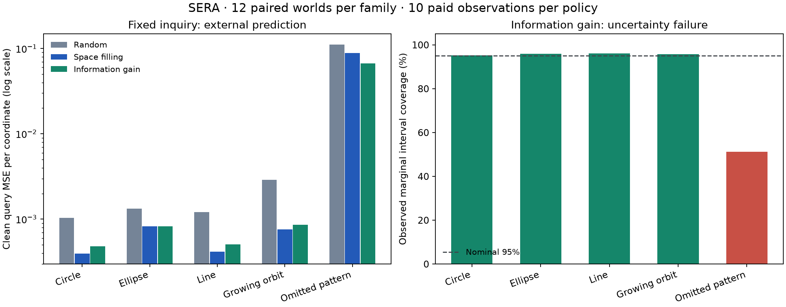

# SERA research continuation — 15 September 2026

I completed the supplied-packet reproductions, the first generative-memory study, the fixed active-inquiry comparison and a real trained-parent generator integration. The main result is that compact supplied generators can predict very accurately and persist inside SERA's shared owner. The main failure is that confident model selection does not reliably detect an inadequate model class.

## What was taught and executed

| Study | Learning or execution | Evidence |
|---|---|---|
| Source packets | Replayed 57 earlier neural checkpoints; executed both pinned suites and the second packet's fresh analytic study | [Source audit](MASTER_AUDIT.md) |
| GG-P0-001 | 5,120 artifacts across eight controls, four task families, four support sizes, two noise levels and 20 instances; learned coefficients, class/expression choices, 640 small neural controls and local residuals | [All geometry results](08_analysis/GG-P0-001/report.md), [audit and errata](08_analysis/GG-P0-001/audit-and-interpretation.md) |
| GG-ACT-001 | 300 fixed-policy runs in 60 paired worlds; 3,000 paid observations; updated coefficient/class posteriors after each observation | [Inquiry results](08_analysis/GG-ACT-001/report.md) |
| SHARED-GG-001 | Four descendants of the actual trained SERA parent; 16 observations and one correction each; one registered R1 generator workspace | [Integration and correction results](05_experiments/shared-generative-integration.md) |
| Preserved R7 | 1,260 finite weight-cloud models; 3,780 query partitions replayed | [Preserved experiment registry](EXPERIMENT_REGISTRY.jsonl) |

These counts mix different declared artifact types and must not be added up as newly trained neural networks. Coordinates, symbolic grammars, simulator access and known noise remain supplied. No language corpus, visual concept encoder or broad physical-law discovery was trained in this continuation.

## Strongest results and limitations

On circles with 64 observations and noise 0.02, the selected compact generator achieved withheld-arc MSE **0.0000182**, versus **0.2299** for interpolation and **0.2545** for the small neural control. Its deployed JSON artifact averaged **1,419 bytes**; decoder, discovery, shared runtime and audit storage remain additional costs. This supports compact prediction when the supplied representation fits the process.

The exception result prevents a generalization of that claim. Adding local residual memory reduced in-region MSE from **0.002421 to 0.000806**, but left unseen-arc MSE at **0.1001** and reduced nominal 95% coverage from **34.1% to 23.2%**. I preserve this failure as a test target for applicability.

The active-inquiry panel completed and replayed exactly. Information gain avoided the uninformative high-noise channel and improved mean error over random sampling, but the cheap space-filling control matched or beat it on the four in-menu families. On omitted patterns, information gain still ended with **99.738%** mean best-class confidence and only **51.3%** interval coverage. No learned investigator was trained or promoted.

In the actual trained-parent circle fixture, correction reduced query MSE from **0.06115 to 0.00009346**. The acquired posterior persisted through full checkpoint restoration. The new generator added **zero trainable parameters and 2,880 registered numeric buffer bytes**. All **92 prior state tensors** remained exact, and **944 retained score elements across 40 capability groups** were unchanged. This establishes controlled integration and retention; it does not establish positive transfer into the recurrent core.

## Verification and preservation

The current local suite passes **156 tests**; lint passes. Historical release verification still passes for **33 evidence artifacts and 154 source concepts**. Geometry verification replayed all **20,480 query partitions**, and full refitting reproduced all **5,120 artifact hashes**. The inquiry's independent audit checked all **12,000 intermediate class posteriors** and exact cohort coverage in addition to the complete procedural replay.

Three generator defects found during this audit are repaired: float32 rounding in hypothetical inputs, an unintended float32 likelihood intermediate, and incomplete reconciliation of restored sufficient statistics with factual evidence. Failed logs and the repaired checks remain preserved. Original packet tolerances and failures are not silently rewritten as passes.

The [architecture comparison](01_audit/final-architecture-comparison.md) maps the implementation back to every packet work package. The [checklist](NEXT_ACTIONS.md) and [machine-readable state](RESEARCH_STATE.json) mark completed controls separately from open research stages. [Compact evidence and frozen source](14_release/README.md) provide a reproducible public record; full local checkpoints and raw arrays remain indexed rather than duplicated into Git.

## What remains

The complete requested architecture is not finished. Four of ten initial geometry families were covered. Learned applicability, general guarded compilation, shared positive transfer, decision-improving causal imagination, a continuing unfamiliar-task stream, and sustained investigator improvement remain open. Same-schema event replay is implemented; learned latent migration is not.

The next experiment trains a guard from actual prediction outcomes and tests it on separate seeds and withheld mechanism families, with equal observation access for fixed controls. It must measure incorrect acceptance, rejection of valid knowledge, useful coverage, retained capability and all added costs. Its [protocol](NEXT_EXPERIMENT_PROTOCOL.md) also specifies the subsequent shared-owner consolidation and old/new knowledge × old/new investigator gates. M2 remains open; M3 and M4 are not established.
