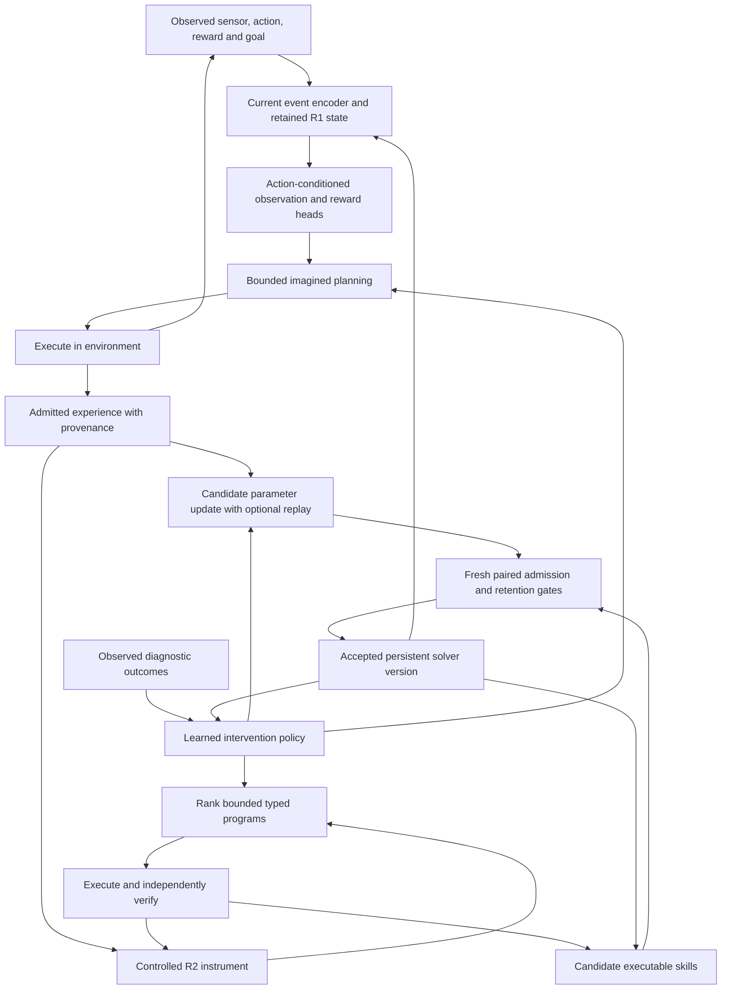

# SERA architecture, version 0.2

I implement the handbook's recommended first integration: R1 with a separated R2 program-learning path. These components share an executable solver and admission lifecycle. The physics atlas constrains representations, reductions and mathematical claims; its 154 concepts are not 154 implemented cognitive functions. R3–R8 are separate future architectures.

The [original-source audit](../reports/original-source-alignment-audit.md) distinguishes the working narrow integration from missing full-blueprint contracts. Version 0.2.1 repairs admission and search guards; the recorded learning study used 0.2.0.

## Connected execution

These are executable paths in `r1.py`, `r2.py`, `connected.py`, `curriculum.py` and `solver.py`. The separate `world.py` and original `quantum.py` experiments remain historical component controls.

## R1: working state, world prediction and feedback

The compact study encodes 22 symbolic features: visible sensor color (4), previous action (4), actual reward (1), goal (4), public world-identity encoding (8), and sensor availability (1). Missing sensors contribute zeros and an availability flag. Internal simulator indices and transition tables never enter the neural encoder. A visible color nevertheless fully identifies the state within its world; learned perception remains absent.

`RecurrentWorldModel.observe()` combines the current embedding with the recurrent readout. The default core has width 48, two associative heads and memory dimension 8. For a normalized key, the corrective write is `M' = alpha*M + beta*(v-alpha*M*k)*k^T`. Learned addressing may interfere. Separate heads predict the next sensor distribution and reward given the aggregate and a proposed action.

`WorldSession` holds fast state in memory. It does not yet carry owner/schema/model/encoder identities or implement validated session save/resume. Its planner branches through the same model without changing the live session. It keeps at most eight beam states and considers four actions, with a horizon of one or three in this study. Imagined observations are argmax predictions. This bounded heuristic does not propagate a full calibrated belief distribution. Only real execution feedback changes the live session.

`planned_evidence()` records actual plan consequences as admitted trajectories. Learning uses next-sensor cross-entropy where the target is visible, plus half-weighted reward binary cross-entropy. It differentiates the encoder, recurrent core, fusion and heads. Replay mixes prior and new admitted trajectories. Imagined outcomes are never labels.

The full reference preset is separately executable with `RecurrentWorldModel(width=256, heads=8, memory_dim=32, kind="reference")`. It contains 128 complex rotor coordinates, eight 32×32 memories and four 16×4 complex density factors: 35,840 retained core bytes at batch size one. Factors define positive density matrices through `rho = L L*`. A controlled channel expands rank; SVD truncation and renormalization impose the budget and record discarded mass. The preset is differentiated and checked numerically, but full-size training is not claimed. Core bytes exclude parameters, gradients, optimizer state, activations and planning branches.

Discarded-mass recording currently retains only the last batch maximum on the module; it is not a persisted trajectory error log. All reference branches execute before the router weights their readouts. Selective event delivery, conditional computation and rank/error/cost curves remain open.

## R2: controlled instruments and verified programs

`ControlledInstrument` uses QR-normalized action Kraus operators and a shared projective event instrument with a learned orthonormal basis. Action control, event likelihood, conditioning and proposals use the same predictive state. Missing events apply the sum of event branches, without conditioning on a guessed or hidden sensor.

Each event projector has rank one. A visible event resets the posterior to its projector; missing events dephase it in the shared basis. From the initial mixed state, this admits an exact four-state classical belief-filter representation. It is a valid restricted R2 case, not the general multi-Kraus-per-event instrument or evidence of additional quantum memory capacity.

The proposal head receives real/imaginary density entries and the goal. Search ranks bounded typed programs using its action logits and predicted goal probability. The interpreter supports `action`, `sequence`, bounded `repeat` and library `call`, with depth, fuel and recursion checks. The experiments mainly acquire action sequences; syntax for calls/repeats does not establish useful abstraction discovery.

The automatic program-learning calls in `connected.intervene()` do not pass the saved library to search. Stored skills affect ordinary inference, but they do not yet change the vocabulary used to acquire new skills. A later composition experiment must connect that path and hold out program structures.

Search executes candidates in a resettable world and independently re-executes successful candidates. Verified traces train likelihood and proposal credit. A skill stores domain, start/goal, typed body, flattened actions, dependencies, evidence and verification. Ordinary goal solving consults admitted skills before neural planning. Applicability still uses explicit world/start/goal routing.

The independent R2 test withholds four start/goal pairs from eight demonstrations, with four candidate executions for each fixed, untrained-instrument and learned-instrument search. Likelihood training can observe transition types used in test programs. Training and model-proposal costs are reported separately.

## Three update rates

| Rate | State that changes | Source |
|---|---|---|
| Fast working state | Recurrent tensors or instrument posterior | Actual observations and execution events |
| Durable task learning | World/instrument parameters and executable skills | Admitted trajectories and verified programs |
| Improvement-policy learning | Eight-input, 32-hidden-unit intervention-value network | Measured candidate outcomes on separate support/query episodes |

The policy chooses `none`, `update`, `replay`, `evidence`, `planning` or `program`. Optimizers and procedures are supplied. The policy is trained during development, saved in the solver and held fixed during final meta-tests and autonomous generations. This is limited learned selection, not recursive invention of learning algorithms.

Features use observed accuracy, actual reward error, entropy, executed goal success, support size, reset permission, a reserved previous-score input and planning horizon. Query outcomes supply development targets, never diagnostic inputs. Normalization uses training episodes; validation selects a checkpoint. Final reset-family outcomes are generated after freezing it. Fixed methods requiring unavailable reset access fall back to no change.

Callers leave the previous-score feature at its default. There is no remaining-budget input, explicit failure-class curriculum or learned informative-observation selector. These are incomplete parts of the source's improvement loop.

## Evidence, promotion and persistence

`EvidenceReplay` admits validated synthetic/verified trajectories and rejects prediction-only provenance and evaluation/query/test/promotion splits. Content hashes and serialization preserve provenance. The original symbolic task generator remains a separate declared source of synthetic labels. Additional CLI learning retains actual collected evidence even after a rejected candidate; rollback restores solver behavior, not deletion of facts.

`SolverStore` snapshots neural parameters, component settings/weights and skills together. It verifies payload and executable identity, restores only registered types, checks finite state and instrument validity, and compares interpreted program bodies to their action records. Checkpoints use `weights_only=True`. Atomic pointers and an exclusive lock support one writer; an interrupted lock requires inspection.

Candidates freeze before fresh evaluation randomness. Equal world counts and equal prediction/control weights define the score. Goal outcomes are enumerated on twelve deterministic unmasked start/goal pairs and independently sampled; this supports a finite-distribution estimate, not a large task-diversity claim.

The gain lower bound is `mean_gain - sqrt(2*log(1/alpha_k)/n)`, with `alpha_k=0.05/2^(k+1)`. Promotion requires it above 0.01, empirical per-task regressions at most 0.02, validity and the configured counted-cost budget. Only the gain bound has this conditional independence interpretation. The ledger reserves evaluations before use and preserves cumulative rounds across rejection/rollback. It is an audit mechanism, not isolation against hostile code.

A failed evaluation retains its work/failure record and preserves the incumbent. Rejection retains a candidate snapshot. Rollback verifies the accepted parent before changing current behavior. Fresh-process tests cover symbolic and connected skill use. Model updates, skills and planning horizon all contribute to executable identity.

## Evidence boundaries

This release does not demonstrate representation discovery, broad partial-observation control, general program transfer, a learned optimizer, open-ended language, R3–R8, quantum hardware advantage or recursive research acceleration. The compact trained R1 and tested full reference preset must not be conflated. The [connected study](../reports/connected-study.md) separates software validity, measured learning and cost.
