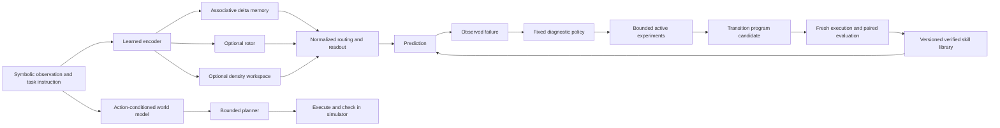

# SERA architecture, release 0.1

I organize SERA around a stateful neural path, an executable skill path, and an independent evaluation path. I keep their assumptions and evidence separate so that I can identify which mechanism contributes to an improvement.

## Neural path

Twenty symbolic input features encode key, observed value, task, marked position, query flag, relative position and initial observable state. Query value features are zero. The default width is 32 with two 8 x 8 associative memory heads. Independent examples reset working state. A query reads memory without writing to delta, rotor, collision or density state. The GRU control processes the query as another token; this convention is part of the declared architecture comparison.

For a normalized key, the memory update is `M' = alpha*M + beta*(v-alpha*M*k)*k^T`. At alpha=beta=1 the addressed value is replaced exactly. Keys are learned, so interference remains possible.

The rotor stores real and imaginary coordinates and performs input-controlled phase rotation plus gated write/forgetting. Its no-phase control keeps the same parameter allocation but disables angles. The driven recurrence is a classical state-space model; it is not a unitary quantum channel as a whole.

The density workspace retains an exact complex 4 x 4 matrix. An input-conditioned unitary uses a fixed Hadamard mixer and learned phases. A convex mixture with a prepared pure state supplies forgetting. Preparation fixes one nonzero coordinate to avoid the zero-factor singularity. The linear channel includes the trace factor for unnormalized operators. No rank compression is performed in the recurrent workspace.

The hybrid normalizes each branch and learns input-dependent mixture weights over delta, rotor and density outputs. It has more parameters than any one component. The parameter-count control is selected without consulting its task scores. Parameter equality does not imply equal state memory, training FLOPs, or tuning budgets.

## Program and world-model paths

The transition learner explores a resettable finite system by access sequences. It repeats every transition query once to detect simple inconsistencies. Observable state IDs and an action alphabet are supplied; semantic state discovery and reliable identification under noise are open work. Repeated-query agreement is a diagnostic, not proof that an arbitrary system is deterministic.

An acquired program is a typed, validated transition table executed under a maximum instruction count. Each skill has a content hash, environment version, assumptions and independent trajectory tests. The skill router currently uses the explicit ordered-control task identifier. Learning applicability is an upcoming experiment.

The world model is a separate action-conditioned MLP over observable finite states. The planner performs bounded breadth-first search over the model's most probable sufficiently confident transitions. Plans are executed in the simulator. It is appropriate only for this deterministic finite setup; it does not implement uncertainty-aware belief-space planning or an actor-critic world-model algorithm.

## Promotion and persistence

The engine freezes the neural hash and program candidate, then draws a fresh evaluation seed. Equal-sized independent task strata keep the pooled paired score equal to macro accuracy. For differences in [-1,1], the one-sided Hoeffding lower bound is `mean_gain - sqrt(2*log(1/alpha_k)/n)`, where `alpha_k=0.05/2^(k+1)`. The lower bound must exceed 0.01, all empirical per-task retention losses must be at most 0.02, and validity and acquisition-cost gates must pass.

The acquisition-cost unit in this release is `oracle calls + executed oracle actions`. It is not total system compute. Reports separately retain training and end-to-end wall time and parameter/core-state sizes. Total optimizer FLOPs, peak resident memory and data-acquisition economics are future accounting work.

The SQLite journal reserves evaluation identifiers before scoring, tracks the cumulative round index, and chains event hashes. This makes honest single-process experiments auditable and rejects recorded reuse. It is not a security boundary against a candidate with filesystem access. The current candidate cannot generate or execute arbitrary code.

Raw tensor checkpoints use `weights_only=True` when loaded. Model snapshots store current and best-validation weights separately, optimizer state, RNG state, configuration, package versions and a source hash. Session files carry explicit ownership and tensor contracts. Rollback selects the recorded parent; unsuccessful candidate proposals do not replace the incumbent pointer.

## Deliberate release limits

The implemented path is a bounded first integration. The full handbook-scale encoder, low-rank multiworkspace stack, language and perceptual decoders, learned curriculum, learned diagnostic policy, open-ended DSL expansion, multi-generation meta-learning and R3-R8 architectures are not claimed as delivered. The original 154 concepts remain an indexed source of future constraints and experiments, rather than a requirement to add every physical concept to one network.
