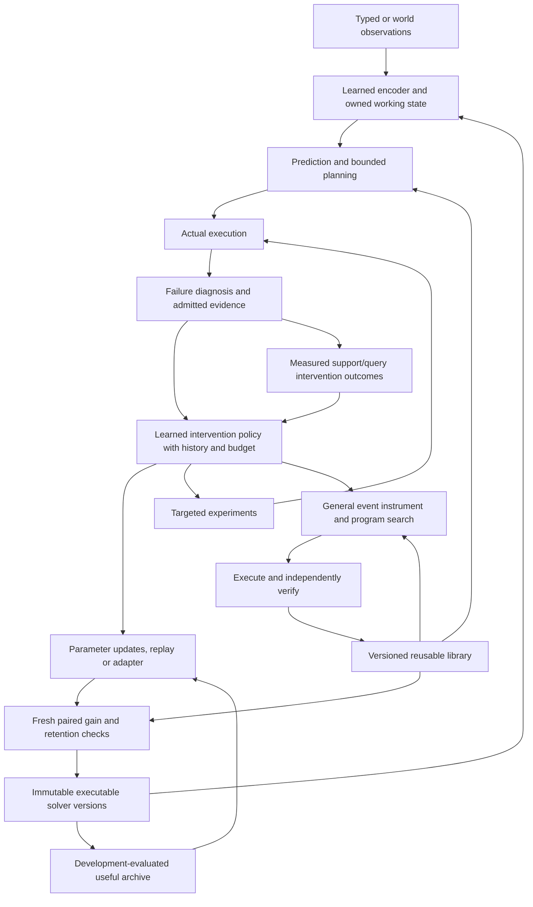

# SERA architecture, version 0.3

I implement the handbook's recommended R1/R2 starting direction. The [0.3 source audit](../reports/stage-three-architecture-audit.md), [protocol](stage-three-protocol.md) and [results](../reports/stage-three-study.md) separate architecture contracts, controlled learning and unresolved hypotheses. The 154 source concepts constrain representations and claims; they are not 154 demonstrated cognitive abilities.

## Connected execution

The implementation keeps three rates distinct. Fast tensors change with observed events; task parameters and programs change through admitted learning; the intervention-value network changes through measured outer episodes. The outer-policy experiment holds the inner solver fixed to compare successive policy updates fairly. Persistent solver generations separately evaluate real task updates and retention. This decomposition does not establish a recursively self-invented optimizer.

## Working state and R1

World observations encode visible color, prior action, actual reward, requested goal, public world identity and availability. A missing sensor has an explicit mask. The learner receives no transition table or hidden simulator state. Each visible color identifies its state in these worlds; aliased history is a separate controlled experiment.

`RecurrentWorldModel` trains its encoder, corrective associative memory, fusion and action-conditioned observation/reward heads. `WorldSession` owns fast tensors with session, schema, model and encoder identities. JSON persistence checks integrity, tensor keys, shapes, dtypes, finiteness and density-factor trace. Model changes invalidate existing sessions. Admitted provenance and external-memory references are explicit. Diagnostic history can be flushed to an external record before its finite in-memory cap is reached.

Planning branches through the same model without updating live state. It uses bounded beam search and most-probable imagined observations; only real consequences update the live session. This is a heuristic planner, not an exact stochastic belief planner. Learning uses visible next-observation labels and actual reward. Ragged traces are padded only for batching; nonexistent time steps do not become targets. Replay mixes admitted prior and new trajectories. A zero-output residual adapter preserves the parent function at insertion and permits adapter-only updates.

The full reference preset has a 256-dimensional embedding, 128 complex rotor coordinates, eight 32x32 memories and four 16x4 complex density factors: 35,840 retained core bytes at batch size one. `rho = L L*` supplies positivity. Rank expansion, SVD truncation and renormalization record discarded mass. Both all-branch and top-1 modes are trained in the 0.3 study. Top-1 routes actual event delivery and evaluates only selected branches, using a declared straight-through surrogate gradient. Rank sweeps share trained weights; they also change initial factors. A single-step discarded mass is not a cumulative conditional-error certificate. Core bytes exclude parameters, optimizer state, activations and planning copies.

## Typed observations and procedures

`TypedReasoner` maps five modalities into shared recurrent state. Its adapters consume normalized values, masks, position, scale and unit indicators; numerical conversions preserve declared physical units. Provenance is checked at the data boundary rather than encoded as a shortcut to the answer. Categorical and numeric heads serve seven small synthetic tasks. Independent calls reset state.

Arithmetic induction searches a supplied 21-candidate integer grammar. A unique support-consistent rule must pass separate validation before it enters the saved typed component. Ordinary inference checks the procedure's domain and falls back to neural prediction outside it. The decimal parser and operations are supplied; selection from examples is learned procedure acquisition. Neural and procedure-assisted scores are both reported, with frozen neural weights in the comparison.

## R2 and library composition

A controlled instrument learns action channels and shared event branches. General branches have multiple Kraus operators per event: `I_y(rho) = sum_j K_yj rho K_yj*`, with a shared completeness constraint. Likelihood is the branch trace, visible conditioning normalizes that branch, and an unobserved event sums all branches. Reduced QR parameterizes valid action and event operators. Final-event scoring applies the final measurement once. Independent tests compare joint likelihood, history retention, physical invariants and gradients.

The historical rank-one projective option remains a smaller, classically reducible control. A trained HMM and GRU provide conventional comparisons on aliased histories. Real/complex parameter comparisons count both coordinates of a complex parameter and exclude unused proposal heads from likelihood-only matching. Positive physical invariants do not imply useful learning or quantum advantage.

The bounded interpreter admits action, sequence, repeat and library-call nodes. Existing skills alter the vocabulary in both automatic program-acquisition searches. Records carry domain, dependencies, pinned dependency versions, flattened actions, examples, failure cases and independent execution tests. New composition tasks request whole input/output transformations excluded from short training programs. Library removal uses the same execution caps; calls intentionally allow longer primitive expansions within the same token budget.

Actual execution traces teach instrument likelihood and proposal credit. Program-credit data passes the same admission checks as other training evidence. Search construction, model scoring, execution and verification have separate counters and finite bounds. Ordinary goal solving consults admitted skills before the recurrent planner.

## Failure-driven learning and the archive

A transparent hybrid diagnostic assigns solved, missing-evidence, missing-procedure, world-model, search or invalid-specification hypotheses. It uses observable prediction/control results and support coverage. The 16-feature controller also receives the previous diagnostic score, actual attempt count and remaining update budget from persistent history. Exhausted update budgets permit no change; reset-dependent interventions are unavailable without reset access.

Targeted acquisition uses observed transition coverage, disagreement and, for prediction failures, model errors on admitted outcomes. It executes the requested experiments and stores actual consequences. Random extra evidence, uniform and difficulty curricula, explicit diagnosis rules and fixed learning methods provide controls. The learned selector chooses among supplied interventions; it does not learn a new arbitrary acquisition program.

The finite mutation grammar includes adapter insertion, selective routing and instrument expansion. Adapter insertion is function-preserving at initialization; other operations require fresh training and admission. The measured mutation experiment screens validity and development transfer before fresh gain/retention evaluation. Immutable parents support rollback.

A useful archive evaluates saved lineages on declared development data and retains nondominated competence/storage records. A task specialist can seed an actual replay candidate; current accepted behavior remains its rollback parent. Cumulative replay retains learning evidence after rejected proposals. The study reports attempted and accepted retention separately.

## Admission and evidence boundaries

`SolverStore` persists the trained legacy sequence decoder, world and typed components, instruments, controller and libraries. Registered settings, tensor digests and skills determine executable identity. Loading uses `weights_only=True`, component validation and pinned program dependencies. The journal records freezes, reservations, decisions and rollback with a single-writer lock.

Candidates freeze before fresh paired evaluation randomness. The gain lower bound is `mean_gain - sqrt(2 log(1/alpha_k)/n)` with `alpha_k = 0.05 / 2^(k+1)`. Admission requires a lower bound above the declared margin, empirical per-task retention, validity and the counted-operation cap. Bytes and time are separate quantities. Retention checks are empirical, and the local journal is not hostile-process isolation.

Whole-run and phase accounting includes failed work, CPU time and cumulative peak RSS. Research pilots and the independently reproduced original benchmark remain separate. Unmeasured external assistance, labor and energy prevent a complete research-efficiency claim. R3–R8, unrestricted language/perception, broad program transfer and sustained acceleration remain separate research objectives.
